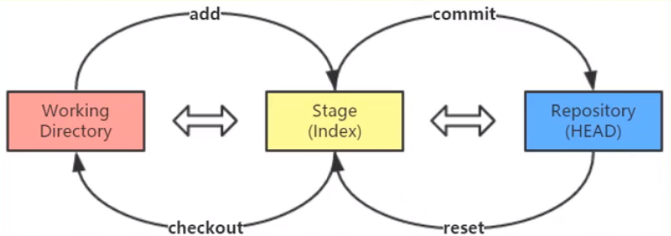
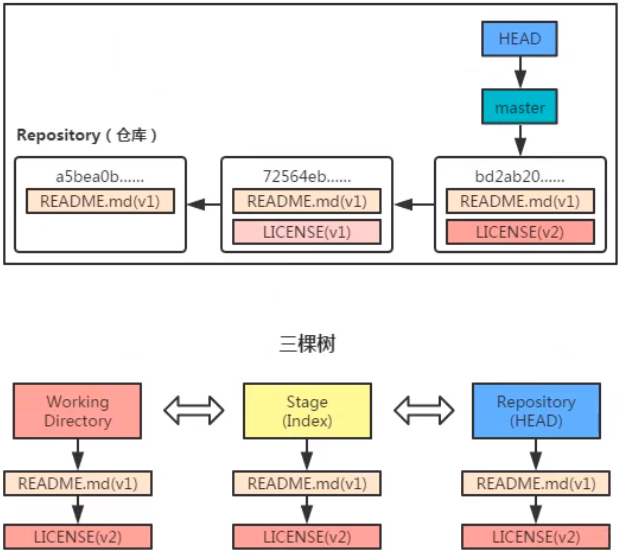
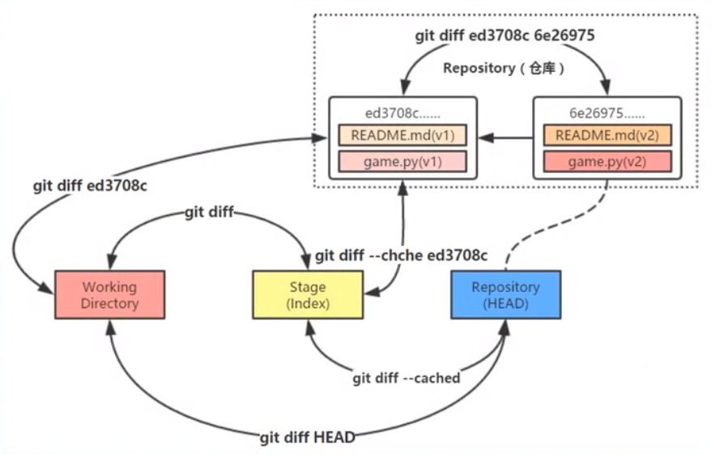

### 初次使用Git前的配置

```
git config --global user.name "username"
git config --global user.email "email"

C:\Users\WZ>git config --list
diff.astextplain.textconv=astextplain
filter.lfs.clean=git-lfs clean -- %f
filter.lfs.smudge=git-lfs smudge -- %f
filter.lfs.process=git-lfs filter-process
filter.lfs.required=true
http.sslbackend=openssl
http.sslcainfo=D:/Git/mingw64/ssl/certs/ca-bundle.crt
core.autocrlf=true
core.fscache=true
core.symlinks=false
pull.rebase=false
credential.helper=manager-core
credential.https://dev.azure.com.usehttppath=true
init.defaultbranch=master
filter.lfs.process=git-lfs filter-process
filter.lfs.required=true
filter.lfs.clean=git-lfs clean -- %f
filter.lfs.smudge=git-lfs smudge -- %f
user.name=aghb123
user.email=wangzhuang137@gmail.com //注册成功
```

###工作区域、暂存区域和Git仓库


### Git的工作流程

+ Git的工作流程一般是：
  1. 在工作目录中添加、修改文件
  2. 将需要进行版本管理的文件放入暂存区域
  3. 将暂存区域的文件提交到Git仓库
+ Git管理的文件有三种状态：
  1. 已修改（modified）
  2. 已暂存（staged）
  3. 已提交（committed）

### 练习

1. 创建仓库

```
G:\github\Git_test>git init
Initialized empty Git repository in G:/github/Git_test/.git/
```

2. 添加文件

```markdown
G:\github\Git_test>git add README.md //将文件加入暂存区

G:\github\Git_test>git commit -m "add a readme file" //将文件提交到仓库，附加说明
[master (root-commit) 3e76ed6] add a readme file
 1 file changed, 1 insertion(+)
 create mode 100644 README.md
```

3. 查看状态

`git status`

```markdown
G:\github\Git_test>git status
On branch master
nothing to commit, working tree clean
//添加LICENSE文件
G:\github\Git_test>git status
On branch master
Untracked files:
  (use "git add <file>..." to include in what will be committed)
        LICENSE

nothing added to commit but untracked files present (use "git add" to track)

//撤销将LICENSE添加到暂存区
G:\github\Git_test>git restore --staged LICENSE

G:\github\Git_test>git status
On branch master
Untracked files:
  (use "git add <file>..." to include in what will be committed)
        LICENSE

nothing added to commit but untracked files present (use "git add" to track)

//修改README.md
G:\github\Git_test>git status
On branch master
Changes not staged for commit:
  (use "git add <file>..." to update what will be committed)
  (use "git restore <file>..." to discard changes in working directory)
        modified:   README.md

no changes added to commit (use "git add" and/or "git commit -a")

G:\github\Git_test>git restore README.md //撤销工作区的修改

//修改README.md之后，再加入到暂存区，然后再修改README.md
G:\github\Git_test> git status
On branch master
Changes to be committed:
  (use "git restore --staged <file>..." to unstage)
        modified:   README.md

Changes not staged for commit:
  (use "git add <file>..." to update what will be committed)
  (use "git restore <file>..." to discard changes in working directory)

G:\github\Git_test>git status -s //简短模式查看状态
MM README.md

G:\github\Git_test>git add README.md

G:\github\Git_test>git status -s
M  README.md

//查看日志
G:\github\Git_test>git log
commit 3b73f3432d9da32413cda486b553a1244a1473ae (HEAD -> master)
Author: aghb123 <wangzhuang137@gmail.com>
Date:   Wed Jan 20 17:00:53 2021 +0800

    modified README.md

commit e4fd1f34e645f031a8c012fc370f099f1abaf78b
Author: aghb123 <wangzhuang137@gmail.com>
Date:   Wed Jan 20 16:28:11 2021 +0800

    add LICENSE

commit 3e76ed6b35181f2b31e8084477a7be30ccaefb9a
Author: aghb123 <wangzhuang137@gmail.com>
Date:   Wed Jan 20 16:04:14 2021 +0800

    add a readme file
```

### 撤销操作





#### `git reset`

reset 重新设置的意思，其实就是用来设置分支的头部指向，当进行了一系列的提交之后，忽然发现最近的几次提交有问题，想从提交记录中删除，这是就会用到 `git reset` 命令，这个命令后面跟 `commit id`，表示当前分支回退到这个 `commit id` 对应的状态，之后的日志记录被删除，工作区中的文件状态根据参数的不同会恢复到不同的状态。

- `--soft`: 被回退的那些版本的修改会被放在暂存区，可以再次提交。
- `--mixed`: 默认选项，被回退的那些版本的修改会放在工作目录，可以先加到暂存区，然后再提交。
- `--hard`: 被回退的那些版本的修改会直接舍弃，好像它们没有来过一样。

这样来看，`git reset` 命令好像是用来回退版本的，但是如果使用 `git reset HEAD file_name` 命令就可以将一个文件回退到 `HEAD` 指向版本所对应的状态，其实就是当前版本库中的状态，也就相当于还原了本地的修改。

`reset`命令回滚快照过程

1. 移动HEAD的指向(--soft)
2. 将快照回滚到暂存区域([--mixed],默认)
3. 将暂存区域还原到工作目录(--hard)


**`reset`回滚指定快照***

`git reset 版本快照的ID号`


**`reset`回滚个别文件**

`git reset 版本快照 文件名/路径`

### 版本对比

1. 比较暂存区域与工作目录

`git diff`

2. 比较两个历史快照

`git diff 快照1ID 快照2ID`

3. 比较当前工作目录和Git仓库中的快照

`git diff 快照ID`

4. 比较暂存区域和Git仓库快照

`git diff --cached [快照ID]`



### 修改最后一次提交

+ 在实际开发中，可能遇到以下两种情景：

  ——情景一：版本刚一提交(commit)到仓库，突然想起漏掉两个文件还没有添加(add)

  ——情景二：版本刚一提交(commit)到仓库，突然想起版本说明写得不够全面，无法彰显本次修改的重大意义

+ 执行带`--amend`选项的`commit`提交命令，Git就会更正最近的一次提交

### 删除文件

不小心删除本地仓库里的文件，可以通过暂存区恢复

`git checkout -- README.md`

+ `git rm 文件名`

  ——该命令删除的只是工作目录和暂存区域的文件，也就是取消跟踪，再下次提交时不纳入版本管理

  ——当工作目录和暂存区域的同一个文件存在不同内容时，执行`git rm -f 文件名`命令就可以把两个都删除

  ——如果只删除暂存区域的文件(保留工作目录的)，那么可以执行`git rm --cached 文件名`命令实现目的

### 重命名文件

+ `git mv 旧文件名 新文件名`

  ——ren/mv 旧文件名 新文件名

  ——git rm 旧文件名

  ——git add 新文件名

### `Git`分支

 

1. 创建分支

`git branch 分支名`

git branch -M "newname" 重命名分支

git branch --list 查看分支

2. 切换分支

`git checkout 分支名`

```
G:\github\Git_test2>git log --decorate --oneline --graph --all
* 2aac3cc (HEAD -> master) change the README file again
| * 4d2155d (feature) change the README file
|/
* 95a0e76 commit all modified file plus readme
* 32556e1 pinyougou
```

3. 分支的合并

`git merge 分支名`

```
G:\github\Git_test2>git log --decorate --oneline --graph --all
*   b112584 (HEAD -> master) fix conflicts
|\
| * 4d2155d (feature) change the README file
* | 2aac3cc change the README file again
|/
* 95a0e76 commit all modified file plus readme
* 32556e1 pinyougou
```

4. 删除分支

`git branch -d 分支名`

### `checkout`

两种功能：

1. 从历史快照(或者暂存区域)中拷贝文件到工作目录
2. 切换分支

`checkout`命令和`reset`命令都可以用于恢复指定快照的指定文件，并且都不会改变HEAD指针的指向

区别是reset命令只将指定文件恢复到暂存区域(--mixed)，而checkout命令同时覆盖暂存区域和工作目录

### 本地仓库往远程仓库推送

```
G:\github\Learning>git status
On branch main
Your branch is up to date with 'origin/main'.

Changes not staged for commit:
  (use "git add/rm <file>..." to update what will be committed)
  (use "git restore <file>..." to discard changes in working directory)
        deleted:    HTML+CSS/css/Cutterman_panel_3.5.0_201711141423.exe

Untracked files:
  (use "git add <file>..." to include in what will be committed)
        HTML+CSS/css/Cutterman_panel_3.5.0_201711141423.zip

no changes added to commit (use "git add" and/or "git commit -a")

G:\github\Learning>git add HTML+CSS/css/Cutterman_panel_3.5.0_201711141423.zip

G:\github\Learning>git rm HTML+CSS/css/Cutterman_panel_3.5.0_201711141423.exe
rm 'HTML+CSS/css/Cutterman_panel_3.5.0_201711141423.exe'

G:\github\Learning>git status
On branch main
Your branch is up to date with 'origin/main'.

Changes to be committed:
  (use "git restore --staged <file>..." to unstage)
        renamed:    HTML+CSS/css/Cutterman_panel_3.5.0_201711141423.exe -> HTML+CSS/css/Cutterman_panel_3.5.0_201711141423.zip


G:\github\Learning>git commit -m "Replace the exe file"
[main 8383346] Replace the exe file
 1 file changed, 0 insertions(+), 0 deletions(-)
 rename HTML+CSS/css/{Cutterman_panel_3.5.0_201711141423.exe => Cutterman_panel_3.5.0_201711141423.zip} (70%)

G:\github\Learning>git push origin main
Enumerating objects: 8, done.
Counting objects: 100% (8/8), done.
Delta compression using up to 16 threads
Compressing objects: 100% (5/5), done.
Writing objects: 100% (5/5), 1.19 MiB | 173.00 KiB/s, done.
Total 5 (delta 3), reused 0 (delta 0), pack-reused 0
remote: Resolving deltas: 100% (3/3), completed with 3 local objects.
To https://github.com/aghb123/Learning.git
   9932b75..8383346  main -> main
```

**工作区的更改必须线提交到本地仓库，才能推送到远程仓库里**

### 删除Git本地仓库

删除Git本地仓库的根本原理是删除“Git本地仓库”里面的根目录下面的隐藏文件夹".git"

方法一：自己手动删除掉Git本地仓库里面的根目录下面的隐藏文件夹".git"

方法二：在本地仓库的目录下调用命令行删除根目录下的.git文件夹，输入

```
find . -name ".git" | xargs rm -Rf
```

检验是否成功删除了本地仓库：在Git bash中进入仓库的目录中，如果目录末尾没有"(master)"，说明成功删除了本地仓库

```
WZ@DESKTOP-8SQ1L5C MINGW64 /g/github/demo (master)
$ find . -name ".git" | xargs rm -Rf

WZ@DESKTOP-8SQ1L5C MINGW64 /g/github/demo
$
```

### gitbash无法显示中文

```
git config --global core.quotepath false
```

### 无法推送的一种原因

```
WZ@DESKTOP-8SQ1L5C MINGW64 /g/github/Learning (main)
$ git push origin main
To https://github.com/aghb123/Learning.git
 ! [rejected]        main -> main (fetch first)
error: failed to push some refs to 'https://github.com/aghb123/Learning.git'
hint: Updates were rejected because the remote contains work that you do
hint: not have locally. This is usually caused by another repository pushing
hint: to the same ref. You may want to first integrate the remote changes
hint: (e.g., 'git pull ...') before pushing again.
hint: See the 'Note about fast-forwards' in 'git push --help' for details.

WZ@DESKTOP-8SQ1L5C MINGW64 /g/github/Learning (main)
$ git pull
remote: Enumerating objects: 5, done.
remote: Counting objects: 100% (5/5), done.
remote: Compressing objects: 100% (3/3), done.
remote: Total 3 (delta 1), reused 0 (delta 0), pack-reused 0
Unpacking objects: 100% (3/3), 722 bytes | 3.00 KiB/s, done.
From https://github.com/aghb123/Learning
   5f26f0e..5bf2c62  main       -> origin/main
Merge made by the 'recursive' strategy.
 README.md | 3 ++-
 1 file changed, 2 insertions(+), 1 deletion(-)

WZ@DESKTOP-8SQ1L5C MINGW64 /g/github/Learning (main)
$ git push origin main
Enumerating objects: 15, done.
Counting objects: 100% (13/13), done.
Delta compression using up to 16 threads
Compressing objects: 100% (7/7), done.
Writing objects: 100% (7/7), 1.96 KiB | 1.96 MiB/s, done.
Total 7 (delta 5), reused 0 (delta 0), pack-reused 0
remote: Resolving deltas: 100% (5/5), completed with 4 local objects.
To https://github.com/aghb123/Learning.git
   5bf2c62..0192cd2  main -> main
```

本地仓库未与远程仓库同步(也就是远程仓库所作的改变本地仓库没有跟进)，此时推送会失败，`git pull`之后再`git push`即可，注意先后顺序即可

### 本地仓库关联多个远程仓库

```
git remote add wz https://gitee.com/aghb123/Learning.git
```

wz为远程库名

提交代码

```
git push wz main
```

删除远程仓库

git remote rm 远程仓库名