# 快捷键

| 快捷键                                    | 作用           |
| ----------------------------------------- | -------------- |
| ctrl+enter                                | 快速进入下一行 |
| Home                                      | 行首           |
| End                                       | 行尾           |
| ctrl + Home                               | 文档开头       |
| ctrl + End                                | 文档末尾       |
| shift + ctrl + :arrow_left:/:arrow_right: | 快速选中       |
| shift + ctrl                              | 切换输入法     |
| F1（Snipaste)                             | 截图           |
| F3（Snipaste)                             | 贴图           |
| ctrl + shift + I(Typora)                  | 插入图片       |
| shift+Tab                                 | 反向缩进       |


# 前端学习

## HTML5

| 标签名            | 定义         | 说明                                                    |
| ----------------- | ------------ | ------------------------------------------------------- |
| `<html></html>`   | HTML标签     | 页面中最大的标签，称为根标签                            |
| `<head></head>`   | 文档的头部   | 注意在head标签中我们必须要设置的标签是title             |
| `<title></title>` | 文档的标题   | 让页面拥有一个属于自己的网页标题                        |
| `<body></body>`   | 文档的主体   | 元素包含文档的所有内容，页面内容 基本都是放在body里面的 |
| <!DOCTYPE>        | 文档类型声明 | 告诉浏览器使用哪种HTML版本来显示网页                    |

### vscode的使用

| 快捷键   | 作用             |
| -------- | ---------------- |
| ctrl+N   | 新建文件         |
| ctrl+S   | 保存文件         |
| ctrl+`+` | 放大视图         |
| ctrl+`-` | 缩小视图         |
| ! + Tab  | 生成页面骨架结构 |
| ctrl+G   | 跳转到某一行     |
| ctrl+`   | 打开终端         |

安装插件

| 插件                  | 作用                                    |
| --------------------- | --------------------------------------- |
| Open in Browser       | 右击选择浏览器打开html文件              |
| JS-CSS-HTML Formatter | 每次保存都会自动格式化js css 和html代码 |
| Auto Rename Tag       | 自动重命名配对的HTML/XML标签            |
| CSS Peek              | 追踪至样式                              |
| Material Icon Theme   | 文件夹图标                              |

### 标签语义

#### 标题标签

`<h1>-<h6>`

#### 段落与换行标签

`<p></p>`文本在一个段落中会根据浏览器窗口的大小自动换行，段落与段落之间保有空袭

`<br/>`换行标签，强制换行显示

#### 文本格式化标签（加粗，倾斜，删除线，下划线）

**加粗**：`<strong></strong>`或者`<b></b>`，推荐使用前一个，语义更强烈

*倾斜*：`<em></em>`或者`<i></i>`，推荐使用前一个，语义更强烈

~~删除线~~：`<del></del>`或者`<s></s>`，推荐使用前一个，语义更强烈

<u>下划线</u>：`<ins></ins>`或者`<u></u>`，推荐使用前一个，语义更强烈

####`div`和`span`标签

没有语义，就是一个盒子，用来装内容

`div`是division的缩写，表示分割、分区。`span`意为跨度、跨距

特点：

1.`<div>`标签用来布局，但是现在一行只能放一个`<div>`。大盒子

2.`<span>`标签用来布局，一行上可以多个`<span>`。小盒子

#### 图像标签和路径(重点)

#####图像标签

在HTML标签中，``标签用于定义HTML页面中的图像

``

`src`是``标签的必须属性，它用于指定图像文件的路径和文件名

图像标签的其它属性

| 属性     | 属性值   | 说明                                 |
| -------- | -------- | :----------------------------------- |
| `src`    | 图片路径 | 必须属性                             |
| `alt`    | 文本     | 替换文本。图像不能显示的文字         |
| `title`  | 文本     | 提示文本。鼠标放到图像上，显示的文字 |
| `width`  | 像素     | 设置图像的宽度                       |
| `height` | 像素     | 设置图像的高度                       |
| `border` | 像素     | 设置图像的边框粗细                   |

**Tips**:

:one:：属性之间不分先后顺序，标签名与属性、属性与属性之间均以空格分开

:two:：属性采取键值对的格式，即`key = "value"`的格式

##### 路径

:one::相对路径

以引用文件所在位置为参考基础，而建立的目录路径

:two::绝对路径

指目录下的绝对位置，直接到达目标位置，通常是从盘符开始的路径

#### 超链接标签(重点)

:one:.链接的语法格式

`<a href="跳转目标" target="目标窗口的弹出方式">文本或图像</a>`

| 属性     | 作用                                                                                    |
| -------- | --------------------------------------------------------------------------------------- |
| `href`   | 用于指定链接目标的url地址，（必须属性）当为标签应用`href`属性时，它就具有了超链接的功能 |
| `target` | 用于指定链接页面的打开方式，其中`_self`为默认值，`_blank`为在新窗口中打开方式           |

:two:.链接分类

1.外部链接，例如`<a href="http://www.baidu.com"></a>`

2.内部链接，例如`<a href="09-图像标签.html" target="_blank"></a>`

3.空链接，如果当时没有确定链接目标时，`<a href="#"></a>`

4.下载链接，如果`href`里面地址是一个文件或者压缩包，会下载这个文件

5.网页元素链接，在网页中的各种网页元素，如文本、图像、表格、音频、视频等都可以添加超链接

6.锚点链接，点击链接，可以快速定位到页面中的某个位置

(1)在链接文本的`href`属性中，设置属性值为`#名字`的形式，如`<a href="#two">第二集</a>`

(2)找到目标位置标签，里面添加一个`id`属性 = 刚才的名字，如`<h3 id="two">第二集介绍</h3>`

#### 注释和特殊字符

:one:.注释

`<!--注释-->`

快捷键`ctrl + /`

:two:.特殊字符

| 特殊字符 | 描述     | 字符的代码 |
| -------- | -------- | ---------- |
|          | 空格符   | `&nbsp;`   |
| <        | 小于号   | `&lt;`     |
| >        | 大于号   | `&gt;`     |
| &        | 和号     | `&amp;`    |
| &copy;   | 版权     | `&copy;`   |
| &reg;    | 注册商标 | `&reg;`    |
| &deg;    | 摄氏度   | `&deg;`    |
| &plusmn; | 正负号   | `&plusmn;` |
| &times;  | 乘号     | `&times;`  |
| &divide; | 除号     | `&divide;` |
| &sup2;   | 平方     | `&sup2;`   |
| &sup3;   | 立方     | `&sup3;`   |

#### 表格标签

:one:.表格的主要作用

（1）`<table></table>`用于定义表格的标签

（2）`<tr></tr>`用于定义表格中的行，必须嵌套在`<table></table>`标签中

（3）`<td></td>`用于定义表格中的单元格，必须嵌套在`<tr></tr>`标签中

（4）`<th></th>`表示HTML表格的表头部分，文字会加粗居中，突出重要性

（5）表格属性

实际开发不常用，后面通过CSS来设置

| 属性名        | 属性值                    | 描述                                              |
| ------------- | ------------------------- | ------------------------------------------------- |
| `align`       | `left`、`center`、`right` | 规定表格相对周围元素的对齐方式                    |
| `border`      | `1`或`""`                 | 规定表格单元是否拥有边框，默认为`""`,表示没有边框 |
| `cellpadding` | 像素值                    | 规定单元边沿与其内容之间的空白，默认`1`像素       |
| `cellspacing` | 像素值                    | 规定单元格之间的空白，默认`2`像素                 |
| `width`       | 像素值或百分比            | 规定表格的宽度                                    |
| `height`      | 像素值或百分比            | 规定表格的高度                                    |

（6）表格结构标签

`<thead>`:表格的头部区域

`<tbody>`:表格的主体区域

（7）合并单元格

1、合并单元格方式

跨行合并：`rowspan=合并单元格的个数`

跨列合并：`colspan=合并单元格的个数`

2、目标单元格

跨行：最上侧单元格为目标单元格，写合并代码

跨列：最左侧单元格为目标单元格，写合并代码

3、合并单元格的步骤

【1】先确定是跨行还是跨列合并

【2】找到目标单元格，写上合并方式=合并的单元格数量。例`<td colspan="2"></td>`

【3】删除多余的单元格

#### 列表标签

表格是用来显示数据的，那么列表就是用来布局的

:one:无序列表

基本语法格式

```html
<ul>
	<li>列表项1</li>
	<li>列表项2</li>
	<li>列表项3</li>
	...
</ul>
```

无序列表的各个列表项之间没有顺序级别之分，是并列的

`<ul></ul>`中只能嵌套`<li></li>`，直接在`<ul></ul>`标签中输入其它标签或者文字的做法是不被允许的

`<li></li>`之间相当于一个容器，可以容纳所有元素

无序列表会带有自己的样式属性，但在实际使用时，我们会使用CSS来设置

:two:有序列表

基本语法格式

```html
<ol>
	<li>列表项1</li>
	<li>列表项2</li>
	<li>列表项3</li>
	...
<ol>
```

注意事项与无序列表基本相同

:three:自定义列表

基本语法格式

```html
<dl>
	<dt>名词1</dt>
	<dd>名词1解释1</dd>
	<dd>名词1解释2</dd>
	...
</dl>
```

`<dl>`标签用于定义描述列表，该标签会与`<dt>`(定义项目、名字)和`<dd>`(描述每一个项目/名字)一起使用

`<dl>`里面只能包含`<dt>`和`<dd>`

#### 表单标签

在HTML中，一个完整的表单通常由表单域、表单控件（也称为表单元素）和提示信息3个部分构成

:one:表单域

包含表单元素的区域

在HTML标签中，`<form>`标签用于定义表单域，以实现用户信息的收集和传递

`<form>`会把它范围内的表单元素信息提交给服务器

```html
<form action="url地址" method="提交方式" name="表单域名称">
	各种表单元素控件
</form>
```

| 属性     | 属性值     | 作用                                               |
| -------- | ---------- | -------------------------------------------------- |
| `action` | url地址    | 用于指定接收并处理表单数据的服务器程序的url地址    |
| `method` | `get/post` | 用于设置表单数据的提交方式，其取值为`get`或`post`  |
| `name`   | 名称       | 用于指定表单的名称，以区分同一个页面中的多个表单域 |

:two:表单元素（表单控件）

**`input`输入表单元素**

用于收集用户信息，包含一个`type`属性，根据不同的`type`属性值，输入字段拥有很多种形式（可以是文本字段、复选框、掩码后的文本控件、单选按钮、按钮等）

`<input type="属性值" />`

`type`属性的属性值及其描述如下：

| 属性值     | 描述                                                         |
| ---------- | ------------------------------------------------------------ |
| `button`   | 定义可点击按钮（多数情况下，用于通过JavaScript启动脚本）     |
| `checkbox` | 定义复选框                                                   |
| `file`     | 定义输入字段和"浏览"按钮，供文件上传                         |
| `hidden`   | 定义隐藏的输入字段                                           |
| `image`    | 定义图像形式的提交按钮                                       |
| `password` | 定义密码字段，该字段中的字符被掩码                           |
| `radio`    | 定义单选按钮                                                 |
| `reset`    | 定义重置按钮，重置按钮会清除表单中的所有数据                 |
| `submit`   | 定义提交按钮，提交按钮会把表单数据发送到服务器               |
| `text`     | 定义单行的输入字段，用户可在其中输入文本，默认宽度为20个字符 |

除`type`属性外，`<input>`标签还有其它很多属性，其常用属性如下

| 属性        | 属性值       | 描述                                |
| ----------- | ------------ | ----------------------------------- |
| `name`      | 由用户自定义 | 定义`input`元素的名称               |
| `value`     | 由用户自定义 | 规定`input`元素的值                 |
| `checked`   | `checked`    | 规定`input`元素首次加载时应当被选中 |
| `maxlength` | 正整数       | 规定输入字段中的字符的最大长度      |

`name`和`value`是每个表单元素都有的属性值，主要给后台人员使用

`name`表单元素的名字，要求单选按钮和复选框要有相同的`name`值

`checked`属性主要针对于单选按钮和复选框，主要作用是一打开页面，就可以默认选中某个表单元素

`maxlength`是用户可以在表单元素输入的最大字符数，一般较少使用

**`<label>`标签**

为`<input>`元素定义标注

`<label>`标签用于绑定一个表单元素，当点击`<label>`标签内的文本时，浏览器就会自动将焦点（光标）转到或者选择对应的表单元素上，用来增加用户体验

语法：

```html
<label for="sex">男</label>
<input type="radio" name="sex" id="sex" />
```

**Tip**:`<label>`标签的`for`属性应当与相关元素的`id`属性相同

**`select`下拉表单元素**

使用场景：在页面中，如果有多个选项让用户选择，并且想要节约页面空间时，我们可以使用`<select>`标签控件定义下拉列表

语法

```html
<select>
	<option>选项1</option>
	<option>选项2</option>
	<option>选项3</option>
	...
</select>
```

`<select>`中至少包含一对`<option>`

在`<option>`中定义`selected="selected"`时，当前项即为默认选中项

**`textarea`文本域元素**

使用场景：当用户输入内容较多的情况下，我们就不能使用文本框表单了，此时我们可以使用`<textarea>`标签。在表单元素中，`<textarea>`标签是用于定义多行文本输入的控件，常见于留言板，评论

```html
<textarea rows="3" cols="20">
	文本内容
</textarea>
```

通过`<textarea>`标签可以轻松地创建多行文本输入框

`cols="每行中的字符数" cols="显示的行数"`，实际开发中不会使用，都是用CSS来改变大小

#### 查阅文档

[w3c](https://www.w3school.com.cn)：<https://www.w3school.com.cn>

##CSS（层叠样式表）

CSS的主要使用场景就是美化网页，布局页面的

1.HTML的局限性---只关注内容的语义

2.CSS-网页的美容师

CSS也是一种标记语言，主要用于设置HTML页面中的文本内容（字体、大小、对齐方式等）、图片的外形（宽高、边框样式、边距等）以及版面的布局和外观显示样式

###CSS语法规范

CSS规则由两个主要的部分构成：选择器以及一条或多条声明

例：`h1 {color: red; font-size: 25px; }`

选择器是用于指定CSS样式的HTML标签，花括号内是对该对象设置的具体样式

属性和属性值以键值对的形式出现

属性是对指定的对象设置的样式属性，例如字体大小、文本颜色等

属性和属性值之间用英文";"分开

### CSS代码风格

不是强制规范，符合实际开发书写方式

:one:样式格式书写

（1）`h3 {color: red;font-size: 20px}`紧凑型

（2）展开型

```css
h3 {

	color: red;
	font-size: 20px

}
```


:two:样式大小写风格

采用小写

:three:样式空格风格

属性值前面，冒号后面，保留一个空格

选择器（标签）和大括号中间保留空格

### CSS基础选择器

:one:CSS选择器的作用

选择器：选择标签

分为基础选择器和复合选择器两个大类，这里先考虑基础选择器

基础选择器是由单个选择器组成的

基础选择器又包括：标签选择器、类选择器、id选择器、通配符选择器

####标签选择器

用HTML标签名称作为选择器，按标签名称分类，为页面中某一类标签指定统一的CSS样式

```css
标签名 {
	属性1: 属性值1;
	属性2: 属性值2;
	属性3: 属性值3;
	...
}
```

优点：能快速为页面中同类型的标签统一设置样式

缺点：不能设计差异化样式，只能选择全部的当前标签

####类选择器

如果想要差异化选择不同的标签，单独选一个或者某几个标签，可以使用类选择器

```css
.类名 {
	属性1: 属性值1;
	...
}
```

类命名规则

| 标签名                   | 命名              |
| ------------------------ | ----------------- |
| 头                       | header            |
| 内容                     | content/container |
| 尾                       | footer            |
| 导航                     | nav               |
| 侧栏                     | sidebar           |
| 栏目                     | column            |
| 页面外围控制整体布局宽度 | wrapper           |
| 左右中                   | left right center |
| 登陆条                   | loginbar          |
| 标志                     | logo              |
| 广告                     | banner            |
| 页面主体                 | main              |
| 热点                     | hot               |
| 新闻                     | news              |
| 下载                     | download          |
| 子导航                   | subnav            |
| 菜单                     | menu              |
| 子菜单                   | submenu           |

**多类名**

可以给一个标签指定多个类名，从而达到更多的选择目的。这些类名都可以选出这个标签。简单理解就是一个标签有多个名字

（1）多类名使用方式

```html
<div class="red font20">
    亚瑟
</div>
```

在标签class属性中写多个类名

多个类名中间必须用空格分开

（2）多类名开发中使用场景

可以把一些标签元素相同的样式（共同的部分）放到一个类里面

这些标签都可以调用这个公共的类，然后再调用自己独有的类

从而节省CSS代码，统一修改也非常方便

####id选择器

id选择器可以为标有特定id的HTML元素指定特定的样式

HTML元素以id属性来设置id选择器，CSS中id选择器以`#`来定义

```css
#id_name {
	属性1: 属性值1;
	...
}
```

**Tip**id属性只能在每个HTML文档中出现一次


id选择器和类选择器的区别

（1）类选择器好比人的名字，一个人可以有多个名字，同时一个名字也可以被多个人使用

（2）id选择器是唯一的，不能重复使用

#### 通配符选择器

在CSS中，通配符选择器使用`*`定义，它表示选取页面中所有元素（标签）

```css
* {
	属性1: 属性值1;
	...
}
```

### CSS字体属性

Fonts属性用于定义字体系列、大小、粗细和文字样式（如斜体）

#### 字体系列

CSS使用`font-family`属性定义文本的字体系列

```css
p {
    font-family: "微软雅黑";
}
div {
    font-family: Arial,"Microsoft Yahei";
}
```

各种字体之间必须使用英文状态下的逗号隔开

一般情况下，如果有空格隔开的多个单词组成的字体，加引号

尽量使用系统默认自带字体，保证在任何用户的浏览器中都能正确显示

最常见的几个字体

```css
body {
    font-family: 'Microsoft YaHei',tahoma,arial,'Hiragino Sans GB';
}
```

#### 字体大小

CSS使用`font-size`属性定义字体大小

```css
p {
    font-size: 20px;
}
```

px(像素)大小是网页的最常用的单位

谷歌浏览器默认的文字大小为16px

不同浏览器可能默认显示的字号大小不一致，尽量给一个明确值大小，不要默认大小

可以给`body`指定整个页面文字的大小

#### 字体粗细

CSS使用`font-weight`属性设置文字粗细

```css
p {
    font-weight: bold；
}
```

| 属性值    | 描述                              |
| --------- | --------------------------------- |
| `normal`  | 默认值（不加粗）                  |
| `bold`    | 定义粗体（加粗的）                |
| `100-900` | 400等同于`normal`,700等同于`bold` |

#### 文字样式

CSS使用`font-style`属性设置文本的风格

```css
p {
    font-style: normal;
}
```

| 属性值   | 作用                               |
| -------- | ---------------------------------- |
| `normal` | 默认值，浏览器会显示标准的字体样式 |
| `italic` | 浏览器会显示斜体的字体样式         |

#### 字体复合属性

字体属性可以把以上文字样式综合来写，这样可以更节约代码

```css
body {
    font: font-style font-weight font-size/line-height font-family;
}
```

使用`font`属性时，必须按照上面语法格式中的顺序书写，`不能更换顺序`，并且各个属性间以空格隔开

不需要设置的属性可以忽略（取默认值），但必须保留`font-size`和`font-family`属性，否则`font`属性将不起作用

###CSS文本属性

CSS Text（文本）属性可以定义文本的外观，比如文本的颜色、对齐文本、装饰文本、文本缩进、行间距等。

#### 文本颜色

`color`属性用于定义文本的颜色

```css
div {
    color: red;
}
```

| 表示           | 属性值                            |
| -------------- | --------------------------------- |
| 预定义的颜色值 | `red`,`green`,`blue`等            |
| 十六进制       | `#ff0000`,`ff6600`                |
| RGB代码        | `rgb(255,0,0)`或`rgb(100%,0%,0%)` |

#### 对齐文本

`text-align`属性用于设置元素内文本内容的水平对齐方式(适用于行内元素和行内块元素)

```css
div {
    text-align: center;
}
```

| 属性值   | 解释     |
| -------- | -------- |
| `left`   | 左对齐   |
| `right`  | 右对齐   |
| `center` | 居中对齐 |

#### 装饰文本

`text-decoration`属性规定添加到文本的修饰。可以给文本添加下划线、删除线、上划线等。

```css
div {
    text-decoration: underline;
}
```

| 属性值         | 描述                       |
| -------------- | -------------------------- |
| `none`         | 默认，没有装饰线（最常用） |
| `underline`    | 下划线（常用）             |
| `overline`     | 上划线（几乎不用）         |
| `line-through` | 删除线（不常用）           |

#### 文本缩进

`text-indent`属性用来指定文本的第一行的缩进，通常是将段落的首行缩进

```css
div {
    text-indent: 10px;
}
```

通过设置该属性，所有元素的第一行都可以缩进一个给定的长度，甚至该长度可以是负值。

```css
p {
    text-indent: 2em;
}
```

`em`是一个相对单位，就是当前元素（`font-size`）1个文字的大小。如果当前元素没有设置大小，则会按照父元素的1个文字大小。

#### 行间距

`line-height`属性用于设置行间的距离（行高）。可以控制文字行与行之间的距离。

```css
p {
    line-height: 26px;
}
```

### CSS的引入方式

根据CSS样式书写的位置（或者引入的方式），CSS样式表可以分为三大类：

####行内样式表（行内式）

在元素标签内部的`style`属性中设定CSS样式，适合于修改简单样式

```css
<div style="color: red; font-size: 12px;">青春不常在</div>
```

`style`其实就是标签的属性

在双引号中间，写法要符合CSS规范

可以控制当前的标签设置样式

####内部样式表（嵌入式）

写到html页面内部，将所有CSS代码抽取出来，单独放到一个`<style>`标签中

```css
<style>
    div {
		color: red;
        font-size: 12px;
    }
</style>
```

`<style>`标签理论上可以放在HTML文档的任何地方，但一般会放在文档的`<head>`标签中

通过此种方式，可以方便控制当前整个页面中的元素样式设置

代码结构清晰，但是并没有实现结构与样式完全分离

使用内部样式表设定CSS，通常也被称为嵌入式引入，这种方式是练习时常用的方式

####外部样式表（链接式）

实际开发中都是外部样式表，适用于样式比较多的情况。核心是：样式单独写到CSS文件中，之后把CSS文件引入到HTML页面中使用

引入外部样式表分为两步：

:one:新建一个后缀名为`.css`的样式文件，把所有CSS代码都放入此文件中

:two:在HTML页面中，使用`<link>`标签引入这个文件

```html
<link rel="stylesheet" href="css文件路径">
```

| 属性   | 作用                                                                                                 |
| ------ | ---------------------------------------------------------------------------------------------------- |
| `rel`  | 定义当前文档与被链接文档之间的关系，在这里需要指定为"stylesheet"，表示被链接的文档是一个样式表文件。 |
| `href` | 定义所链接外部样式表文件的URL，可以是相对路径，也可以是绝对路径                                      |

使用外部样式表设定CSS，通常也被称为外链式或链接式引入，这种方式是开发中常用的方式

### Chrome调试工具

#### 使用调试工具

:one:`Ctrl+滚轮`可以放大开发者工具代码大小

:two:左边是HTML元素结构，右边是CSS样式

:three:右边CSS样式可以改动数值（左右箭头或者直接输入）和查看颜色

:four:`Ctrl+0`复原浏览器大小

:five:如果点击元素，发现右侧没有样式引入，极有可能是类名或者样式引入错误

:six:如果有样式，但是样式前面有黄色叹号提示，则是样式属性书写错误

### Emmet语法

Emmet语法的前身是Zen coding，它使用缩写，来提高html/css的编写速度，VSCode内部已经集成该语法。

#### 快速生成HTML结构语法

1.生成标签直接输入标签名 按tab键即可 比如 div 然后tab键 就可以生成`<div></div>`

2.如果想要生成多个相同标签 加上`*`就可以了 比如`div*3` 就可以快速生成3个div

3.如果有父子级关系的标签，可以用`>` 比如`ul>li`就可以了

4.如果有兄弟关系的标签，用`+`就可以了 比如`div+p`

5.如果生成带有类名或者`id`名字的，直接写`.demo`或者`#two` tab键就可以了

```css
.demo
<div class="demo"></div>
#two
<div id="two"></div>
p#three
<p id="three"></p>
p.four
<p class="four"></p>
```

6.如果生成的`div`类名是有顺序的，可以用自增符号`$`

```css
.demo$*3
<div class="demo1"></div>
<div class="demo2"></div>
<div class="demo3"></div>
```

7.如果想要在生成的标签内部写内容可以用`{}`表示

```css
div{test}*3
<div>test</div>
<div>test</div>
<div>test</div>
```

#### 快速生成CSS样式语法

CSS基本采取简写形式即可

1.比如`w200` 按tab键可以生成 `width: 200px;`

2.比如`lh26` 按tab键可以生成`line-height: 26px;`

#### 快速格式化代码

VScode 快速格式化代码 `shift+alt+f`

也可以设置当我们保存页面的时候自动格式化代码：

1）文件------>首选项------->设置

2）搜索emmet.include

3)在settings.json下的用户中添加以下语句：

```json
"editor.formatOnType":true,
"editor.formatOnSave":true
```

只需要设置一次即可，以后都可以自动保存格式化代码

新版本VScode可以搜索format，勾选保存时自动格式化

### CSS的复合选择器

在CSS中，可以根据选择器的类型把选择器分为基础选择器和复合选择器，复合选择器是建立在基础选择器之上，对基本选择器进行组合形成的

复合选择器可以更准确、更高效的选择目标元素（标签）

复合选择器是由两个或多个基础选择器，通过不同的方式组合而成的

常用的复合选择器包括：后代选择器、子选择器、并集选择器、伪类选择器等

#### 后代选择器

又称为包含选择器，可以选择父元素里面子元素。其写法就是把外层标签写在前面，内层标签写在后面，中间用空格分隔。当标签发生嵌套时，内层标签就成为外层标签的后代

```css
元素1 元素2 {
    样式声明
}
```

选择元素1里面的所有元素2（后代元素）

元素1和元素2中间用空格隔开

元素1是父级，元素2是子级，最终选择的是元素2

元素2可以是儿子，也可以是孙子等，只要是元素1的后代即可

元素1和元素2可以是任意基础选择器

#### 子选择器

只能选择作为某元素的最近一级子元素，简单理解就是选择亲儿子元素

```css
元素1>元素2 {样式声明}
```

上述语法表示选择元素1里面的所有直接后代（子元素）元素2

#### 并集选择器（重要）

并集选择器可以选择多组标签，同时为他们定义相同的样式，通常用于集体声明

并集选择器是各选择器通过英文逗号连接而成，任何形式的选择器都可以作为并集选择器的一部分

```css
元素1,元素2 {样式声明}
```

上述语法表示选择元素1和元素2

#### 伪类选择器

伪类选择器用于向某些选择器添加特殊的效果，比如给链接添加特殊效果，或选择第一个，第n个元素

伪类选择器书写最大的特点就是用冒号（:）表示，比如`:hover`,`:first-child`

伪类选择器很多，比如有链接伪类、结构伪类等，这里只介绍常用的链接伪类选择器

##### 链接伪类选择器

```css
a:link /*选择所有未被访问的链接*/
a:visited /*选择所有已被访问的链接*/
a:hover /*选择鼠标指针位于其上的链接*/
a:active /*选择活动链接（鼠标按下未弹起的链接）*/
```

:one:链接伪类选择器注意事项

1.为了确保生效，请按照LVHA的顺序声明：`:link :visited :hover :active`

2.因为a链接在浏览器中具有默认样式，所以实际工作中都需要给链接单独指定样式

:two:链接伪类选择器实际开发中的写法

```css
a {
    color: gray;
}
a:hover {
    color: red;
}
```

#### `:focus`伪类选择器

用于选取获得焦点的表单元素

焦点就是光标，一般情况`<input>`类表单元素才能获取，因此这个选择器也主要针对于表单元素来说

```css
input:focus {
    background-color: yellow;
}
```

### CSS的元素显示模式

####什么是元素的显示模式

作用：网页的标签非常多，在不同地方会用到不同类型的标签，了解他们的特点可以更好的布局我们的网页

元素显示模式就是元素以什么方式进行显示，比如`<div>`自己占一行，比如一行可以放多个`<span>`

HTML元素一般分为块元素和行内元素两种类型

#### 元素显示模式的分类

#####块元素

常见的块元素有`<h1>~<h6> <p> <div> <ul> <ol> <li>`等，其中`<div>`标签是最典型的块元素

块级元素的特点：

1.独占一行

2.高度、宽度、外边距以及内边距都可以控制

3.宽度默认是容器（父级宽度）的100%

4.是一个容器及盒子，里面可以放行内或者块级元素

注意：

文字类的元素内不能使用块级元素

`<p>`标签主要用于存放文字，因此`<p>`里面不能放块级元素，特别是不能放`<div>`

同理，`<h1>~<h6>`等都是文字类块级标签，里面也不能放其他块级元素

##### 行内元素

常见的行内元素有`<a> <strong> <b> <em> <i> <del> <s> <ins> <u> <span>`等，其中`<span>`标签是最典型的行内元素，有的地方也将行内元素称为内联元素

行内元素的特点：

1.相邻行内元素在一行上，一行可以显示多个

2.高、宽直接设置是无效的

3.默认宽度就是它本身内容的宽度

4.行内元素只能容纳文本或其他行内元素

注意：

链接里面不能再放链接

特殊情况链接`<a>`里面可以放块级元素，但是给`<a>`转换一下块级模式最安全

##### 行内块元素

在行内元素中有几个特殊的标签——` <input /> <td>`，它们同时具有块元素和行内元素的特点。

有些资料称它们为行内块元素

行内块元素的特点：

和相邻行内元素（行内块）在一行上，但是它们之间会有空白缝隙，一行可以显示多个（行内元素特点）

默认宽度就是它本身内容的宽度（行内元素特点）

高度、行高、外边距以及内边距都可以控制（块级元素特点）

#### 元素显示模式的转换

特殊情况下，需要元素模式的转换，简单理解：一个模式的元素需要另外一种模式的特性

比如想要增加链接`<a>`的触发范围

`转换为块元素：display:block;`

`转换为行内元素：display:inline;`

`转换为行内块：display:inline-block;`

#### 小技巧 单行文字垂直居中的代码

CSS没有提供文字垂直居中的代码，这里可以使用一个小技巧来实现

解决方案：让文字的行高等于盒子的高度 就可以让文字在当前盒子内垂直居中

### CSS的背景

通过CSS背景属性，可以给页面元素添加背景样式

背景属性可以设置背景颜色、背景图片、背景平铺、背景图片位置、背景图像固定等

#### 背景颜色

`background-color`属性定义了元素的背景颜色

```css
background-color: 颜色值;
```

一般情况下元素背景颜色默认值是`transparent`（透明），我们也可以手动指定背景颜色为透明色

#### 背景图片

`background-image`属性描述了元素的背景图像，实际开发常见于logo或者一些装饰性的小图片或者是超大的背景图片，优点是非常便于控制位置（精灵图也是一种运用场景）

```css
background-image: none|url();
```

#### 背景平铺

如果需要在HTML页面上对背景图像进行平铺，可以使用`background-repeat`属性

```css
background-repeat: repeat|no-repeat|repeat-x|repeat-y
```

#### 背景图片位置

利用`background-position`属性可以改变图片在背景中的位置

```css
background-position: x y;
```

参数代表的意思是： x坐标和y坐标。可以使用方位名词或者精确单位

| 参数值     | 说明                                         |
| ---------- | -------------------------------------------- |
| `length`   | 百分数 由浮点数字和单位标识符组成的长度值    |
| `position` | top center bottom left center right 方位名词 |

1.参数是方位名词

如果指定的两个值都是方位名词，则两个值前后顺序无关，比如`left top`和`top left`效果一致

如果只指定了一个方位名词，另一个值省略，则第二个值默认居中对齐

2.参数是精确单位

如果参数值是精确坐标，那么第一个肯定是x坐标，第二个一定是y坐标

3.参数是混合单位

如果指定的两个值是精确单位和方位名词混合使用，则第一个值是x坐标，第二个值是y坐标

#### 背景图像固定（背景附着）

`background-attachment`属性设置背景图像是否固定或者随着页面的其余部分滚动

`background-attachment`后期可以制作视差滚动的效果

```css
background-attachment: scroll|fixed
```

| 参数     | 作用                     |
| -------- | ------------------------ |
| `scroll` | 背景图像是随对象内容滚动 |
| `fixed`  | 背景图像固定             |

#### 背景复合写法

为了简化背景属性的代码，可以将这些属性合并简写在同一个属性`background`中，从而节约代码量

`background: 背景颜色 背景图片地址 背景平铺 背景图像滚动 背景图片位置`

#### 背景色半透明

CSS3提供了背景颜色半透明的效果

```css
background: rgba(0,0,0,0.3);
```

最后一个参数是`alpha`透明度，取值范围在0~1之间

习惯把0.3的0省略掉，写为`background: rgba(0,0,0,.3);`

注意：背景半透明是指盒子背景半透明，盒子里面的内容不受影响

### CSS的三大特性

CSS有三个非常重要的特性：层叠性、继承性、优先级

#### 层叠性

相同选择器给设置相同的样式，此时一个样式就会覆盖（层叠）另一个冲突的样式。层叠性主要解决样式冲突的问题

层叠性原则：

+ 样式冲突，遵循的原则是就近原则，哪个样式离结构近，就执行哪个样式

+ 样式不冲突，不会层叠

#### 继承性

CSS中的继承：子标签会继承父标签的某些样式，如文本颜色和字号

+ 恰当的使用继承可以简化代码，降低CSS样式的复杂性
+ 子元素可以继承父元素的样式（`text-`，`font-`，`line-`这些元素开头的可以继承，以及`color`属性）

##### 行高的继承

```css
body {
    font: 12px/1.5 'Microsoft Yahei';
}
```

+ 行高可以跟单位也可以不跟单位
+ 如果子元素没有设置文字大小，则会继承父元素的行高为1.5
+ 如果子元素设置文字大小，则行高是：当前子元素的文字大小*1.5
+ `body行高1.5 这样写法最大的优势就是里面子元素可以根据自己文字大小自动调整行高`

#### 优先级

当同一个元素指定多个选择器，就会有优先级的产生

+ 选择器相同，则执行层叠性
+ 选择器不同，则根据`选择器权重`执行

选择器权重如下表：

| 选择器               | 选择器权重     |
| -------------------- | -------------- |
| 继承或者*            | 0,0,0,0        |
| 元素（标签）选择器   | 0,0,0,1        |
| 类选择器，伪类选择器 | 0,0,1,0        |
| id选择器             | 0,1,0,0        |
| 行内样式 style=""    | 1,0,0,0        |
| !important           | &infin; 无穷大 |

注意：

1. 权重由4组数字组成，但是不会进位
2. 可以理解为类选择器永远大于元素选择器，id选择器永远大于类选择器，以此类推
3. 等级判断从左向右，如果某一位数值相同，则判断下一位数值
4. 继承的权重是0，如果该元素没有直接选中，不管父元素权重多高，子元素得到的权重都是0

##### 权重叠加

如果是复合选择器，则会有权重叠加，需要计算权重

### CSS盒子模型

#### 盒子模型

页面布局要学习三大核心，盒子模型、浮动和定位。学习好盒子模型能够帮助更好的布局页面

##### 网页布局过程

1. 先准备好相关的网页元素，网页元素基本都是盒子Box
2. 利用CSS设置好盒子样式，然后摆放到相应位置（`核心`）
3. 往盒子里面装内容

##### 盒子模型组成

CSS盒子模型本质上是一个盒子，封装周围的HTML元素，它包括：边框（`border`）、外边距（`padding`）、内边距（`margin`）和实际内容（`content`）

##### 边框（`border`）

`border`可以设置元素的边框。边框由三部分组成：边框宽度（粗细） 边框样式 边框颜色

```css
border: border-width border-style border-color
```

| 属性           | 作用                   |
| -------------- | ---------------------- |
| `border-width` | 定义边框粗细，单位是px |
| `border-style` | 边框样式               |
| `border-color` | 边框颜色               |

CSS边框属性允许你指定一个元素边框的样式和颜色

简写：

```css
border: 1px solid red; //没有顺序
```

边框分开写法：

```css
border-top:1px solid red;
```

边框会改变盒子的大小

##### 内边距

`padding`属性用于设置内边距，即边框与内容之间的距离

`padding-left padding-right padding-top padding-bottom`

| 值的个数                      | 表达意思                                                   |
| ----------------------------- | ---------------------------------------------------------- |
| `padding:5px;`                | 1个值，代表上下左右都有5像素内边距                         |
| `padding:5px 10px;`           | 2个值，代表上下内边距是5像素，左右内边距是10像素           |
| `padding:5px 10px 20px;`      | 3个值，代表上内边距5像素，左右内边距10像素，下内边距20像素 |
| `padding:5px 10px 20px 30px;` | 4个值，上是5像素，右10像素，下20像素，左30像素 顺时针      |

内边距也会影响盒子的大小

如果盒子本身没有指定`width/height`属性，则此时`padding`不会撑开盒子大小

##### 外边距

`margin`属性用于设置外边距，即控制盒子和盒子之间的距离

`margin-left margin-right margin-top margin-bottom`

`margin`简写方式代表的意义跟`padding`完全一致

##### 外边距典型应用

外边距可以让块级盒子水平居中，但是必须满足两个条件：

1. 盒子必须指定宽度（width)
2. 盒子左右的外边距都设置为auto

```css
.header {
    width: 960px;
    margin: 0 auto;
}
```

常见的写法，以下三种都可以：

+ `margin-left: auto;` `margin-right: auto;`
+ `margin: auto;`
+ `margin: 0 auto;`

注意：以上方法是让块级元素水平居中，行内元素或者行内块元素水平居中给其父元素添加`text-align: center;`即可

##### 外边距合并

使用`margin`定义块元素的垂直外边距时，可能会出现外边距的合并

1. 相邻块元素垂直外边距的合并

当上下相邻的两个块元素（兄弟关系）相遇时，如果上面的元素有下外边距`margin-bottom`，下面的元素有上外边距`margin-top`，则它们之间的垂直间距不是`margin-bottom`与`margin-top`之和。取两个值中的较大者这种现象被称为相邻块元素垂直外边距的合并

解决方案：

尽量只给一个盒子添加`margin`值

2. 嵌套块元素垂直外边距的塌陷

对于两个嵌套关系（父子关系）的块元素，父元素有上外边距同时子元素也有上外边距，此时父元素会塌陷较大的外边距值

解决方案：

+ 可以给父元素定义上边框
+ 可以给父元素定义上内边距
+ 可以为父元素添加`overflow:hidden;`

##### 清除内外边距

网页元素很多都带有默认的内外边距，而且不同浏览器默认的也不一致，因此我们在布局前，首先要清除下网页原宿的内外边距

```css
* {
    padding: 0; //清除内边距
    margin: 0; //清除外边距
}
```

注意：行内元素为了照顾兼容性，尽量只设置左右内外边距，不要设置上下内外边距，但是转换为块级和行内块元素就可以了

##### 去掉`li`前面的项目符号（小圆点）

```css
list-style: none;
```


####**Tips**

1. 布局为啥用不同盒子？

标签都是由语义的，合理的地方用合理的标签。比如产品标题 就用`h`，大量文字段落就用`p`

2. 起类名？

类名就是给每个盒子起了一个名字，可以更好的找到这个盒子，选取盒子更容易，后期维护也方便

3. 到底用`margin`还是`padding`？

大部分情况两个可以混用，两者各有优缺点，但是根据实际情况，总有更简单的方法实现

#####圆角边框

在CSS3中，新增了圆角边框样式，这样我们的盒子就可以变圆角了

`border-radius`属性用于设置元素的外边框圆角

语法：

```css
border-radius: length;
```

radius半径（圆的半径）原理：（椭）圆与边框的交集形成圆角效果

+ 参数值可以是数值或百分比的形式
+ 如果是正方形，想要设置为一个圆，把数值修改为高度或者宽度的一半即可，或者直接写为50%
+ 该属性是一个简写属性，可以跟四个值，分别代表左上角、右上角、右下角、左下角
+ 分开写 `border-top-left-radius` `border-top-right-radius` `border-bottom-right-radius` `border-bottom-left-radius`

#####盒子阴影

CSS3中新增了盒子阴影，可以使用`box-shadow`属性为盒子添加阴影

语法：

```css
box-shadow: h-shadow v-shadow blur spread color inset;
```

| 值         | 描述                           |
| ---------- | ------------------------------ |
| `h-shadow` | 必需，水平阴影的位置，允许负值 |
| `v-shadow` | 必需，垂直阴影的位置，允许负值 |
| `blur`     | 可选，模糊距离                 |
| `spread`   | 可选，阴影的尺寸               |
| `color`    | 可选，阴影的颜色               |
| `inset`    | 可选，将外部阴影改为内部阴影   |

注意：

1. 默认的是外阴影（outset），但是不可以写这个单词，否则阴影无效
2. 盒子阴影不占用空间，不会影响其他盒子排列

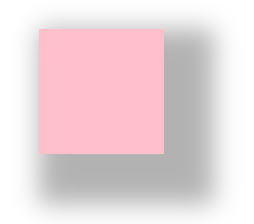

#####文字阴影

在CSS3中，可以使用`text-shadow`属性将阴影应用于文本

语法：

```css
text-shadow: h-shadow v-shadow blur color;
```

参数意义与盒子阴影相同


### 浮动

####传统网页布局的三种方式

网页布局的本质-用CSS来摆放盒子。把盒子摆放到相应位置

CSS提供了三种传统布局方式（简单说，就是盒子如何进行排列排序）

+ 普通流（标准流）
+ 浮动
+ 定位

#### 标准流（普通流、文档流）

所谓的标准流：就是标签按照规定好默认方式排列

1. 块级元素会独占一行，从上向下顺序排列

+ 常用元素：`div` `hr` `p` `h1~h6` `ul` `ol` `dl` `form` `table`

2. 行内元素会按照顺序，从左到右顺序排列，碰到父元素边缘则自动换行

+ 常用元素：`span` `a` `i` `em` 等

以上都是标准流布局，前面学习的就是标准流，标准流是最基本的布局方式

#### 为什么需要浮动？

1. 如何让多个块级盒子（`div`）水平排成一行？

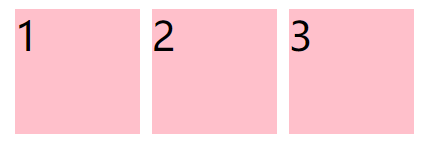

比较难，虽然转换为行内元素可以实现一行显示，但是它们之间会有大的空白缝隙，很难控制

2. 如何实现两个盒子的左右对齐？

总结：有很多的布局效果，标准流没有办法完成，此时就可以利用浮动完成布局。因为浮动可以改变元素标签默认的排列方式

浮动最典型的应用：可以让多个块级元素一行内排列显示

网页布局第一准则：多个块级元素纵向排列找标准流，多个块级元素横向排列找浮动

网页布局第二准则：先设置盒子大小，之后设置盒子的位置

#### 什么是浮动？

`float`属性用于创建浮动框，将其移动到一边，直到左边缘或者右边缘触及包含块或另一个浮动框的边缘

语法：

```css
选择器 {
    float: 属性值;
}
```

| 属性值  | 描述                 |
| ------- | -------------------- |
| `none`  | 元素不浮动（默认值） |
| `left`  | 元素向左浮动         |
| `right` | 元素向右浮动         |

#### 浮动特性

加了浮动之后的元素，会具有很多特性，需要掌握

1. 浮动元素会脱离标准流

设置了浮动（`float`）的元素最重要特性：

+ 脱离标准普通流的控制（浮）移动到指定位置（动），（俗称脱标）

+ 浮动的盒子不再保留原先的位置

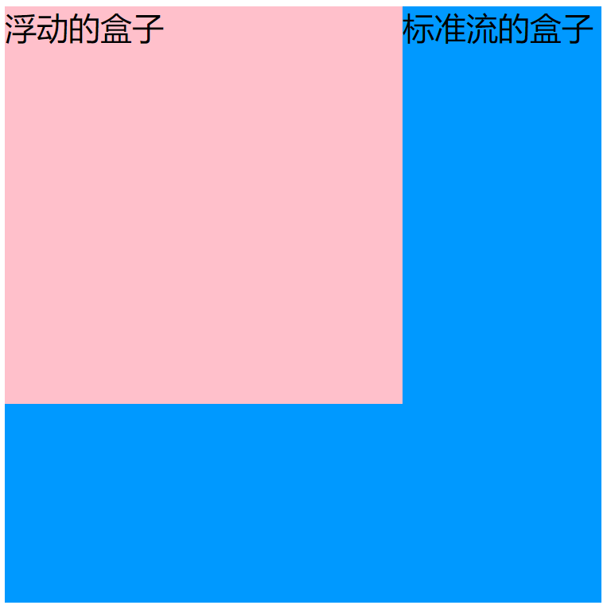

2. 浮动的元素会一行内显示并且元素顶部对齐

注意：浮动的元素是互相贴靠在一起的（不会有缝隙），如果父级宽度装不下这些浮动的盒子，多出的盒子会另起一行对齐

3. 浮动的元素会具有行内块元素的特性

任何元素都可以浮动。不管原先是什么模式的元素，添加浮动之后具有行内块元素相似的特性

+ 如果块级盒子没有设置宽度，默认宽度和父级一样宽，但是添加浮动后，它的大小根据内容来决定
+ 浮动的盒子中间是没有缝隙的，是紧挨着一起的
+ 行内元素同理

#### 浮动元素经常和标准流父级搭配使用

为了约束浮动元素位置，网页布局一般采取的策略是：

先用标准流的父元素排列上下位置，之后内部子元素采取浮动排列左右位置，符合网页布局第一准则

#### 常见网页布局

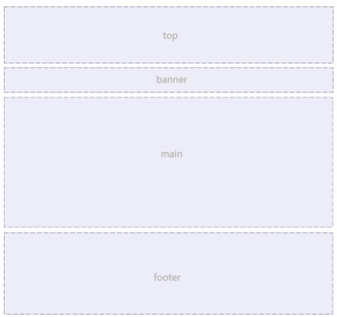

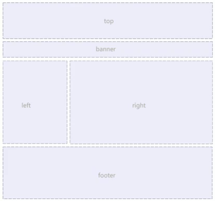

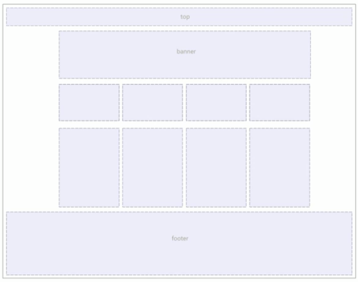

#### 浮动布局注意点

1. 浮动和标准流的父盒子搭配

先用标准流的父元素排列上下位置，之后内部子元素采取浮动排列左右位置

2. 一个元素浮动了，理论上其余的兄弟元素也要浮动

一个盒子里面有多个子盒子，如果其中一个盒子浮动了，那么其它兄弟盒子也应该浮动，以防止引起问题

浮动的盒子只会影响浮动盒子后面的标准流，不会影响前面的标准流

#### 清除浮动

由于父盒子很多情况下，不方便给高度，但是子盒子浮动又不占有位置，最后父级盒子高度为0时，就会影响下面的标准流盒子

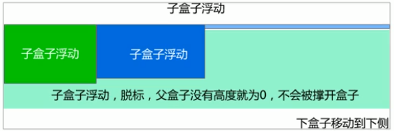

+ 由于浮动元素不再占用原文档流的位置，所以它对后面的元素排版产生影响

##### 清除浮动本质

+ 清除浮动的本质是清除浮动元素造成的影响
+ 如果父盒子本身有高度，则不需要清除浮动
+ 清除浮动之后，父级就会根据浮动的子盒子自动检测高度。父级有了高度，就不会影响下面的标准流了

##### 清除浮动

语法：

```css
选择器 {
    clear: 属性值;
}
```

| 属性值  | 描述                                       |
| ------- | ------------------------------------------ |
| `left`  | 不允许左侧有浮动元素（清除左侧浮动的影响） |
| `right` | 不允许右侧有浮动元素（清除右侧浮动的影响） |
| `both`  | 同时清除左右两侧浮动的影响                 |

实际工作中，几乎只用`clear: both;`

清除浮动的策略是：闭合浮动，只让浮动在父盒子内部影响，不影响父盒子外面的其它盒子

##### 清除浮动方法

1. 额外标签法也称为隔离法，是W3C推荐的做法

在浮动元素末尾添加一个空的标签。例如`<div style="clear:both;" ></div>`，或者其它标签（如`<br/>`等）

+ 优点：通俗易懂

+ 缺点：添加许多无意义的标签，结构化较差

注意：新添加的标签必须是块级标签

2. 父级添加`overflow`属性

将属性值设置为`hidden`、`auto`或`scroll`

+ 优点：代码简洁
+ 缺点：无法显示溢出的部分

3. 父级添加`:after`伪元素

`:after`方式是额外标签法的升级版。也是给父元素添加

```css
.clearfix:after {
    content: "";
    display: block;
    height: 0;
    clear: both;
    visibility: hidden;
}
.clearfix {
    *zoom: 1; // IE 6、7专有
}
```

+ 优点：没有增加标签，结构更简单
+ 缺点：照顾低版本浏览器

4. 父级添加双伪元素

```css
.clearfix:before,.clearfix:after {
    content: "";
    display:table; //转换为块级元素并且一行显示
}
.clearfix:after {
    clear: both;
}
.clearfix {
    *zoom: 1;
}
```

+ 优点：代码更简洁
+ 缺点：照顾低版本浏览器
+ 代表网站：小米、腾讯等

### PS切图

PS有很多的切图方式：图层切图、切片切图、PS插件切图等

#### 图层切图

最简单的切图方式：右击图层:arrow_right:快速导出为PNG

但是很多情况下，需要合并图层再导出：

1. 选中需要的图层：图层菜单:arrow_right:合并图层（ctrl+E)
2. 右击:arrow_right:快速导出为PNG

#### 切片切图

1. 利用切片选中图片

+ 利用切片工具手动划出

2. 导出选中的图片

文件菜单&#10142;导出&#10142;存储为web设备所用格式&#10142;选择需要的图片格式&#10142;存储

#### PS插件切图

`Cutterman`是一款运行在`Photoshop`中的插件，能够自动将你需要的图层进行输出，以替代传统的手工“导出web所用格式”以及使用切片工具进行挨个切图的繁琐流程

### 学成在线案例

#### 准备工作

1. 创建study目录文件夹
2. 用vscode打开这个目录文件夹
3. study目录内新建images文件夹，用于保存图片
4. 新建首页文件index.html
5. 新建style.css样式文件
6. 将样式引入到我们的HTML页面文件中
7. 样式表写入清除内外边距的样式，来检测样式表是否引入成功

#### CSS属性书写顺序（重点）

建议遵循以下顺序：

1. 布局定位属性：`display/position/float/clear/visibility/overflow`（建议`display`第一个写，毕竟关系到模式）
2. 自身属性：`width/height/margin/padding/border/background`
3. 文本属性：`color/font/text-decoration/text-align/vertical-align/white-space/break-word`
4. 其它属性（CSS3）：`content/cursor/border-radius/box-shadow/text-shadow/background:linear-gradient...`

####页面布局整体思路

为了提高网页制作的效率，布局时通常有以下的整体思路：

1. 必须确定页面的版心（可视区），测量可得知
2. 分析页面中的行模块，以及每个行模块中的列模块（页面布局第一准则）
3. 一行中的列模块经常浮动布局，先确定每个列的大小，之后确定列的位置（页面布局第二准则）
4. 制作HTML结构，遵循先有结构，后有样式的原则，结构永远最重要
5. 所以，先理清楚布局结构，再写代码尤为重要，需要多写多积累

#### 确定版心

定义版心为公共类

```css
.w {
    width: 1200px;
    margin: auto;
}
```

#### 头部制作

导航栏注意点：

实际开发中，我们不会直接用链接a而是用li包含链接（li+a—）的做法

1. `li+a`语义更清晰，一看这就是有条理的列表型内容
2. 如果直接用`a`，搜索引擎容易辨别为有堆砌关键字嫌疑（故意堆砌关键字容易被搜索引擎有降权的风险），从而影响网站排名

注意：

1. 让导航栏一行显示，给`li`加浮动，因为`li`是块级元素，需要一行显示
2. 这个`nav`导航栏可以不给宽度，将来可以继续添加其余文字
3. 因为导航栏里面文字不一样多，所以做好给链接`a`左右`padding`撑开盒子，而不是指定宽度

### 定位

#### 为什么需要定位？

1. 浮动可以让多个块级盒子一行没有缝隙排列显示，经常用于横向排列盒子
2. 定位则是可以让盒子自由的在某个盒子内移动位置或者固定屏幕中某个位置，并且可以压住其它盒子

#### 定位组成

将盒子定在某一个位置，所以定位也是在摆放盒子，按照定位的方式移动盒子

定位 = 定位模式 + 边偏移

定位模式用于指定一个元素在文档中的定位方式，边偏移则决定了该元素的最终位置

##### 定位模式

决定元素的定位方式，通过CSS的`position`属性来设置，其值可以分为四个：

| 值         | 语义     |
| ---------- | -------- |
| `static`   | 静态定位 |
| `relative` | 相对定位 |
| `absolute` | 绝对定位 |
| `fixed`    | 固定定位 |

##### 边偏移

定位的盒子移动到最终位置，有`top`、`bottom`、`left`和`right`4个属性

| 边偏移属性 | 示例           | 描述                                           |
| ---------- | -------------- | ---------------------------------------------- |
| `top`      | `top: 80px`    | 顶端偏移量，定义元素相对于其父元素上边线的距离 |
| `bottom`   | `bottom: 80px` | 底部偏移量，定义元素相对于其父元素下边线的距离 |
| `left`     | `left: 80px`   | 左侧偏移量，定义元素相对于其父元素左边线的距离 |
| `right`    | `right: 80px`  | 左侧偏移量，定义元素相对于其父元素右边线的距离 |

#### 静态定位 static(了解)

元素的默认定位方式，无定位的意思

语法： 

```css
选择器 {
    position: static;
}
```

+ 静态定位按照标准流特性摆放位置，它没有边偏移
+ 静态定位在布局时很少用到

#### 相对定位 relative(重要)

相对定位是元素在移动位置的时候，是相对于它原来的位置来说的

语法：

```css
选择器 {
    position: relative;
}
```

相对定位的特点：（务必记住）

1. 它是相对于自己原来的位置来移动的（移动位置的时候参照点是自己原来的位置）
2. 原来在标准流的位置继续占有，后面的盒子仍然以标准流的方式对待它（不脱标，继续保留原来位置）

因此，相对定位并没有脱标

#### 绝对定位 absolute(重要)

绝对定位是元素在移动位置的时候，是相对于它祖先元素来说的

语法：

```css
选择器 {
    position: absolute;
}
```

绝对定位的特点：（务必记住）

1. 如果没有祖先元素或者祖先元素没有定位，则以浏览器为准定位（Document文档）
2. 如果祖先元素有定位（相对、绝对、固定定位），则以最近一级的有定位祖先元素为参考点移动位置
3. 绝对定位不再占有原先的位置（脱标）

#### 子绝父相

子级是绝对定位的话，父级要用相对定位

1. 子级绝对定位，不会占有位置，可以放到父盒子里面的任何一个地方，不会影响其它的兄弟盒子
2. 父盒子需要加定位限制子盒子在父盒子内显示
3. 父盒子布局时，需要占有位置，因此父亲只能是相对定位

相对定位经常用来作为绝对定位的父级

总结：因为父级需要占有位置，因此是相对定位，子盒子不需要占有位置，则是绝对定位

当然，子绝父相不是永远不变的，如果父元素不需要占有位置，子绝父绝也会遇到

#### 固定定位fixed(重要)

固定定位是元素固定于浏览器可视区的位置。主要使用场景：可以在浏览器页面滚动时元素的位置不会改变

语法：

```css
选择器 {
    position: fixed;
}
```

固定定位的特点：（务必记住）

1. 以浏览器的可视窗口为参照点移动元素

+ 跟父元素没有任何关系
+ 不随滚动条滚动

2. 固定定位不再占有原先的位置

固定定位也是脱标的，其实固定定位也可以看作是一种特殊的绝对定位

固定定位小技巧：固定在版心右侧位置

小算法：

1. 让固定定位的盒子`left: 50%;`.走到浏览器可视区的一半位置
2. 让固定定位的盒子`margin-left:版心宽度的一半距离`，多走版心宽度的一半位置

就可以让固定定位的盒子贴着版心右侧对齐了

#### 粘性定位sticky(了解)

粘性定位可以被认为是相对定位和固定定位的混合

语法：

```css
选择器 {
    position: sticky;
    top: 10px;
}
```

粘性定位的特点：

1. 以浏览器的可视窗口为参照点移动元素（固定定位特点）
2. 粘性定位占有原先的位置（相对定位特点）
3. 必须添加`top、 left、right、bottom`其中一个才有效

跟页面滚动搭配使用。兼容性较差，IE不支持

#### 定位叠放次序 z-index

在使用定位布局时，可能会出现盒子重叠的情况。此时，可以使用`z-index`来控制盒子的前后次序（z轴）

语法：

```css
选择器 {
    z-index: 1;
}
```

+ 数值可以是正整数、负整数或0，默认是auto，数值越大，盒子越靠上
+ 如果属性值相同，则按照书写顺序，后来居上
+ 只有定位的盒子才有`z-index`属性

#### 定位的拓展

##### 绝对定位的盒子居中

加了绝对定位的盒子不能通过`margin: 0 auto;`水平居中，但是可以通过以下计算方法实现水平和垂直居中

1. `left: 50%;` 让盒子的左侧移动到父级元素的水平中心位置
2. `margin-left: -100px;` 让盒子向左移动自身宽度的一半

##### 定位特殊特性

绝对定位和固定定位也和浮动类似

1. 行内元素添加绝对或者固定定位，可以直接设置高度和宽度
2. 块级元素添加绝对或者固定定位，如果不给宽度或者高度，默认大小是内容的大小（脱离标准流）

##### 脱标的盒子不会触发外边距塌陷

浮动元素、绝对定位、固定定位元素都不会触发外边距合并的问题

##### 绝对定位（固定定位）会完全压住盒子

浮动元素不同，只会压住它下面标准流的盒子，但是不会压住下面标准流盒子里面的文字（图片）

但是绝对定位（固定定位）会压住下面标准流所有的内容

浮动之所以不会压住文字，因为浮动产生的目的最初是为了做文字环绕效果的

### 网页布局总结

通过盒子模型，清楚知道大部分html标签是一个盒子

通过CSS浮动、定位可以让每个盒子排列成为网页

一个完整的网页，是标准流、浮动、定位一起完成布局的，每个都有自己的专门用法

1. 标准流

可以让盒子上下排列或者左右排列，垂直的块级盒子显示就用标准流布局

2. 浮动

可以让多个块级元素一行显示或者左右对齐盒子，多个块级盒子水平显示就用浮动布局

3. 定位

定位最大的特点是有层叠的概念，就是可以让多个盒子前后叠压来显示，如果元素自由在某个盒子内移动就用定位布局

### 元素的显示与隐藏

类似网站广告，点击关闭就不见了，但是重新刷新页面，会重新出现！

本质：让一个元素在页面中隐藏或者显示出来

1. `display`显示隐藏

用于设置一个元素应如何显示

+ `display: none;` 隐藏对象
+ `display: block;` 除了转换为块级元素之外，同时还有显示元素的意思

`display`隐藏元素后，不再占有原来的位置。后面应用极其广泛，搭配JS可以做很多的网页特效

2. `visibility`显示隐藏

用于指定一个元素应可见还是隐藏

+ `visibility: visible;` 元素可视
+ `visibility: hidden;` 元素隐藏

`visibility`隐藏元素后，继续占有原来的位置

3. `overflow`溢出显示隐藏

指定了如果内容溢出一个元素的框（超过其指定高度及宽度）时，会发生什么

| 属性值    | 描述                                       |
| --------- | ------------------------------------------ |
| `visible` | 不剪切内容也不添加滚动条                   |
| `hidden`  | 不显示超过对象尺寸的内容，超出的部分隐藏掉 |
| `scroll`  | 不管超出内容否，总是显示滚动条             |
| `auto`    | 超出自动显示滚动条，不超出不显示滚动条     |

一般的情况下，都不想让溢出的内容显示出来，因为溢出的部分会影响布局

但是如果有定位的盒子，请慎用`overflow:hidden`因为它会隐藏多余的部分

### 精灵图

1. 为什么需要精灵图？

一个网页中往往会应用很多小的背景图像作为装饰，当网页中的图像过多时，服务器就会频繁地接收和发送请求图片，造成服务器请求压力过大，这将大大降低页面地加载速度

因此，为了有效地减少服务器接收和发送请求地次数，提高页面地加载速度，出现了CSS精灵技术

核心原理：将网页中的一些小背景图像整合到一张大图中，这样服务器只需要一次请求就可以了

2. 精灵图的使用

使用精灵图核心：

（1）精灵图主要针对于背景图片使用，就是把多个小背景图片整合到一张大图片中

（2）这张大图片也称为sprites精灵图或者雪碧图

（3）移动背景图片位置，此时可以使用`background-position`

（4）移动的距离就是这个目标图片的`x`和`y`坐标，注意网页中的坐标有所不同

（5）因为一般情况下都是往上往左移动，所以数值是负值

### 字体图标

使用场景：主要用于显示网页中通用、常用的一些小图标

精灵图是有诸多优点的，但是缺点很明显

1. 图片文件还是比较大的
2. 图片本身放大和缩小会失真
3. 一旦图片制作完毕想要更换非常复杂

此时，有一种技术的出现很好地解决了以上问题，就是字体图标`iconfont`

字体图标可以为前端工程师提供一种方便高效的图标使用方式，展示的是图标，本质属于字体

**字体图标的优点**

+ 轻量级：一个图标字体要比一系列的图像要小，一旦字体加载了，图标就会马上渲染出来，减少了服务器请求
+ 灵活性：本质其实是文字，可以很随意的改变颜色，产生阴影，透明效果，旋转等
+ 兼容性：几乎支持所有的浏览器，放心使用

注意：字体图标不能替代精灵技术，只是对工作中图标部分技术的提升和优化

总结：

（1）如果遇到一些结构和样式比较简单的小图标，就用字体图标

（2）如果遇到一些结构和样式复杂一点的小图片，就用精灵图

**使用字体图标**

+ 字体图标的下载

`icomoon字库` <http://icomoon.io>

`阿里 iconfont字库` <http://www.iconfont.cn/>

+ 字体图标的引入（引入到html页面中）

把下载包里面的`fonts`文件夹放入页面根目录下

在CSS样式中全局声明字体：简单理解把这些字体文件通过CSS引入到页面中

一定注意字体文件路径的问题

```css
@font-face {
  font-family: 'icomoon';
  src:  url('fonts/icomoon.eot?wgp6fr');
  src:  url('fonts/icomoon.eot?wgp6fr#iefix') format('embedded-opentype'),
    url('fonts/icomoon.ttf?wgp6fr') format('truetype'),
    url('fonts/icomoon.woff?wgp6fr') format('woff'),
    url('fonts/icomoon.svg?wgp6fr#icomoon') format('svg');
  font-weight: normal;
  font-style: normal;
  font-display: block;
}
//上述代码可以直接在style.css文件中复制
```

+ 字体图标的追加（以后添加新的小图标）

如果工作中，原来的字体图标不够用了，我们需要添加新的字体图标到原来的字体文件中

把压缩包里面的`selection.json`重新上传，然后选择自己想要的新的图标，重新下载安装包，并替换原来的文件即可

### CSS三角

网页中常见一些三角形，使用CSS直接画出来就可以，不必做成图片或者字体图标

```css
.box2 {
            width: 0;
            height: 0;
            border: 50px solid transparent;
            border-top-color: pink;
            margin: 100px auto;
 }
```

### CSS用户界面样式

所谓的界面样式，就是更改一些用户操作样式，以便提高用户体验

+ 更改用户的鼠标样式

```css
li {
    cursor: pointer;
}
```

设置或检索在对象上移动的鼠标指针采用何种系统预定义的光标形状

| 属性值        | 描述          |
| ------------- | ------------- |
| `default`     | 小白箭头 默认 |
| `pointer`     | 小手          |
| `move`        | 移动          |
| `text`        | 文本          |
| `not-allowed` | 禁止          |

+ 表单轮廓线 `outline`

给表单添加`outline:0;` 或者`outline:none;` 样式之后，就可以去掉默认的蓝色边框

```css
input {
    outline: none;
}
```

+ 防止表单域拖拽

```css
textarea {
    resize: none;
}
```

### `vertical-align`属性应用

CSS的`vertical-align`属性使用场景：经常用于设置图片或者表单（行内块元素）和文字垂直对齐

官方解释：用于设置一个元素的垂直对齐方式，但是它只针对于行内元素或者行内块元素有效

语法：

```css
vertical-align: baseline | top | middle | bottom
```

| 值         | 描述                                   |
| ---------- | -------------------------------------- |
| `baseline` | 默认，元素放置在父元素的基线上         |
| `top`      | 把元素的顶端与行中最高元素的顶端对齐   |
| `middle`   | 把此元素放置在父元素的中部             |
| `bottom`   | 把元素的顶端与行中最低的元素的顶端对齐 |


图片、表单都属于行内块元素，默认的`vertical-align`是基线对齐，此时给图片、表单这些行内块元素的`vertical-align`属性设置为`middle`就可以让文字和图片垂直居中对齐了

**解决图片底部默认空白缝隙问题**

bug:图片底侧会有一个空白缝隙，原因是行内块元素会和文字的基线对齐

主要解决方法有两种：

1. 给图片添加`vertical-align: middle | top | bottom`等（提倡使用）
2. 把图片转换为块级元素`display:block;`

### 溢出的文字省略号显示

1. 单行文本溢出显示省略号

必须满足三个条件

```css
/* 1. 先强制一行内显示文本 默认normal自动换行 */
white-space: nowrap;
/* 2.超出的部分隐藏 */
overflow: hidden;
/* 3.文字用省略号替代超出的部分 */
text-overflow: ellipsis;
```

2. 多行文本溢出显示省略号

多行文本溢出显示省略号，有较大兼容性问题，适合于webKit浏览器或移动端（移动端大部分是webKit内核）

```css
overflow: hidden;
text-overflow: ellipsis;
/* 弹性伸缩盒子模型显示 */
display: -webkit-box;
/* 限制在一个块元素显示的文本的行数 */
-webkit-line-clamp: 2;
/* 设置或检索伸缩盒对象的子元素的排列方式 */
-webkit-box-orient: vertical;
```

### 常见布局技巧

1. `margin`负值的运用

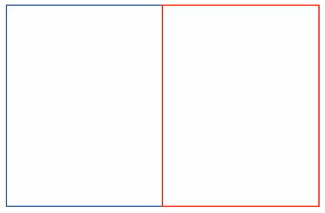

(1)让每个盒子`margin`往左侧移动-1px 正好压住相邻盒子边框

(2)鼠标经过某个盒子的时候，提高当前盒子的层级即可（如果没有用定位，则加相对定位（保留位置），如果有定位，则加`z-index`）

2. 文字围绕浮动元素

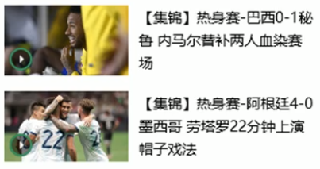

巧妙运用浮动元素不会压住文字的特性

3. 行内块的巧妙运用

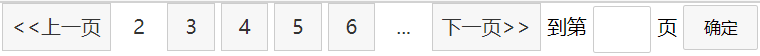

4. CSS三角强化


代码：

```css
width:0;
height:0;
border-color: transparent red transparent transparent;
border-style:solid;
border-width:22px 8px 0 0;
```

### CSS初始化

不同浏览器对有些标签的默认值是不同的，为了消除不同浏览器对HTML文本呈现的差异，照顾浏览器的兼容，需要对CSS初始化

简单理解：CSS初始化是指重设浏览器的样式（也称为CSS reset)

每个网页都必须首先进行CSS初始化

以京东CSS初始化代码为例

```css
/* 把我们所有标签的内外边距清零 */
* {
    margin: 0;
    padding: 0
}
/* em 和 i 斜体的文字不倾斜 */
em,
i {
    font-style: normal
}
/* 去掉li的小圆点 */
li {
    list-style: none
}

img {
    /* border 0 照顾低版本浏览器 如果图片外面包含了链接会有边框的问题 */
    border: 0;
    /* 取消图片底侧有空白缝隙的问题 */
    vertical-align: middle
}

button {
    /* 当鼠标经过button 按钮的时候，鼠标变成小手 */
    cursor: pointer
}

a {
    color: #666;
    text-decoration: none
}

a:hover {
    color: #c81623
}

button,
input {
    /* \5B8B\4F53 就是宋体 提高浏览器兼容性 */
    font-family: Microsoft YaHei, Heiti SC, tahoma, arial, Hiragino Sans GB, "\5B8B\4F53", sans-serif
}

body {
    /* 抗锯齿性 让文字显示更加清晰 CSS3 */
    -webkit-font-smoothing: antialiased;
    background-color: #fff;
    font: 12px/1.5 Microsoft YaHei, Heiti SC, tahoma, arial, Hiragino Sans GB, "\5B8B\4F53", sans-serif;
    color: #666
}

.hide,
.none {
    display: none
}
/* 清除浮动 */
.clearfix:after {
    visibility: hidden;
    clear: both;
    display: block;
    content: ".";
    height: 0
}
.clearfix {
    *zoom: 1
}
```

Unicode编码字体：

把中文字体的名称用相应的Unicode编码来代替，这样就可以有效的避免浏览器解释CSS代码时候出现乱码的问题

比如：

黑体 `\9ED1\4F53`

宋体 `\5B8B\4F53`

微软雅黑 `\5FAE\8F6F\96C5\9ED1`

## HTML5和CSS3提高

### HTML5新特性

新增特性主要针对于以前的不足，增加了一些新的标签、新的表单和新的表单属性等

这些新特性都有兼容性问题，基本都是IE9+以上版本的浏览器才支持，如果不考虑兼容性问题，可以大量使用这些新特性

声明：

1. 新特性增加了很多，但是专注于开发常用的新特性
2. 后面学习其它新特性

#### HTML5新增的语义化标签

以前布局，基本使用`div`来做。`div`对于搜索引擎来说，是没有语义的

+ `<header>` 头部标签
+ `<nav>` 导航标签
+ `<article>` 内容标签
+ `<section>` 定义文档某个区域
+ `<aside>` 侧边栏标签
+ `<footer>` 尾部标签


注意：

+ 这种语义化标准主要是针对搜索引擎的
+ 这些新标签页面中可以使用多次
+ 在IE9中，需要把这些元素转换为块级元素
+ 移动端不需要考虑兼容性，使用起来更方便

#### HTML5新增的多媒体标签

使用它们可以很方便地在页面中嵌入音频和视频，而不是去使用flash和其它浏览器插件，但是支持地格式是有限的。

新增的多媒体标签主要包含两个：

1. 音频 `<audio>`

当前`<video>`元素支持三种视频格式：尽量使用mp4格式

语法：

```css
<video src="文件地址" controls="controls"></video>
```

```css
<video controls="controls" width="300">
    <source src="move.ogg" type="video/ogg">
    <source src="move.mp4" type="video/mp4">
    您的浏览器暂不支持video标签播放视频 
</video>
```

常见属性：

| 属性       | 值                                      | 描述                                                            |
| ---------- | --------------------------------------- | --------------------------------------------------------------- |
| `autoplay` | `autoplay`                              | 视频就绪自动播放（谷歌浏览器需要添加`muted`来解决自动播放问题） |
| `controls` | `controls`                              | 向用户显示播放控件                                              |
| `width`    | `pixels`像素                            | 设置播放器宽度                                                  |
| `height`   | `pixels`像素                            | 设置播放器高度                                                  |
| `loop`     | `loop`                                  | 播放完是否继续播放该视频，循环播放                              |
| `preload`  | `auto` 预先加载视频 `none` 不应加载视频 | 规定是否预加载视频（如果有了`autoplay` 就忽略该属性）           |
| `src`      | `url`                                   | 视频`url`地址                                                   |
| `poster`   | `imgurl`                                | 加载等待的画面图片                                              |
| `muted`    | `muted`                                 | 静音播放                                                        |


2. 视频 `<video>`

当前`<audio>`元素支持三种音频格式：

`mp3` `wav` `ogg`

语法：

```css
<audio src="文件地址" controls="controls"></audio>
```

```css
<audio controls>
  <source src="horse.ogg" type="audio/ogg">
  <source src="horse.mp3" type="audio/mpeg">
您的浏览器不支持 audio 元素。
</audio>
```

常见属性

| 属性       | 值         | 描述                                           |
| ---------- | ---------- | ---------------------------------------------- |
| `autoplay` | `autoplay` | 如果出现该属性，则音频在就绪后马上播放         |
| `controls` | `controls` | 如果出现该属性，则向用户显示控件，比如播放按钮 |
| `loop`     | `loop`     | 如果出现该属性，则每当音频结束时重新开始播放   |
| `src`      | `url`      | 要播放的音频的URL                              |

谷歌浏览器把音频和视频自动播放禁止了


#### HTML5新增的`input`类型

| 属性值            | 说明                        |
| ----------------- | --------------------------- |
| `type="email"`    | 限制用户输入必须为Email类型 |
| `type="url"`      | 限制用户输入必须为URL类型   |
| `type="date"`     | 限制用户输入必须为日期类型  |
| ``type="time"``   | 限制用户输入必须为时间类型  |
| `type="month"`    | 限制用户输入必须为月类型    |
| `type="week"`     | 限制用户输入必须为周类型    |
| ``type="number"`` | 限制用户输入必须为数字类型  |
| ``type="tel"``    | 手机号码                    |
| ``type="search"`` | 搜索框                      |
| ``type="color"``  | 生成一个颜色选择表单        |

#### HTML5新增表单属性

| 属性           | 值        | 说明                                                                                                                                                                                    |
| -------------- | --------- | --------------------------------------------------------------------------------------------------------------------------------------------------------------------------------------- |
| `required`     | required  | 表单拥有该属性表示其内容不能为空，必填                                                                                                                                                  |
| `placeholder`  | 提示文本  | 表单的提示信息，存在默认值将不显示                                                                                                                                                      |
| `autofocus`    | autofocus | 自动聚焦属性，页面加载完成自动聚焦到指定表单                                                                                                                                            |
| `autocomplete` | off/on    | 当用户在字段开始键入时，浏览器基于之前键入过的值，应该显示出在字段中填写的选项。默认已经打开，如autocomplete="on"，关闭autocomplete="off"需要放在表单内，同时加上name属性，同时成功提交 |
| `multiple`     | multiple  | 可以多选文件提交                                                                                                                                                                        |

可以通过以下设置方式修改placeholder里面的字体颜色：

```css
input::placeholder {
    color:pink;
}
```

### CSS3新特性

#### CSS3新增选择器

1. **属性选择器**

属性选择器可以根据元素特定属性来选择元素，这样可以不用借助于类或者id选择器

| 选择符          | 简介                                  |
| --------------- | ------------------------------------- |
| `E[att]`        | 选择具有att属性的E元素                |
| `E[att="val"]`  | 选择具有att属性且属性值等于val的E元素 |
| `E[att^="val"]` | 选择具有att属性且值以val开头的E元素   |
| `E[att$="val"]` | 选择具有att属性且值以val结尾的E元素   |
| `E[att*="val"]` | 选择具有att属性且值中含有val的E元素   |

属性选择器权重为10，跟类选择器相同

2. **结构伪类选择器**

结构伪类选择器主要根据文档结构来选择元素，常用于根据父级选择器里面的子元素

| 选择符             | 简介                          |
| ------------------ | ----------------------------- |
| `E:first-child`    | 匹配父元素中的第一个子元素E   |
| `E:last-child`     | 匹配父元素中的最后一个子元素E |
| `E:nth-child(n)`   | 匹配父元素中的第n个子元素E    |
| `E:first-of-type`  | 指定类型E的第一个             |
| `E:last-of-type`   | 指定类型E的最后一个           |
| `E:nth-of-type(n)` | 指定类型E的第n个              |

`nth-child(n)`选择某个父元素的一个或多个特定的子元素

+ n可以是数字，关键字和公式
+ n如果是数字，就是选择第n个子元素，里面数字从1开始
+ n可以是关键字：even偶数 odd奇数
+ n可以是公式：常见的公式如下（如果n是公式，则从0开始计算，但是第0个元素或者超出了元素的个数会被忽略）

| 公式   | 取值                            |
| ------ | ------------------------------- |
| `2n`   | 偶数                            |
| `2n+1` | 奇数                            |
| `5n`   | 5 10 15 ...                     |
| `n+5`  | 从第5个开始（包含第五个）到最后 |
| `-n+5` | 前5个（包含第5个）...           |

区别：

+ `nth-child`对父元素里面所有孩子排序选择（序号是固定的）先找到第n个孩子，然后看看是否和E匹配

+ `nth-of-type`对父元素里面指定子元素进行排序选择。先去匹配E，然后再根据E找第n个孩子

小结：

+ 结构伪类选择器一般用于选择父级里面的第几个孩子、
+ 关于`nth-child(n)`，要知道n是从0开始计算的

3. **伪元素选择器**

伪元素选择器可以帮助利用CSS创建新标签元素，而不需要HTML标签，从而简化HTML结构

| 选择符     | 简介                     |
| ---------- | ------------------------ |
| `::before` | 在元素内部的前面插入内容 |
| `::after`  | 在元素内部的后面插入内容 |

注意：

+ `before`和`after`创建一个元素，但是属于行内元素
+ 新创建的这个元素在文档树中是找不到的，称为伪元素
+ 语法：`element::before {}`
+ `before`和`after`必须有`content`属性
+ `before`在父元素内容的前面创建元素，`after`在父元素内容的后面插入元素
+ 伪元素选择器和标签选择器一样，权重为1

**伪元素选择器使用场景1：伪元素字体图标**


```css
div::after {
    position: absolute;
    top: 10px;
    right: 10px;
    font-family: 'icomoon';
    content: '\ea3e';
}
```

**伪元素选择器使用场景2：仿土豆效果**


```css
.tudou::before {
    content: '';
    display: none;
    position: absolute;
    top: 0;
    left: 0;
    width: 100%;
    height: 100%;
    background: rgba(0, 0, 0, .4) url(media/arr.png) no-repeat center;
}

.tudou:hover::before {
    display: block;
}
```

**伪元素选择器使用场景3：伪元素清除浮动**

（1) 额外标签法也称为隔墙法，是W3C推荐的做法

（2）父级添加`overflow`属性

（3）父级添加`after`伪元素

（4）父级添加双伪元素

后面两种伪元素清除浮动算是第一种额外标签法的一个升级和优化

```css
.clearfix:after {
    content: ""; //伪元素必须写的属性
    display: block; //插入的元素必须是块级
    height: 0; //不要看见这个元素
    clear: both; //核心代码，清除浮动
    visibility: hidden; //不要看见这个元素
}
.clearfix {
    *zoom: 1; // IE 6、7专有
}
```

#### CSS3盒子模型

CSS3中可以通过`box-sizing`来指定盒子模型，有两个值：即可指定为`content-box`、`border-box`，这样我们计算盒子大小的方式就发生了改变。

可以分成两种情况：

1. `box-sizing: content-box;` 盒子大小为width+padding+border(以前默认的)
2. `box-sizing: border-box;` 盒子大小为width

如果盒子模型改为了`box-sizing: border-box;`，那么`padding`和`border`就不会撑大盒子了（前提`padding`和`border`不会超过`width`宽度）

#### CSS3其它特性（了解）

1. CSS3滤镜filter

filter CSS属性将模糊或颜色偏移等图形效果应用于元素

```css
filter: function();
//for example,  filter:blur(5px); blur模糊处理 数值越大越模糊
```

2. CSS3 calc函数

`calc()` 在声明CSS属性值时执行一些计算

```css
width: calc(100%-80px);
```

#### CSS3过渡（重点）

过渡（transition)是CSS3中具有颠覆性的特征之一，可以在不使用Flash动画或Javascript的情况下，当元素从一种样式变换为另一种样式时为元素添加效果

过渡动画：是从一个状态渐渐的过渡到另外一个状态

可以让页面更好看，更动感十足，虽然低版本浏览器不支持，但是不会影响页面布局

现在经常和`:hover`一起搭配使用

```css
transition: 要过渡的属性 花费时间 运动曲线 何时开始
```

1.属性：想要变化的CSS属性，宽度、高度、背景颜色、内外边距都可以。如果想要所有的属性都变化过渡，写一个all就可以

2.花费时间：单位是秒（必须写单位）比如0.5s

3.运动曲线：默认是ease(可以省略)

4.何时开始：单位是秒（必须写单位） 可以设置延迟触发时间 默认是0s（可以省略）

**谁做过渡，属性就给谁加**

```css
div {
    width: 200px;
    height: 100px;
    background-color: pink;
    transition: width 1s ease 0s, height 1s ease 0s;
}

div:hover {
    width: 400px;
    height: 200px;
}
```

进度条案例

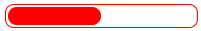

```css
.bar {
    width: 150px;
    height: 15px;
    border: 1px solid red;
    border-radius: 7px;
    padding: 1px;
}

.bar_in {
    width: 50%;
    height: 100%;
    border-radius: 7px;
    background-color: red;
    transition: all .7s;
}

.bar:hover .bar_in {
    width: 100%;
}
```

#### 2D转换

转换(transform)是CSS3中具有颠覆性的特征之一，可以实现元素的位移、旋转、缩放等效果

2D转换是改变标签在二维平面上的位置和形状的一种技术


##### 移动：translate

2D移动是2D转换里面的一种功能，可以改变元素在页面中的位置，类似定位

```css
transform: translate(x,y); 
//或者分开写
transform: translateX(n);
transform: translateY(n);
```

重点：

1. 定义2D转换中的移动，沿着X和Y轴移动元素
2. translate最大的优点：不会影响到其他元素的位置
3. translate中的百分比单位是相对于自身元素的translate:(50%,50%)
4. 对行内标签没有效果

##### 旋转：rotate

```css
transform: rotate(度数);
```

重点：

1. rotate里面跟度数，单位是deg，比如rotate(45deg)

2. 角度为正时，顺时针，负时，为逆时针

3. 默认旋转的中心点是元素的中心点

##### 缩放：scale

```css
transform: scale(x,y);
```

重点：

+ 注意其中的`x`和`y`用逗号分隔
+ `transform: scale(1,1);` 宽和高都放大一倍，相当于没有放大
+ `transform: scale(2,2);` 宽和高都放大了两倍
+ `transform: scale(2);` 只写一个参数，第二个参数则和第一个参数一样
+ `transform: scale(0.5,0.5);` 缩小
+ `scale`缩放最大的优势：可以设置转换中心点缩放，默认以中心点缩放的，而且不影响其它盒子

##### 2D转换中心点`transform-origin`

可以设置元素转换的中心点

```css
transform-origin: x y;
```

重点：

+ 注意后面的参数`x`和`y`用空格隔开
+ `x` `y`默认转换的中心点是元素的中心点(50%,50%)
+ 还可以给`x` `y`设置像素或者方位名词 (top bottom left right center)

##### 2D转换综合写法

注意：

1. 同时使用多个转换，其格式为：`transform:translate() rotate() scale() ...`等
2. 其顺序会影响转换的效果(先旋转会改变坐标轴方向)
3. 当同时有位移和其它属性的时候，位移要放到最前面

#### 动画

是CSS3中具有颠覆性的特征之一，可通过设置多个节点来精确控制一个或一组动画，常用来实现复杂的动画效果。

相比较过渡，动画可以实现更多变化，更多控制，连续自动播放等效果

制作动画分为两步：

1. 先定义动画
2. 再使用(调用)动画

1. 用keyframes定义动画(类似定义类选择器)

```css
@keyframes 动画名称 {
    0% {
        width:100px;
    }
    100% {
        width:200px;
    }
}
```

动画序列：

* 0%是动画的开始，100%是动画的完成，这样的规则就是动画序列
* 在`@keyframes`中规定某项CSS样式，就能创建由当前样式逐渐改为新样式的动画效果
* 动画是使元素从一种样式逐渐变化为另一种样式的效果，可以改变任意多的样式任意多的次数
* 请用百分比来规定变化发生的时间，或用关键字`from`和`to`，等同于`0%`和`100%`

2. 元素使用动画

```css
div {
    width: 200px;
    height: 200px;
    background-color: pink;
    margin: 100px auto;
    /* 调用动画 */
    animation-name: move;
    /* 持续时间 */
    animation-duration: 5s;
}
```

**动画常见属性：**

| 属性                      | 描述                                                         |
| ------------------------- | ------------------------------------------------------------ |
| @keyframes                | 规定动画                                                     |
| animation                 | 所有动画属性的简写属性，除了animation-play-state属性         |
| animation-name            | 规定@keyframes动画的名称(必须的)                             |
| animation-duration        | 规定动画完成一个周期所花费的秒或毫秒，默认是0(必须的)        |
| animation-timing-function | 规定动画的速度曲线，默认是"ease"                             |
| animation-delay           | 规定动画何时开始，默认是0                                    |
| animation-iteration-count | 规定动画被播放的次数，默认是1，还有infinite                  |
| animation-direction       | 规定动画是否在下一周期逆向播放，默认是"normal"，"alternate"逆播放 |
| animation-play-state      | 规定动画是否正在运行或暂停(鼠标放上)，默认是"running"，还有"paused" |
| animation-fill-mode       | 规定动画结束后状态，保持forwards，回到起始backwards          |

**动画简写属性：**

```css
animation: 动画名称 持续时间 运动曲线 何时开始 播放次数 是否反方向 动画起始或者结束的状态
```

**速度曲线细节：**

`animation-timing-function:规定动画的速度曲线，默认是"ease"`

| 值          | 描述                                         |
| ----------- | -------------------------------------------- |
| linear      | 动画从头到尾的速度是相同的，匀速             |
| ease        | 默认，动画以低速开始，然后加快，在结束前变慢 |
| ease-in     | 动画以低速开始                               |
| ease-out    | 动画以低速结束                               |
| ease-in-out | 动画以低速开始和结束                         |
| steps()     | 指定时间函数中的间隔数量(步长)               |

#### 3D转换

特点：

+ 近大远小
+ 物体后面遮挡不可见

**三维坐标系**

+ x轴：水平向右 	注意：x右边是正值，左边是负值
+ y轴：垂直向下     注意：y下面是正值，上面是负值
+ z轴：垂直屏幕     注意：往外面是正值，往里面是负值

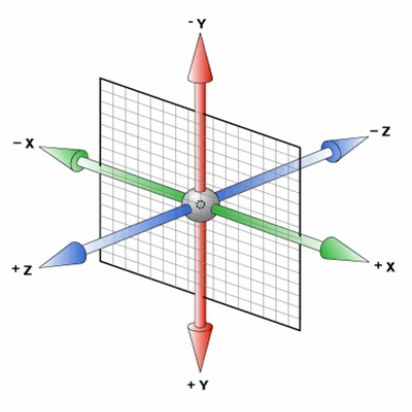

##### 3D位移

3D移动在2D移动的基础上多加了一个可以移动的方向，就是z轴方向

+ `transform:translateX(100px);`仅仅在X轴上移动
+ `transform:translateY(100px);`仅仅在Y轴上移动
+ `transform:translateZ(100px);`仅仅在Z轴上移动(注意：`translateZ`一般用px单位)
+ `transform:translate3d(x,y,z);`其中x,y,z分别指要移动的轴的方向的距离

##### 透视perspective

在2D平面产生近大远小视觉立体，但是只是效果二维的

+ 如果想要在网页产生3D效果需要透视(理解成3D物体投影在2D平面内)
+ 模拟人类的视觉位置，可认为安排一只眼睛去看
+ 透视也称为视距：就是人的眼睛到屏幕的距离
+ 距离视觉点越近的在电脑平面成像越大，越远成像越小
+ 透视的单位是像素

透视写在被观察元素的父盒子上面的

d: 就是视距，视距就是一个距离人的眼睛到屏幕的距离

z:就是z轴，物体距离屏幕的距离，z轴越大(正值)，看到的物体越大

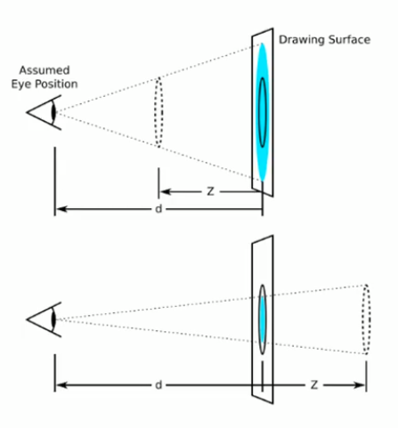

##### 3D旋转 rotate3d

3D旋转指可以让元素在三维平面内沿着x轴，y轴，z轴或者自定义轴进行旋转

语法：

+ `transform:rotateX(45deg);`沿着x轴正方向旋转45度
+ `transform:rotateY(45deg);`沿着y轴正方向旋转45度
+ `transform:rotateZ(45deg);`沿着z轴正方向旋转45度
+ `transform:rotate3d(x,y,z,deg);`沿着自定义轴旋转deg角度

对于元素旋转的方向的判断 需要学习一个左手准则

左手准则

+ 左手的手拇指指向x轴的正方向
+ 其余手指的弯曲方向就是该元素沿着x轴旋转的方向

##### 3D呈现`transform-style`

+ 控制子元素是否开启三维立体环境
+ `transform-style:flat;`子元素不开启3D立体空间 默认的
+ `transform-style:preserve-3d;`子元素开启立体空间
+ 代码写给父级，但是影响的是子盒子
+ 属性很重要，后面必用

### 浏览器私有前缀

浏览器私有前缀是为了兼容老版本的写法，比较新版本的浏览器无须添加

1. 私有前缀

   (1)`-moz-`代表firefox浏览器私有属性

   (2)`-ms-`代表ie浏览器私有属性

   (3)`-webkit-`代表safari、chrome私有属性

   (4)`-o-`代表opera私有属性

2. 提倡的写法

```css
-moz-border-radius: 10px;
-webkit-border-radius: 10px;
-o-border-radius: 10px;
border-radius: 10px;
```


## 品优购

### 网站favicon图标

`favicon.ico`一般用于作为缩略的网站标志，它显示在浏览器的地址栏或者标签上

目前主要的浏览器都支持`favicon.ico`图标

1. 制作favicon图标

（1）把图标切成png图片

（2）把png图片转换为ico图标，这需要借助于第三方转换网站，比如[比特虫](http://www.bitbug.net/)

2. favicon图标放到网站根目录下

3. HTML页面引入favicon图标

在html页面里面的`<head></head>`元素之间引入代码

```css
<link rel="shortcut icon" href="favicon.ico" />
```

### 网站TDK三大标签SEO优化

SEO(Search Engine Optimization)汉译为搜索引擎优化，是一种利用搜索引擎的规则提高网站在有关搜索引擎内自然排名的方式

SEO的目的是对网站进行深度的优化，从而帮助网站获取免费的流量，进而在搜索引擎上提升网站的排名，提高网站的知名度

页面必须有三个标签用来符合SEO优化

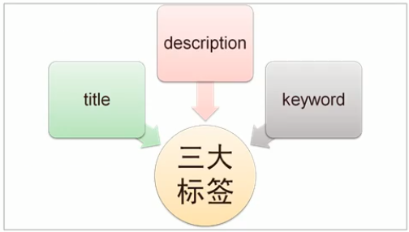

1. title网站标题

title具有不可替代性，是内页的第一个重要标签，是搜索引擎了解网页的入口和对网页主题归属的最佳判断点

建议：**网站名（产品名）- 网站的介绍**（尽量不要超过30个汉字）

2. description网站说明

简要说明网站主要是做什么的

提倡description作为网站的总体业务和主题概括，多采用"我们是..."、"我们提供..."、"xxx网作为..."、"电话:010..."之类语句。

```css
<meta name="description" content="相关描述" />
```

3. keywords关键字

keywords是页面关键词，是搜索引擎的关注点之一

keywords最好限制为6~8个关键词，关键词之间用英文逗号隔开，采用关键词1，关键词2的形式

```css
<meta name="keywords" content="网上购物，网上商城，手机，笔记本，电脑，MP3" />
```

### 模块命名

| 名称             | 说明                  |
| ---------------- | --------------------- |
| 快捷导航栏       | shortcut              |
| 头部             | header                |
| 标志             | logo                  |
| 购物车           | shopcar               |
| 搜索             | search                |
| 热点词           | hotwords              |
| 导航             | naw                   |
| 导航左侧         | dropdown 包含 .dd .dt |
| 导航右侧         | navitems              |
| 页面底部         | footer                |
| 页面底部服务模块 | mod_service           |
| 页面底部帮助模块 | mod_help              |
| 页面底部版权模块 | mod_copyright         |

### LOGO SEO优化

1. logo里面首先放一个`h1`标签，目的是为了提权，告诉搜索引擎，这个地方很重要
2. `h1`里面再放一个链接，可以返回首页的，把logo的背景图片给链接即可
3. 为了让搜索引擎收录，链接里面要放文字（网站名称），但是文字不要显示出来

+ 方法1：`text-indent`移到盒子外面（`text-indent:-9999px`），然后`overflow:hidden`，淘宝的做法
+ 方法2：直接给`font-size:0`就看不到文字了，京东的做法

4. 最后给链接一个`title`属性，这样鼠标放到logo上就可以看到提示文字了

### 注册页类名命名

注册页面：register.html

注意：注册页面比较隐私，为了保护用户信息，不需要对当前页面做SEO优化

| 名称     | 说明         |
| -------- | ------------ |
| 注册专区 | registerarea |
| 注册内容 | reg-form     |
| 错误的   | error        |
| 成功的   | success      |
| 默认的   | default      |
