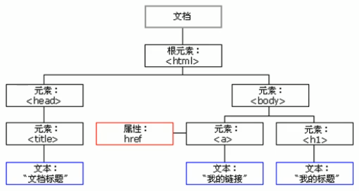

## 初识JavaScript

### JavaScript是什么

+ javascript是一种运行在客户端的脚本语言
+ 脚本语言：不需要编译，运行过程中由js解释器(js引擎)逐行进行解释并执行
+ 现在也可以基于Node.js技术进行服务器端编程

### JavaScript的作用

+ 表单动态校验(密码强度检测)(js产生最初的目的)
+ 网页特效
+ 服务端开发(Node.js)
+ 桌面程序(Electron)
+ App(Cordova)
+ 控制硬件-物联网(Ruff)
+ 游戏开发(cocos2d-js)

### HTML/CSS/JS的关系

HTML/CSS标记语言--描述类语言

+ HTML决定网页结构和内容(决定看到什么)，相当于人的身体
+ CSS决定网页呈现给用户的模样(决定好不好看)，相当于给人穿衣服、化妆

JS脚本语言--编程类语言

实现业务逻辑和页面控制(决定功能)，相当于人的各种动作

### 浏览器执行JS简介

浏览器分成两部分：渲染引擎和JS引擎

+ 渲染引擎：用来解析HTML与CSS，俗称内核，比如chrome浏览器的blink，老版本的webkit
+ JS引擎：也称为JS解释器。用来读取网页中的javascript代码，对其处理后运行，比如chrome浏览器的V8

浏览器本身并不会执行JS代码，而是通过内置JavaScript引擎(解释器)来执行JS代码。JS引擎执行代码时逐行解释每一句源码(转换为机器语言)，然后由计算机去执行，所以JavaScript语言归为脚本语言，会逐行解释执行

### JS的组成


1. ECMAScript是由ECMA国际(原欧洲计算机制造商协会)进行标准化的一门编程语言，这种语言在万维网上应用广泛，它往往被称为JavaScript或JScript，但实际上后两者是ECMAScript语言的实现和扩展


ECMAScript:规定了JS的编程语法和基础核心知识，是所有浏览器厂商共同遵守的一套JS语法工业标准。

2. DOM——文档对象模型

文档对象模型(Document Object Model，简称DOM)，是W3C组织推荐的处理可扩展标记语言的标准编程接口。通过DOM提供的接口可以对页面上的各种元素进行操作(大小、位置、颜色等)

3. BOM——浏览器对象模型

BOM(Browser Object Model，简称BOM)是指浏览器对象模型，它提供了独立于内容的、可以与浏览器窗口进行互动的对象结构。通过BOM可以操作浏览器窗口，比如弹出框、控制浏览器跳转、获取分辨率等

### JS初体验

JS有三种书写位置，分别为行内、内嵌和外部

1. 行内式JS

```javascript
<input type="button" value="点我试试" onclick="alert('Hello World')" />
```

​	(1)可以将单行或少量JS代码写在HTML标签的事件属性中(以on开头的属性)，如:onclick

​	(2)注意单双引号的使用：在HTML中推荐使用双引号，JS中推荐使用单引号

​	(3)可读性差，在html中编写JS大量代码时，不方便阅读

​	(4)引号易错，引号多层嵌套匹配时，非常容易弄混

​	(5)特殊情况下使用

2.  内嵌JS

```javascript
<script>
	alert('Hello World!');    
</script>
```

​	(1)可以将多行JS代码写到`<script>`标签中

​	(2)内嵌JS是学习时常用的方式

3. 外部JS文件

```javascript
<script src="my.js"></script> 
```

​	(1)利用HTML页面代码结构化，把大段JS代码独立到HTML页面之外，既美观，也方便文件级别的复用

​	(2)引用外部JS文件的script标签中间不可以写代码

​	(3)适合于JS代码量比较大的情况

### 注释快捷键

单行注释 ctrl + /

多行注释 shift + alt + a(默认) vscode中修改多行注释的快捷键 ctrl + shift + /

### JavaScript输入输出语句

为了方便信息的输入输出，JS中提供了一些输入输出语句，其常用的语句如下：

| 方法                | 说明                           | 归属   |
| ------------------- | ------------------------------ | ------ |
| `alert(msg);`       | 浏览器弹出警示框               | 浏览器 |
| `console.log(msg);` | 浏览器控制台打印输出信息       | 浏览器 |
| `prompt(info);`     | 浏览器弹出输入框，用户可以输入 | 浏览器 |

## 变量

变量：用于存放数据的容器，通过变量名获取数据，甚至数据可以修改

本质：变量是程序在内存中申请的一块用来存放数据的空间

变量在使用时分为两步：1.声明变量 2.赋值

### 声明变量

```javascript
var age;
```

+ `var`是一个JS关键字，用来声明变量(variable变量的意思)。使用该关键字声明变量后，计算机会自动为变量分配内存空间
+ age是程序员定义的变量名，要通过变量名来访问内存中分配的空间

```javascript
var age = 18;
```

声明一个变量并赋值，称之为变量的初始化

### 变量语法扩展

1. 更新变量

一个变量被重新赋值后，它原有的值就会被覆盖，变量值将以最后一次赋的值为准

2. 同时声明多个变量

同时声明多个变量时，只需要写一个var，多个变量名之间使用英文逗号隔开

```javascript
var age = 10, name = 'wz', sex = 2;
```

3. 声明变量的特殊情况

| 情况                          | 说明                   | 结果      |
| ----------------------------- | ---------------------- | --------- |
| `var age; console.log(age);`  | 只声明 不赋值          | undefined |
| `console.log(age);`           | 不声明 不赋值 直接使用 | 报错      |
| `age = 10; console.log(age);` | 不声明 只赋值          | 10        |

### 变量命名规范

+ 由字母(A-Z,a-z)、数字(0-9)、下划线(_)、美元符号($)组成，如：usrAge,num01,__name
+ 严格区分大小写，var app;和var App;是两个变量
+ 不能以数字开头，18age 是错误的
+ 不能是关键字、保留字。例如var、for、while
+ 变量名必须有意义。MMD BBD
+ 遵守驼峰命名法。首字母小写，后面单词的首字母需要大写。myFirstName

## 数据类型

### 变量的数据类型

变量是用来存储值的所在处，有名字和数据类型。变量的数据类型决定了如何将代表这些值的位存储到计算机的内存中。JavaScript是一种弱类型或者说动态语言。这意味着不用提前声明变量的类型，在程序运行过程中，类型会被自动确定。

```javascript
var age = 10;
var str = 'abc';
```

在代码运行时，变量的数据类型是由JS引擎根据`=`右边变量值的数据类型来判断的，运行完毕之后，变量就确定了数据类型。

JavaScript拥有动态类型，同时也意味着相同的变量可用作不同的类型

```javascript
var x = 6;
x = 'Bill';
```

### 数据类型的分类

JS把数据类型分为两类：

+ 简单数据类型(`Number,String,Boolean,Undefined,Null`)
+ 复杂数据类型(`object`)

| 简单数据类型 | 说明                                                    | 默认值    |
| ------------ | ------------------------------------------------------- | --------- |
| `Number`     | 数字型，包含整型值和浮点型值，如21、0.21                | 0         |
| `Boolean`    | 布尔值类型，如`true、false`，等价于1和0                 | false     |
| `String`     | 字符串类型，注意JS里面，字符串都带引号                  | ''        |
| `Undefined`  | `var a;` 声明了变量a，但是没有给值，此时`a = undefined` | undefined |
| `Null`       | `var a = null;` 声明了变量a为空值                       | null      |

#### 数字型Number

1. 数字型进制

最常见的进制有二进制、八进制、十进制、十六进制

```javascript
// 1. 八进制 0 ~ 7 程序里面数字前面加0 表示八进制
var num1 = 010;
console.log(num1);
// 2. 十六进制 0 ~ 9 a ~ f 数字的前面加0x表示十六进制
var num3 = 0x9a;
console.log(num3)
```

在JS中八进制前面加`0`，十六进制前面加`0x`

2. 数字型范围

JavaScript中数值的最大和最小值

```javascript
// 3.数字型的最大值
console.log(Number.MAX_VALUE); // 1.7976931348623157e+308
// 4. 数字型的最小值
console.log(Number.MIN_VALUE); // 5e-324
```

3. 数字型的三个特殊值

```javascript
// 5. 无穷大
console.log(Number.MAX_VALUE * 2); // Infinity 无穷大
// 6. 无穷小
console.log(-Number.MAX_VALUE * 2); // -Infinity 无穷小
// 7. 非数字
console.log('abc' - 100); // NaN
```

+ Infinity,代表无穷大，大于任何数值
+ -Infinity,代表无穷小，小于任何数值
+ NaN，Not a number,代表一个非数值

4. isNaN()

这个方法用来判断非数字 并且返回一个值 如果是数字返回的是false 如果不是数字返回的是true

#### 字符串型 `String`

字符串型可以是引号中的任意文本，其语法为双引号""和单引号''

1. 字符串引号嵌套

JS可以用单引号嵌套双引号，或者用双引号嵌套单引号(外双内单，外单内双)

```javascript
var strMsg = 'abc"de"fgh';
var strMsg2 = "abc'de'fgh";
```

2. 字符串转义符

类似HTML中的特殊字符，字符串中也有特殊字符，称之为转义符

转义符都是`\`开头的，常用的转义符及其说明如下：

| 转义符 | 解释说明                     |
| ------ | ---------------------------- |
| `\n`   | 换行符， n 是 newline 的意思 |
| `\\`   | 斜杠 \                       |
| `\'`   | ' 单引号                     |
| `\"`   | " 双引号                     |
| `\t`   | tab 缩进                     |
| `\b`   | 空格 ， b 是 blank的意思     |

3. 字符串长度

字符串是由若干个字符组成的，这些字符的数量就是字符串的长度，通过字符串的`length`属性可以获取整个字符串的长度

4. 字符串拼接

+ 多个字符串之间可以使用`+`进行拼接，其拼接方式为`字符串 + 任何类型 = 拼接之后的新字符串`
+ 拼接前会把与字符串相加的任何类型转成字符串，再拼接成一个新的字符串

5. 字符串拼接加强

+ 经常会将字符串和变量来拼接，因为变量可以很方便地修改里面地值
+ 变量是不能添加引号的，因为加引号的变量会变成字符串

#### 布尔型 `Boolean`

布尔类型有两个值：true和false，其中true表示真，而false表示假

布尔型和数字型相加时，true的值为1，false的值为0

#### `Undefined`和`Null`

一个声明后没有被赋值的变量会有一个默认值undefined(如果进行相连或者相加时，注意结果)

```javascript
var variable = undefined;
console.log(variable + 'pink'); // undefinedpink
console.log(variable + 1); // NaN
```

一个声明变量给null值，里面存的值为空

```javascript
var space = null;
console.log(space + 'pink'); // nullpink
console.log(space + 1); // 1
```

简单数据类型`null` 返回的是一个空的对象 object

```javascript
var timer = null;
console.log(typeof timer); // object
```

如果有个变量以后打算存储为对象，但是暂时没想好放啥，这个时候就给null


### 获取检测变量的数据类型

1. `typeof`可用来获取检测变量的数据类型

```javascript
var num = 10;
console.log(typeof num); // number
var str = 'pink';
console.log(typeof str); // string
```

2. 字面量

字面量是在源代码中一个固定值的表示法，通俗来说，就是字面量表示如何表达这个值

+ 数字字面量：8，9，10
+ 字符串字面量：'南京'，"长沙"
+ 布尔字面量：true，false

### 数据类型转换

使用表单、prompt获取过来的数据默认是字符串类型的，此时就不能简单的进行加法运算。而需要转换变量的数据类型。通俗来说，就是把一种数据类型的变量转换成另外一种数据类型

通常会实现3种方式的转换：

+ 转换为字符串类型
+ 转换为数字型
+ 转换为布尔型

#### 转换为字符串

| 方式               | 说明                         | 案例                                 |
| ------------------ | ---------------------------- | ------------------------------------ |
| `toString()`       | 转成字符串                   | var num = 1; alert(num.toString());  |
| `String()`强制转换 | 转成字符串                   | var num = 1; alert(String(num));     |
| 加号拼接字符串     | 和字符串拼接的结果都是字符串 | var num = 1; alert(num + '字符串')； |

+ `toString()`和`String()`使用方式不一样
+ 三种转换方式，更喜欢用第三种拼接字符串转换方式，这一种方式也称之为隐式转换

#### 转换为数字型(==重点==)

| 方式                 | 说明                         | 案例                |
| -------------------- | ---------------------------- | ------------------- |
| `parseInt(string)`   | 将string类型转换为整数数字型 | parseInt('78')      |
| `parseFloat(string)` | 将string类型转换为浮点数字型 | parseFloat('78.21') |
| `Number()`强制转换   | 将string类型转换为数字型     | Number('12')        |
| js隐式转换(- * /)    | 利用算术运算隐式转换为数字型 | '12' - 0            |

#### 转换为布尔型

| 方式        | 说明               | 案例             |
| ----------- | ------------------ | ---------------- |
| `Boolean()` | 其它类型转成布尔值 | Boolean('true'); |

+ 代表空、否定的值会被转换为false，如''、0、NaN、null、undefined
+ 其余值都会被转换为true

## 运算符

### 算术运算符

| 运算符 | 描述         |
| ------ | ------------ |
| `+`    | 加           |
| `-`    | 减           |
| `*`    | 乘           |
| `/`    | 除           |
| `%`    | 取余数(取模) |

浮点数值的最高精度是17位小数，但在进行算术计算时其精确度远远不如整数

```javascript
var result = 0.1 + 0.2; // 0.30000000000000004
var res = 0.07 * 100; // 7.000000000000001
```

所以：不要直接判断两个浮点数是否相等

#### 表达式和返回值

表达式：是由数字、运算符、变量等以能求得数值的有意义排列方法所得的组合

简单理解：是由数字、运算符、变量等组成的式子

### 递增和递减运算符概述

如果需要反复给数字变量添加或减去1，可以使用递增(++)和递减(--)运算符来完成。

### 比较运算符

| 运算符名称  | 说明                        | 案例       | 结果  |
| ----------- | --------------------------- | ---------- | ----- |
| `==`        | 判等号(会转型)              | 18 == '18' | true  |
| `===` `!==` | 全等 要求值和数据类型都一致 | 18 == '18' | false |

### 逻辑运算符

#### 短路运算(逻辑中断)

原理:当有多个表达式(值)时，左边的表达式值可以确定结果时，就不再继续运算右边的表达式的值

逻辑与短路运算：如果左边的表达式结果为真 则返回右边表达式 如果左边表达式为假，那么返回左边表达式

逻辑或

+ 语法：表达式1 || 表达式2
+ 如果第一个表达式的值为真，则返回表达式1
+ 如果第一个表达式的值为假，则返回表达式2

```javascript
console.log(123 || 456); // 123
console.log(0 || 456); // 456
console.log(123 || 456 || 789); // 123
```

### 赋值运算符

| 赋值运算符    | 说明                 | 案例                          |
| ------------- | -------------------- | ----------------------------- |
| `=`           | 直接赋值             | var usrName = 'abc';          |
| `+=、-=`      | 加、减一个数后再赋值 | var age = 10; age += 5; // 15 |
| `*=、/=、%=*` | 乘、除、取模后再赋值 | var age = 2; age *= 5; // 10  |

### 运算符优先级

| 优先级 | 运算符     | 顺序             |
| ------ | ---------- | ---------------- |
| 1      | 小括号     | ()               |
| 2      | 一元运算符 | ++ -- !          |
| 3      | 算术运算符 | 先 * / % 后 + -  |
| 4      | 关系运算符 | > >= < <=        |
| 5      | 相等运算符 | == != ===  `!==` |
| 6      | 逻辑运算符 | 先 && 后 \|\|    |
| 7      | 赋值运算符 | =                |
| 8      | 逗号运算符 | ,                |

+ 一元运算符里面的逻辑非优先级很高
+ 逻辑与比逻辑或优先级高

## 流程控制

主要有三种结构，分别是**顺序结构**、**分支结构**和**循环结构**


### 顺序结构

按照代码的先后顺序，依次执行

### 分支结构

JS语言提供了两种分支结构语句

+ **if语句**
+ **switch语句**

#### switch语句

```javascript
switch(表达式) {
    case value1:
        执行语句1；
        break;
    case value2:
        执行语句2；
        break;
    ...
    default:
    	执行最后的语句；
}
```

1. 表达式常写成变量
2. 表达式和value值相匹配的时候是全等，必须是值和数据类型都一致
3. 如果当前的case里面没有break 则不会退出switch 而是继续执行下一个case

## 命名规范以及语法格式

### 标识符命名规范

+ 变量、函数的命名必须要有意义
+ 变量的名称一般用名词
+ 函数的名称一般用动词

### 操作符规范

操作符左右两侧各保留一个空格

## 数组

### 创建数组

#### 利用new创建数组

```javascript
var arr = new Array();
```

#### 利用数组字面量创建数组

```javascript
var arr = [];
var arr1 = [1,2,'abc',true];
```

+ ==js中数组可以同时存放不同数据类型的值==
+ 声明数组并赋值称为数组的初始化
+ 数组的字面量是方括号{}

### 数组长度

`arr.length`

### 数组中新增元素

#### 通过修改==length==长度新增数组元素

+ 可以通过修改length长度来实现数组扩容的目的
+ ==length==属性是可读写的

#### 通过修改索引号 追加数组元素

```javascript
var arr1 = ['red','green','blue'];
arr1[3] = 'pink';
```

## 函数

### 函数使用

1. 声明函数

```javascript
function 函数名() {
    //函数体
}
```

2. 调用函数

 ### 形参和实参

| 参数 | 说明                                                 |
| ---- | ---------------------------------------------------- |
| 形参 | 形式上的参数 函数定义的时候 传递的参数               |
| 实参 | 实际上的参数 函数调用时传递的参数 实参是传递给形参的 |

形参和实参匹配问题

1. 如果实参的个数和形参的个数一致，则正常输出结果
2. 如果实参的个数多于参的个数，会取到形参的个数
3. 如果实参的个数小于形参的个数，多余的形参就是没有值的变量undefined

### 函数返回值

如果有`return` 则返回的是return后面的值 如果函数没有return 则返回undefined

### `arguments`的使用(==伪数组==)

当不确定有多少个参数传递的时候，可以用`arguments`来获取。在JavaScript中，arguments实际上是当前函数的一个内置对象。所有函数都内置了一个arguments对象，arguments对象中存储了传递的所有实参

arguments展现形式是一个伪数组，因此可以进行遍历。伪数组具有以下特点

+ 具有`length`属性
+ 按索引方式储存数据
+ 不具有数组的push，pop等方法

### 函数的两种声明方式

1. 利用函数关键字自定义函数(命名函数)

```javascript
function fn() {}
```

2. 函数表达式(匿名函数)

```javascript
var fun = function(){};
```

+ `fun`是变量名 不是函数名
+ 函数表达式声明方式跟声明变量差不多 只不过变量里面存的是值 而函数表达式里面存的是函数
+ 函数表达式也可以进行传递参数

## 作用域

通常来说，一段程序代码中所用到的名字并不总是有效和可用的，而限定这个名字的可用性的代码范围就是这个名字的作用域。作用域的使用提高了程序逻辑的局部性，增强了程序的可靠性，减少了名字冲突。

### 变量作用域的分类

+ 全局变量
+ 局部变量

#### 全局变量

在全局作用域下声明的变量叫做全局变量(在函数外部定义的变量)

+ 全局变量在代码的任何位置都可以使用
+ 在全局作用域下`var`声明的变量是全局变量
+ 特殊情况下，在函数内不使用`var`声明的变量也是全局变量(不建议使用)

#### 局部变量

在局部作用域下声明的变量叫做局部变量(在函数内部定义的变量)

+ 局部变量只能在该函数内部使用
+ 在函数内部`var`声明的变量是局部变量
+ 函数的形参实际上就是局部变量

#### 全局变量和局部变量的区别

+ 全局变量：在任何一个地方都可以使用，只有在浏览器关闭时才会被销毁，因此比较占内存
+ 局部变量：只在函数内部使用，当其所在的代码块被执行时，会被初始化；当代码块运行结束后，就会被销毁，因此更节省内存空间

### 作用域链

+ 只要是代码，就至少有一个作用域
+ 写在函数内部的局部作用域
+ 如果函数中还有函数，那么在这个作用域中就又诞生一个作用域
+ 根据在内部函数可以访问外部函数变量的这种机制，用链式查找决定哪些数据能被内部函数访问，就称作作用域链

## JavaScript预解析

JS代码是由浏览器中的JS解析器来执行的。JS解析器在运行JS代码的时候分为两步：预解析和代码执行

预解析：js引擎会把js里面所有的var还有function提升到当前作用域的最前面

代码执行：按照代码书写的顺序从上往下执行

预解析分为 变量预解析(变量提升) 和 函数预解析(函数提升)

**变量提升:**就是把所有的变量声明提升到当前作用域最前面 不提升赋值操作

**函数提升:** 就是把所有的函数声明提升到当前作用域的最前面 不调用函数

函数表达式 调用必须写在函数表达式的下面

经典案例：

```javascript
var num = 10;
fun();
function fun() {
    console.log(num);
    var num = 20;
}

//预解析完后
var num;
function fun() {
    var num;
    console.log(num);
    num = 20;
}
num = 10;
fun();

//最后输出undefined
```

```javascript
f1();
console.log(c);
console.log(b);
console.log(a);
function f1() {
    var a = b = c = 9;
    console.log(a);
    console.log(b);
    console.log(c);
}
//预解析完后
function f1() {
    var a;
    a = b = c = 9;
    // 相当于 var a = 9; b = 9; c = 9;
    //集体声明 var a = 9, b = 9, c = 9;
    console.log(a);
    console.log(b);
    console.log(c);
}
f1();
console.log(c);
console.log(b);
console.log(a);

//结果：9 9 9 9 9 a is not defined
```

## 对象

对象由属性和方法组成的

+ 属性：事物的特征，在对象中用属性来表示(常用名词)
+ 方法：事物的行为，在对象中用方法来表示(常用动词)

### 创建对象的三种方式

+ 利用字面量创建对象

对象字面量：就是花括号{}里面包含了表达这个具体事务(对象)的属性和方法。

```javascript
var obj = {
    name: 'wz',
    age: 23,
    sex: 'male',
    sayHi: function() {
        console.log('hi~');
    }
}
```

+ 利用`new Object`创建对象

```javascript
var obj = new Object();
obj.name = 'wz';
obj.age = 18;
obj.sex = '男'；
obj.sayHi = function() {
    console.log('hi~');
}
```

+ 利用构造函数创建对象

构造函数名字首字母要大写，构造函数不需要return 就可以返回结果，调用构造函数必须使用`new`

```javascript
function Star(name, age, sex) {
    this.name = name;
    this.age = age;
    this.sex = sex;
}
var wz = new Star('wz', 18, 'male');
```

#### new关键字执行过程

1. new 构造函数可以在内存中创建了一个空的对象
2. this 就会指向刚才创建的空对象
3. 执行构造函数里面的代码 给这个空对象添加属性和方法
4. 返回这个对象

### 使用对象

+ 使用对象的属性 采用 对象名.属性名 
+ 调用属性还可以使用 对象名['属性名']
+ 调用对象的方法 对象名.方法名()

### 遍历对象属性

`for ... in `语句用于对数组或者对象的属性进行循环操作(for in 里面的变量常用 k 或者 key)

```javascript
var obj = {
    name: 'wz',
    age: 23,
    sex: 'male'
}
for (var k in obj) {
    console.log(k); //得到属性名
    console.log(obj[k]); //得到属性值
}
```

## JavaScript内置对象

分为三种：自定义对象、内置对象、浏览器对象

前面两种对象是JS基础内容，属于ECMAScript;第三个浏览器对象属于JS独有的

### MDN

学习一个内置对象的使用，只要学会其常用成员的使用即可，可以通过查文档学习，可以通过MDN/W3C来查询

Mozilla开发者网络(MDN)提供了有关开发网络技术(Open Web)的信息，包括HTML、CSS和万维网及HTML5应用的API

MDN：(https://developer.mozilla.org/zh-CN/)

### Date()日期对象

是一个构造函数 必须使用`new` 来调用创建日期对象

日期格式化

| 方法名          | 说明                      |
| --------------- | ------------------------- |
| `getFullYear()` | 获取当年                  |
| `getMonth()`    | 获取当月(0-11)            |
| `getDate()`     | 获取当天日期              |
| `getDay()`      | 获取星期几(周日0 到周六6) |
| `getHours()`    | 获取当前小时              |
| `getMinutes()`  | 获取当前分钟              |
| `getSeconds()`  | 获取当前秒钟              |

### 数组对象

#### 检测是否为数组

1. `instanceof` 运算符 可以用来检测是否为数组

```javascript
arr instanceof Array
```

2. `Array.isArray(参数)`

```javascript
Array.isArray(arr)
```

#### 添加删除数组元素的方法

| 方法名              | 说明                                                   | 返回值               |
| ------------------- | ------------------------------------------------------ | -------------------- |
| `push(参数1...)`    | 末尾添加一个或多个元素，注意修改原数组                 | 并返回新的长度       |
| `pop()`             | 删除数组最后一个元素，把数组长度减1 无参数、修改原数组 | 返回它删除的元素的值 |
| `unshift(参数1...)` | 向数组的开头添加一个或更多元素，注意修改原数组         | 并返回新的长度       |
| `shift()`           | 删除数组的第一个元素，数组长度减1 无参数、修改原数组   | 并返回第一个元素的值 |

 #### 数组排序

1. 翻转数组

```javascript
arr.reverse();
```

2. 数组排序

```javascript
arr.sort(function(a,b) {
    return a-b; //升序
    return b-a; //降序
});
```

#### 返回数组索引

`indexOf(数组元素)` 返回该数组元素的索引号，只返回第一个满足条件的索引号 找不到返回-1

`lastIndexOf(数组元素)` 从后面开始查找

#### 数组转换为字符串

| 方法名           | 说明                                       | 返回值         |
| ---------------- | ------------------------------------------ | -------------- |
| `toString()`     | 把数组转换成字符串，逗号分隔每一项         | 返回一个字符串 |
| `join('分隔符')` | 方法用于把数组中的所有元素转换为一个字符串 | 返回一个字符串 |

#### 数组的分隔和合并

| 方法名     | 说明                                     | 返回值                                        |
| ---------- | ---------------------------------------- | --------------------------------------------- |
| `concat()` | 连接两个或多个数组 不影响原数组          | 返回一个新的数组                              |
| `slice()`  | 数组截取`slice(begin,end)`               | 返回被截取项目的新数组                        |
| `splice()` | 数组删除`splice(第几个开始，要删除个数)` | 返回被删除项目的新数组 注意，这个会影响原数组 |

### 字符串对象

#### **基本包装类型**

为了方便操作基本数据类型，JavaScript提供了三个特殊的引用类型：`String` `Number` `Boolean` 

**基本包装类型**就是把简单数据类型包装成为复杂数据类型，这样基本数据类型就有了属性和方法

#### 字符串的不可变

指的是字符串本身的值不可变，虽然看上去可以改变内容，但其实是地址变了，内存中新开辟了一个内存空间

#### 根据字符返回位置

字符串所有的方法，都不会修改字符串本身(字符串是不可变的)，操作完成会返回一个新的字符串

| 方法名                               | 说明                                                         |
| ------------------------------------ | ------------------------------------------------------------ |
| `indexOf('要查找的字符',开始的位置)` | 返回指定内容在原字符串中的位置，如果找不到就返回-1，开始的位置是index索引号 |
| `lastIndexOf()`                      | 从后往前找，只找第一个匹配的                                 |

#### 根据位置返回字符

| 方法名              | 说明                                     | 使用                          |
| ------------------- | ---------------------------------------- | ----------------------------- |
| `charAt(index)`     | 返回指定位置的字符(index字符串的索引号)  | str.charAt(0)                 |
| `charCodeAt(index)` | 获取指定位置处字符的ASCII码(index索引号) | str.charCodeAt(0)             |
| `str[index]`        | 获取指定位置处字符                       | HTML5,IE8+支持 和charAt()等效 |

#### 字符串操作方法

| 方法名                      | 说明                                                         |
| --------------------------- | ------------------------------------------------------------ |
| `concat(str1,str2,str3...)` | concat()方法用于连接两个或多个字符串。拼接字符串，等效于`+` `+`更常用 |
| `substr(start,length)`      | 从start位置开始，length 取的个数                             |
| `slice(start,end)`          | 从start位置开始，截取到end位置，end取不到                    |
| `substring(start,end)`      | 从start位置开始，截取到end位置，end取不到，基本和slice相同，但是不接受负值 |
| `toUpperCase()`             | 转换大写                                                     |
| `toLowerCase()`             | 转换小写                                                     |

## WEB APIs

JS的组成


+ Web APIs 是W3C组织的标准
+ Web APIs 主要学习DOM和BOM
+ Web APIs JS独有的部分
+ 学习页面交互功能

### Web API

Web API 是浏览器提供的一套操作浏览器功能和页面元素的API(BOM和DOM)

**MDN 详细API:(https://developer.mozilla.org/zh-CN/docs/Web/API)**

### DOM

文档对象模型(Document Object Model，简称DOM)，是W3C组织推荐的处理可扩展标记语言(HTML或者XML)的标准变成接口

W3C已经定义了一系列的DOM接口，通过这些DOM接口可以改变网页的内容、结构和样式

#### DOM树



+ 文档：一个页面就是一个文档，DOM中使用document表示
+ 元素：页面中所有标签都是元素，DOM中使用element表示
+ 节点：网页中的所有内容都是节点(标签、属性、文本、注释等)，DOM中使用node表示

**DOM把以上内容都看做是对象**

#### 获取网页元素

DOM在实际开发中主要用来操作元素

获取页面中的元素可以使用以下几种方式：

+ 根据ID获取
+ 根据标签名获取
+ 通过HTML5新增的方法获取
+ 特殊元素获取

##### 根据ID获取

使用`getElementById()`方法可以获取带有ID的元素对象

```javascript
// 1. 因为文档页面从上往下加载，所以先得有标签 script写到标签的下面
// 2. 参数 id是大小写敏感的字符串
// 3. 返回的是一个元素对象
var timer = document.getElementById('time');
console.log(timer);
console.log(typeof timer);
// 4. console.dir() 打印返回的元素对象 更好的查看里面的属性和方法
console.dir(timer);
```

##### 根据标签名获取

根据 `getElementsByTagName()` 方法可以返回带有指定标签名的对象的集合

```javascript
// 1. 返回的是 获取过来元素对象的集合 以伪数组的形式存储的
var lis = document.getElementsByTagName('li');
console.log(lis);
console.log(lis[0]);
// 2. 想要依次打印里面的元素对象，可以采取遍历的方式
for (var i = 0; i < lis.length; i++) {
    console.log(lis[i]);
}
```

**注意：**

1. 因为得到的是一个对象的集合，所以想要操作里面的元素就需要遍历
2. 得到元素对象是动态的

还可以获取某个元素(父元素)内部所有指定标签名的子元素

```javascript
// 5. element.getElementsByTagName('标签名')
/* 根据标签名获取父元素
var ol = document.getElementsByTagName('ol');
console.log(ol[0].getElementsByTagName('li')); 
*/
// 根据id获取父元素
var ol = document.getElementById('ol');
console.log(ol.getElementsByTagName('li'));
```

**注意：父元素必须是单个对象(必须指明是哪一个元素对象)。获取的时候不包括父元素自己**

##### 通过HTML5新增的方法获取

1. `getElementsByClassName` 根据类名获得某些元素集合

```javascript
var boxs = document.getElementsByClassName('box');
console.log(boxs);
```

2. `querySelector` 返回指定选择器的第一个元素对象

```javascript
var firstBox = document.querySelector('.box');
console.log(firstBox);
var nav = document.querySelector('#nav');
console.log(nav);
var li = document.querySelector('li');
console.log(li);
```

3. querySelectorAll 返回指定选择器的所有元素对象集合

```javascript
var allBox = document.querySelectorAll('.box');
console.log(allBox);
```

##### 获取特殊元素(body html)

获取body元素

```javascript
var bodyEle = document.body;
console.log(bodyEle);
console.dir(bodyEle);
```

获取html元素

```javascript
var htmlEle = document.documentElement;
console.log(htmlEle);
```

#### 事件基础

JavaScript有能力创建动态页面，而事件是可以被JavaScript侦测到的行为

简单理解：**触发---响应机制**

网页中的每个元素都可以产生某些可以触发JavaScript的事件，例如，可以在用户点击某按钮时产生一个事件，然后去执行某些操作

```javascript
// 点击一个按钮，弹出对话框
// 1. 事件是有三部分组成 事件源 事件类型 事件处理程序 也称为事件三要素
//(1) 事件源 事件被触发的对象  谁 按钮
var btn = document.getElementById('btn');
//(2) 事件类型 如何触发 什么事件 比如鼠标点击(onclick) 还是鼠标经过 还是键盘按下
//(3) 事件处理程序 通过一个函数赋值的方式 完成
btn.onclick = function() {
    alert('def');
}
```

**执行事件的步骤**

1. 获取事件源
2. 注册事件(绑定事件)
3. 添加事件处理程序(采取函数赋值形式)

常见的鼠标事件

| 鼠标事件      | 触发条件         |
| ------------- | ---------------- |
| `onclick`     | 鼠标点击左键触发 |
| `onmouseover` | 鼠标经过触发     |
| `onmouseout`  | 鼠标离开触发     |
| `onfocus`     | 获得鼠标焦点触发 |
| `onblur`      | 失去鼠标焦点触发 |
| `onmousemove` | 鼠标移动触发     |
| `onmouseup`   | 鼠标弹起触发     |
| `onmousedown` | 鼠标按下触发     |

#### 操作元素

JavaScript的DOM操作可以改变网页内容、结构和样式，可以利用DOM操作来改变元素里面的内容、属性等。注意以下都是属性

##### 改变元素内容

```javascript
element.innerText
```

从起始位置到终止位置的内容，但它去除html标签，同时空格和换行也会去掉

```javascript
element.innerHTML
```

起始位置到终止位置的全部内容，包括html内容，同时保留空格和换行

##### 常见元素的属性操作

1. `innerText` `innerHTML` 改变元素内容
2. `src` `href`
3. `id` `alt`  `title` 

```javascript
/*
      根据系统不同时间来判断，所以需要用到日期内置对象
      利用多分支语句来设置不同的图片
      需要一个图片，并且根据时间修改图片，就需要用到操作元素src属性
      需要一个div元素，显示不同问候语，修改元素内容即可               
      */
// 1. 获取元素
var img = document.querySelector('img');
var div = document.querySelector('div');
// 2. 得到当前的小时数
var date = new Date();
var h = date.getHours();
// 3. 判断小时数改变图片和文字信息
if (h < 12) {
    img.src = 'images/s.gif';
    div.innerHTML = '上午好';
} else if (h < 18) {
    img.src = 'images/x.gif';
    div.innerHTML = '下午好'
} else {
    img.src = 'images/w.gif';
    div.innerHTML = '晚上好';
}
```

##### 表单元素的属性操作

利用DOM可以操作如下表单元素的属性

`type` `value` `checked` `selected` `disabled` 

```javascript
// 1. 获取元素
var btn = document.querySelector('button');
var input = document.querySelector('input');
// 2. 注册事件 处理程序
btn.onclick = function() {
// input.innerHTML = '点击了'; //这个是普通盒子 比如div标签里的内容
// 表单里面的值 文字内容是通过 value来修改的
	input.value = '被点击了';
// 如果想要某个表单被禁用 不能再点击 disabled 想要按钮 button禁用
// btn.disabled = true;
    this.disabled = true;
    // this 指向的是事件函数的调用者 btn
}
```

##### 样式属性操作

可以通过JS修改元素的大小、颜色、位置等样式

```javascript
element.style //行内样式操作
element.className //类名样式操作
```

注意：

1. JS里面的样式采取驼峰命名法 
2. JS修改style样式操作，产生的是行内样式，CSS权重比较高

```javascript
<script>
    // 1. 获取元素
    var lis = document.querySelectorAll('li');
    for (var i = 0; i < lis.length; i++) {
        var y = i * 44;
        lis[i].style.backgroundPosition = '0 -' + y + 'px';
    }
</script>
```

```javascript
<script>
    // 1. 使用 element.style 获得修改元素样式 如果样式比较少 或者 功能简单的情况下使用
    var test = document.querySelector('div');
	test.onclick = function() {
        // this.style.backgroundColor = 'purple';
        // this.style.color = '#fff';
        
        // 2. 可以通过修改元素的className更改元素的样式 适合于样式较多或者功能复杂的情况
        // this.className = 'change';
        // 3. 如果想要保留原先的类名，可以这么做
        this.className = 'first change';
	}
</script>
```

注意：

1. 如果样式修改较多，可以采取操作类名方式更改元素样式
2. class因为是个保留字，因此使用className来操作元素类名属性
3. className 会直接更改元素的类名，会覆盖原先的类名

##### 排他思想


如果有同一组元素，想要某一个元素实现某种样式，需要用到循环的排他思想

1. 所有元素全部清除样式
2. 给当前元素设置样式
3. 注意顺序不能颠倒

```javascript
var btns = document.getElementsByTagName('button');
for (var i = 0; i < btns.length; i++) {
    btns[i].onclick = function() {
        for (var j = 0; j < btns.length; j++) {
            btns[j].style.backgroundColor = '';
        }
        this.style.backgroundColor = 'pink';
    }
}
```

##### 自定义属性的操作

1. 获取属性值

+ `element.属性` 获取属性值
+ `element.getAttribute('属性');` 

区别：

+ `element.属性` 获取内置属性值(元素本身自带的属性)
+ `element.getAttribute('属性');` 主要获得自定义的属性(标准) 程序员自定义的属性2

2. 设置属性值

+ `element.属性 = '值'` 设置内置属性值
+ `element.setAttribute('属性','值');` 

区别：

+ `element.属性` 设置内置属性值
+ `element.setAttribute('属性');` 主要设置自定义的属性(标准)

3. 移除属性

+ `element.removeAttribute('属性');` 

```javascript
<div id="demo" index="1"></div>
<script>
    var div = document.querySelector('div');
    // 1. 获取元素的属性值
    // (1) element.属性
    console.log(div.id);
    // (2) element.getAttribute('属性') 
    console.log(div.getAttribute('id'));
    console.log(div.getAttribute('index'));
    // 2. 设置元素属性值
    // (1) element.属性 = '值'
    div.id = 'test';
    // (2) element.setAttribute('属性','值'); 主要针对于自定义属性
    div.setAttribute('index', 2);
    // 3. 移除属性
    div.removeAttribute('index');
</script>
```

##### H5自定义属性

自定义属性目的：是为了保存并使用数据。有些数据可以保存到页面中而不用保存到数据库中

自定义属性获取是通过`getAttribute('属性')`获取

但是有些自定义属性很容易引起歧义，不容易判断是元素的内置属性还是自定义属性

H5新增了自定义属性：

1. 设置H5自定义属性

H5规定自定义属性`data-`开头作为属性名并且赋值

<font color="red">比如`<div data-index = "1"></div>`</font>

或者使用JS设置

`element.setAttribute('data-index',2)`

2. 获取H5自定义属性

(1) 兼容性获取`element.getAttribute('data-index');`

(2) H5新增`element.dataset.index` 或者 `element.dataset['index']` IE11 才开始支持 `dataset`是一个集合里面存放了所有以`data`开头的自定义属性

注意：如果自定义属性里面有多个 - 链接的单词，获取的时候采取驼峰命名法

```javascript
<div getTime="20" data-index="1" data-list-name="andy"></div>
<script>
    var div = document.querySelector('div');
    // console.log(div.getTime);
    console.log(div.getAttribute('getTime'));
    div.setAttribute('data-time', 20);
    console.log(div.getAttribute('data-index'));
    // H5新增的获取自定义属性的方法
    console.log(div.dataset.index);
    // 如果自定义属性里面有多个 - 链接的单词，获取的时候采取驼峰命名法
    console.log(div.dataset.listName);
</script>
```

#### 节点操作

##### 为什么学节点操作

获取元素通常使用两种方式：

1. 利用DOM提供的方法获取元素

+ `document.getElementById()`
+ `document.getElementsByTagName()`
+ `document.querySelector`等
+ 逻辑性不强、繁琐

2. 利用节点层级关系获取元素

+ 利用父子兄节点关系获取元素
+ 逻辑性强，但是兼容性稍差

##### 节点概述

网页中的所有内容都是节点(标签、属性、文本、注释等)，在DOM中，节点使用`node`来表示。

HTML DOM树中的所有节点均可通过JS进行访问，所有HTML元素(节点)均可被修改，也可以创建或删除


一般情况下，节点至少拥有`nodeType`(节点类型)、`nodeName`(节点名称)和`nodeValue`(节点值)这三个基本属性

+ 元素节点 `nodeType` 为 1
+ 属性节点 `nodeType` 为 2
+ 文本节点 `nodeType` 为 3(文本节点包含文字、空格、换行等)

在实际开发中，节点操作主要操作的是元素节点

##### 节点层级

1. 父级节点

```javascript
node.parentNode
```

2. 子节点

```javascript
parentNode.childNodes   (标准)
```

`parentNode.childNodes`返回包含指定节点的子节点的集合，该集合为即时更新的集合

注意：返回值里面包含了所有的子节点，包括元素节点、文本节点等

如果只想要获得里面的元素节点，则需要专门处理，一般不提倡使用

```javascript
var ul = document.querySelector('ul');
for (var i = 0; i < ul.childNodes.length; i++) {
    if (ul.childNodes[i].nodeType == 1) {
        console.log(ul.childNodes[i]);
    }
}
```

```javascript
parentNode.children   (非标准)
```

`parentNode.children`是一个只读属性，返回所有的子元素节点。它只返回子元素节点，其余节点不返回(<font color=red>重点</font>)

虽然children是一个非标准，但是得到了各个浏览器的支持

```javascript
parentNode.firstChild
```

`firstChild`返回第一个子节点，找不到则返回null。同样，也是包含所有的节点

```javascript
parentNode.lastChild
```

`lastChild`返回最后一个子节点，找不到则返回null。同样，也是包含所有的节点

```javascript
parent.firstElementChild
```

返回第一个子元素节点，找不到则返回null

```javascript
parent.lastElementChild
```

返回最后一个子元素节点，找不到则返回null

<font color=red>注意：这两个方法有兼容性问题，IE9以上才支持</font>

##### 兄弟节点

```javascript
node.nextSibling
```

返回当前元素的下一个兄弟节点，找不到则返回null。同样，也是<font color=red>包含所有的节点</font>

```]
node.previousSibling
```

返回当前元素上一个兄弟节点，找不到则返回null。同样，也是<font color=red>包含所有的节点</font>

```javascript
node.nextElementSibling
```

返回当前元素下一个兄弟元素节点，找不到则返回null。

```
node.previousElementSibling
```

返回当前元素上一个兄弟节点，找不到则返回null。

<font color=red>注意：这两个方法有兼容性问题，IE9 以上才支持</font>

如何解决兼容性问题？

自己封装一个兼容性的函数

```javascript
function getNextElementSibling(element){
    var el = element;
    while(el = el.nextSibling){
        if(el.nodeType == 1){
            return el;
        }
        return null;
    }
}
```

##### 创建和添加节点

```javascript
document.createElement('tagName');
```

创建由tagName指定的HTML元素。因为这些元素原先不存在，是根据需求动态生成的，所以也称为<font color=red>动态创建元素节点</font>

```
node.appendChild(child)
```

将一个节点添加到指定父节点的子节点列表<font color=red>末尾</font>。类似于CSS里面的`after`伪元素

```javascript
node.insertBefore(child,指定元素)
```

将一个节点添加到父节点的指定子节点<font color=red>前面</font>。类似于CSS里面的before伪元素

```javascript
// 简单版发布留言案例
<textarea name="" id="" cols="30" rows="10">123</textarea>
<button>发布</button>
<ul></ul>
<script>
    // 1. 获取元素
    var btn = document.querySelector('button');
    var text = document.querySelector('textarea');
    var ul = document.querySelector('ul');
    // 2. 注册事件
    btn.onclick = function() {
        if (text.value == '') {
            alert('您没有输入内容');
            return false;
        } else {
            // (1) 创建元素
            var li = document.createElement('li');
            li.innerHTML = text.value;
            // (2) 添加元素
            // ul.appendChild(li);
            ul.insertBefore(li, ul.children[0]);
        }
	}
</script>
```

##### 删除节点

```javascript
node.removeChild(child)
```

从DOM中删除一个子节点，返回删除的节点

##### 复制节点

```javascript
node.cloneNode()
```

`node.cloneNode()`方法返回调用该方法的节点的一个副本。也称为克隆节点/拷贝节点

<font color=red>注意:</font>

1. 如果括号参数为空或者为false，则是浅拷贝，即只克隆复制节点本身，不克隆里面的子节点/内容
2. 如果括号参数为空或者为true，则是深拷贝，会复制节点本身以及里面所有的子节点/内容

##### 三种动态创建元素区别

+ `document.write()`
+ `element.innerHTML`
+ `document.createElement()`

区别

1. `document.write()`是直接将内容写入页面的内容流，但是文档流执行完毕后，再执行会导致页面全部重绘(原来的页面消失)
2. `innerHTML`是将内容写入某个DOM节点，不会导致页面全部重绘
3. `innerHTML`创建多个元素效率更高(不要拼接字符串，采用数组形式拼接)，结构稍微复杂
4. `createElement()`创建多个元素效率稍低一点点，但是结构更清晰

总结：不同浏览器下，`innerHTML`效率要比`createElement`高

#### DOM重点核心

1. 对于javascript，为了能够使javascript操作HTML，javascript就有了一套自己的DOM编程接口
2. 对于HTML，DOM使得html形成一棵DOM树，包含 文档、元素、节点

关于dom操作，我们主要针对于元素的操作。主要有创建、增、删、改、查、属性操作、事件操作

#### 事件高级

##### 注册事件

给元素添加事件，称为注册事件或者绑定事件

注册事件有两种方式：传统方式和方法监听注册方式

###### 传统注册方式

+ 利用`on`开头的事件，例如`onclick`
+ `<button onclick="alert('hi~')"></button>`
+ `btn.onclick=function(){}`
+ 特点：注册事件的唯一性
+ 同一个元素同一个事件只能设置一个处理函数，最后注册的处理函数将会覆盖前面注册的处理函数

###### 方法监听注册方式

+ w3c标准推荐方式
+ `addEventListener()`是一个方法
+ IE9之前的IE不支持此方法，可使用`attachEvent()`代替
+ 特点：同一个元素同一个事件可以注册多个监听器
+ 按注册顺序依次执行

###### `addEventListener`事件监听方式

```javascript
eventTarget.addEventListener(type,listener[,useCapture])
```

`eventTarget.addEventListener()`方法将指定的监听器注册到`eventTarget`(目标对象)上，当该对象触发指定的事件时，就会执行事件处理函数

该方法接收三个参数：

+ `type`：事件类型字符串，比如`click`、`mouseover`，注意这里不需要带`on`
+ `listener`：事件处理函数，事件发生时，会调用该监听函数
+ `useCapture`：可选参数，是一个布尔值，默认是false。在DOM事件流后会进一步介绍

```javascript
sliderbar.addEventListener('mouseover', animate(con, -160)); //无法使用，因为相当于直接传入animate(con,-160)的返回值
```

###### `attachEvent`事件监听方式(IE9以前支持)

```javascript
eventTarget.attachEvent(eventNameWithOn,callback)
```

`eventTarget.attachEvent()`方法将指定的监听器注册到eventTarget(目标对象)上，当该对象触发指定的事件时，指定的回调函数就会被执行

该方法接收两个参数：

+ `eventNameWithOn`：事件类型字符串，比如onclick、onmouseover，这里需要加on
+ `callback`：事件处理函数，当目标触发事件时回调函数被调用

###### 注册事件兼容性解决方案

```
function addEventListener(element,eventName,fn){
	// 判断当前浏览器是否支持addEventListener方法
	if(element.addEventListener){
		element.addEventListener(eventName,fn); //第三个参数 默认是false
	}else if(element.attachEvent){
		element.attachEvent('on' + eventName,fn);
	}else {
	//相当于element.onclick = fn
		element['on' + eventName] = fn;
	}
}
```

兼容性处理的原则：首先照顾大多数浏览器，再处理特殊浏览器

##### 删除事件(解绑事件)

###### 删除事件的方式

1. 传统注册方式

```javascript
eventTarget.onclick = null;
```

2. `removeEventListener` 删除事件

```javascript
eventTarget.removeEventListener('click', fn);
```

##### DOM事件流

事件流描述的是从页面中接收事件的顺序

事件发生时会在元素节点之间按照特定的顺序传播，这个传播过程即DOM事件流

给一个div注册点击事件

DOM事件流分为3个阶段：

1.捕获阶段

2.当前目标阶段

3.冒泡阶段

+ 事件冒泡：IE最早提出，事件开始时由最具体的元素接收，然后逐级向上传播到DOM最顶层节点的过程
+ 事件捕获：网景最早提出，由DOM最顶层节点开始，然后逐级向下传播到最具体的元素接收的过程


注意：

1. JS代码只能执行捕获或者冒泡其中的一个阶段
2. onclick和attachEvent只能得到冒泡阶段
3. `addEventListenser(type,listener[,useCapture])`第三个参数如果是true，表示在事件捕获阶段调用事件处理程序；如果是false(不写默认就是false)，表示在事件冒泡阶段调用事件处理程序
4. 实际开发中，很少使用事件捕获，更关注事件冒泡
5. 有些事件是没有冒泡的，比如onblur、onfocus、onmouseenter、onmouseleave
6. 事件冒泡有时候会带来麻烦，有时候又可以很巧妙的处理某些事件

##### 事件对象

```javascript
eventTarget.onclick = function(event) {}
eventTarget.addEventListener('click',function(event){})
```

官方解释：event对象代表事件的状态，比如键盘按键的状态、鼠标的位置、鼠标按钮的状态。

简单解释：事件发生后，跟事件相关的一系列信息数据的集合都放到这个对象里面，这个对象就是事件对象event，它有很多属性和方法。

比如：

1. 谁绑定了这个事件
2. 鼠标触发事件的话，会得到鼠标的相关信息，如鼠标位置

注意:

event是个形参，系统帮我们设定为事件对象，不需要传递实参过去。

当我们注册事件时，event对象就会被系统自动创建，并依次传递给事件监听器(事件处理函数)

事件对象本身的获取存在兼容问题

1.标准浏览器中是浏览器给方法传递的参数，只需要定义形参event就可以获取到

2.在浏览器IE6~8中，浏览器不会给方法传递参数，如果需要的话，需要到window.event中获取查找

解决：`e = e || window.event;`

###### 事件对象的常见属性和方法

| 事件对象属性方法      | 说明                                                         |
| --------------------- | ------------------------------------------------------------ |
| `e.target`            | 返回触发事件的对象 标准                                      |
| `e.srcElement`        | 返回触发事件的对象 非标准IE6~8使用                           |
| `e.type`              | 返回事件的类型 比如click mouseover 不带on                    |
| `e.cancelBubble`      | 该属性阻止冒泡 非标准 IE6~8使用                              |
| `e.returnValue`       | 该属性 阻止默认事件(默认行为) 非标准 IE6~8使用 比如不让链接跳转 |
| `e.preventDefault()`  | 该方法 阻止默认事件(默认行为) 比如不让链接跳转               |
| `e.stopPropagation()` | 阻止冒泡 标准                                                |

##### 阻止事件冒泡

两种方式

事件冒泡：开始时由最具体的元素接收，然后逐级向上传播到DOM最顶层节点

事件冒泡本身的特性，会带来的坏处，也会带来的好处，需要灵活掌握

<font color=red>阻止事件冒泡</font>

+ 标准写法：利用事件对象里面的`stopPropagation()`方法

```javascript
e.stopPropagation();
```

+ 非标准写法：IE6~8 利用事件对象`cancelBubble`属性

```javascript
if(e &&if (e && e.stopPropagation()) {
	e.stopPropagation();
} else {
	window.event.cancelBubble = true;
});
```

##### 事件委托(代理、委派)

事件冒泡本身的特性，会带来的坏处，也会带来的好处，需要灵活掌握。程序中有如下场景：

```javascript
<ul>
    <li>abc</li>
    <li>abc</li>
    <li>abc</li>
    <li>abc</li>
    <li>abc</li>
    <li>abc</li>
</ul>
```

点击每个li都会弹出对话框，以前需要给每个li注册事件，是非常辛苦的，而且访问DOM的次数越多，这就会延长整个页面的交互就绪时间

<font size=4>事件委托</font>

事件委托也称为事件代理，在jQuery里面称为事件委派

<font color=red size=4>事件委托的原理</font>

<font color=red>不是每个子节点单独设置事件监听器，而是事件监听器设置在其父节点上，然后利用冒泡原理影响设置每个子节点</font>

以上案例：给ul注册点击事件，然后利用事件对象的target来找到当前点击的li，因为点击li，事件会冒泡到ul上，ul有注册事件，就会触发事件监听器

事件委托的作用：只操作了一次DOM，提高了程序的性能

##### 常用的鼠标事件

| 鼠标事件      | 触发条件         |
| ------------- | ---------------- |
| `onclick`     | 鼠标点击左键触发 |
| `onmouseover` | 鼠标经过触发     |
| `onmouseout`  | 鼠标离开触发     |
| `onfocus`     | 获得鼠标焦点触发 |
| `onblur`      | 失去鼠标焦点触发 |
| `onmousemove` | 鼠标移动触发     |
| `onmouseup`   | 鼠标弹起触发     |
| `onmousedown` | 鼠标按下触发     |

###### 常见的鼠标事件

1.禁止鼠标右键菜单

contextmenu主要控制应该何时显示上下文菜单，主要用于程序员取消默认的上下文菜单

```javascript
 document.addEventListener('contextmenu', function(e) {
 	e.preventDefault();
 })
```

2.禁止鼠标选中(selectstart 开始选中)

```javascript
document.addEventListener('selectstart', function(e) {
	e.preventDefault();
})
```

###### 鼠标事件对象

event对象代表事件的状态，跟事件相关的一系列信息的集合。现阶段主要用鼠标事件对象

MouseEvent和键盘事件对象KeyboardEvent

| 鼠标事件对象 | 说明                                   |
| ------------ | -------------------------------------- |
| `e.clientX`  | 返回鼠标相对于浏览器窗口可视区的X坐标  |
| `e.clientY`  | 返回鼠标相对于浏览器窗口可视区的Y坐标  |
| `e.pageX`    | 返回鼠标相对于文档页面的X坐标 IE9+支持 |
| `e.pageY`    | 返回鼠标相对于文档页面的Y坐标 IE9+支持 |
| `e.screenX`  | 返回鼠标相对于电脑屏幕的X坐标          |
| `e.screenY`  | 返回鼠标相对于电脑屏幕的Y坐标          |

###### 案例分析

1.鼠标不断地移动，使用鼠标移动事件：mousemove

2.在页面中移动，给document注册事件

3.图片要移动距离，而且不占位置，使用绝对定位即可

4.核心原理：每次移动鼠标，都会获得最新地鼠标坐标，把这个x和y坐标作为图片的top和left值就可以移动图片

##### 常用的键盘事件

事件除了使用鼠标触发，还可以使用键盘触发

| 键盘事件     | 触发条件                                                     |
| ------------ | ------------------------------------------------------------ |
| `onkeyup`    | 某个键盘按键被松开时触发                                     |
| `onkeydown`  | 某个键盘按键被按下时触发                                     |
| `onkeypress` | 某个键盘按键被按下时 触发 但是它不识别功能键 比如 ctrl shift 箭头等 |

三个事件的执行顺序： keydown => keypress => keyup

###### 键盘事件对象

| 键盘事件对象属性 | 说明                |
| ---------------- | ------------------- |
| `keyCode`        | 返回该键的ASCII码值 |

<font color=red>注意：onkeydown和onkeyup不区分字母大小写，onkeypress区分字母大小写</font>

<font color=red>在实际开发中，更多的使用keydown和keyup，它们能识别所有的键(包括功能键)</font>

<font color=red>keypress不识别功能键，但是keyCode属性能区分大小写，返回不同的ASCII码值</font>

<font color=red>keydown和keypress在文本框中的特点：它们两个事件触发的时候，文字还没有落入文本框中</font>

### BOM

#### BOM概述

BOM(Browser Object Model)即浏览器对象模型，它提供了独立于内容而与浏览器窗口进行交互的对象，其核心对象是window

BOM由一系列相关的对象构成，并且每个对象都提供了很多方法与属性

<table style="margin-left: auto; margin-right: auto;">
    <tr>
        <td>
            DOM
            文档对象模型
            DOM就是把文档当作一个对象来看待
            DOM的顶级对象是document
            DOM主要学习的是操作页面元素
            DOM是W3C标准规范
        </td>
        <td>
            BOM
            浏览器对象模型
            把浏览器当作一个对象来看待
            BOM的顶级对象是window
            BOM学习的是浏览器窗口交互的一些对象
            BOM是浏览器厂商在各自浏览器上定义的，兼容性较差
        </td>
    </tr>
</table>

#### BOM的构成

window对象是浏览器的顶级对象，它具有双重角色

1. 它是JS访问浏览器窗口的一个接口
2. 它是一个全局对象。定义在全局作用域中的变量、函数都会变成window对象的属性和方法。在调用的时候可以省略window，前面学习的对话框都属于window对象方法，如alert()、prompt()等

注意：window下的一个特殊属性window.name

#### window对象的常见事件

##### 窗口加载事件(load,pageshow,DOMContentLoaded)

```javascript
window.onload = function(){};
window.addEventListener('load',function(){});
```

window.onload是窗口(页面)加载事件，当文档内容完全加载完成会触发该事件(包括图像、脚本文件、CSS文件等)，就调用的处理函数

下面三种情况都会刷新页面都会触发load事件

1. a标签的超链接
2. F5或者刷新按钮(强制刷新)
3. 前进后退按钮

但是火狐中，有个特点，有个"往返缓存"，这个缓存中不仅保存着页面数据，还保存了DOM和JavaScript的状态；实际上是将整个页面都保存在了内存里

所以此时后退按钮不能刷新页面

此时可以使用pageshow事件来触发。这个事件在页面显示时触发，无论页面是否来自缓存。在重新加载页面中，pageshow会在load事件触发后触发；根据事件对象中的persisted来判断是否是缓存中的页面触发的pageshow事件，注意这个事件给window添加。e.persisted返回的是true 就是说这个页面是从缓存取过来的页面

注意：

1. 有了window.onload就可以把JS代码写到页面元素的上方，因为onload是等页面内容全部加载完毕，再去执行处理函数

2. window.onload传统注册事件方式只能写一次，如果有多个，会以最后一个window.onload为准

3. 如果使用addEventListener则没有限制

4. ```javascript
   document.addEventListener('DOMContentLoaded',function(){})
   ```

   DOMContentLoaded事件触发时，仅当DOM加载完成，不包括样式表、图片、flash等等。IE9以上才支持。如果页面的图片很多的话，从用户访问到onload触发可能需要较长的时间。交互效果就不能实现，必然影响用户的体验，此时用DOMContentLoaded事件比较合适

注意：

load 等页面内容全部加载完毕，包含页面dom元素 图片 flash css等等

DOMContentLoaded是DOM加载完毕，不包含图片 flash css等就可以执行 加载速度比load更快一些

##### 调整窗口大小事件resize

```javascript
window.onresize = function(){}
window.addEventListener('resize',function(){})
```

window.onresize是调整窗口大小加载事件，当触发时就调用的处理函数

注意：

1. 只要窗口大小发生像素变化，就会触发这个事件
2. 经常利用这个事件完成响应式布局。window.innerWidth当前屏幕的宽度

##### 定时器

###### 两种定时器

window对象提供了2个非常好用的方法-定时器

+ `setTimeout()`
+ `setInterval()`

###### setTimeout()定时器

```javascript
window.setTimeout(调用函数，[延迟的毫秒数]);
```

setTimeout()方法用于设置一个定时器，该定时器在定时器到期后执行调用函数

注意：

1. window可以省略
2. 这个调用函数可以直接写函数，或者写函数名或者采取字符串'函数名()'三种形式。第三种不推荐
3. 延迟的毫秒数省略默认是0，如果写，必须是毫秒
4. 因为定时器可能有很多，所以经常给定时器赋值一个标识符

setTimeout()里的调用函数也称为回调函数`callback`

普通函数是按照代码顺序直接调用，而这个函数，需要等待时间，时间到了才去调用这个函数，因此称为回调函数

简单理解：回调，就是回头调用的意思。上一件事干完，再回头再调用这个函数。

以前所说的`element.onclick = function(){}`或者`element.addEventListener('click',fn);`里面的函数也是回调函数

###### 停止clearTimeout()定时器

```javascript
window.clearTimeout(timeoutID);
```

注意：

1. window可以省略
2. 里面的参数就是定时器的标识符

###### setInterval()定时器

```javascript
window.setInterval(回调函数，[间隔的毫秒数]);
```

setInterval()方法重复调用一个函数，每隔这个时间，就去调用一次回调函数。

注意：

1. window可以省略
2. 这个调用函数可以直接写函数，或者写函数名或者采取字符串'函数名()'三种形式。第三种不推荐
3. 延迟的毫秒数省略默认是0，如果写，必须是毫秒，表示每隔多少毫秒就自动调用这个函数。
4. 因为定时器可能有很多，所以经常给定时器赋值一个标识符

###### 停止clearInterval()定时器

```javascript
window.clearInterval(intervalID);
```

clearInterval()方法取消了先前通过调用setInterval()建立的定时器

注意:

1. window可以省略
2. 里面的参数就是定时器的标识符

###### this

this的指向在函数定义的时候是确定不了的，只有执行函数时才能确定this到底指向谁，一般情况下this的最终指向的是那个调用它的对象

1. 全局作用域或者普通函数中this指向全局对象window(注意定时器里面的this指向window)
2. 方法调用中谁调用 this 指向谁
3. 构造函数中this指向构造函数的实例

#### JS执行机制

##### JS是单线程

JavaScript语言的一大特点就是单线程，也就是说，同一个时间只能做一件事。这是因为JavaScript这门脚本语言诞生的使命所致——JavaScript是为处理页面中用户的交互，以及操作DOM而诞生的。比如对某个DOM元素进行添加和删除操作，不能同时进行。应该先进行添加，之后再删除

单线程就意味着，所有任务需要排队，前一个任务结束，才会执行后一个任务。这样所导致的问题是：如果JS执行的时间过长，就会造成页面的渲染不连贯，导致渲染加载阻塞的感觉。

##### 同步和异步

为了解决这个问题，利用多核CPU的计算能力，HTML5提出Web Worker标准，允许JavaScript脚本创建多个线程。于是，JS中出现了同步和异步。

同步：前一个任务结束后再执行后一个任务，程序的执行顺序与任务的排列顺序是一致的、同步的。比如做饭的同步做法：先烧水煮饭、等水开了，再去切菜，炒菜。

异步：在做一件事情时，因为这件事情会花费很长时间，在做这件事的同时，还可以去处理其它事情。比如做饭的异步做法，在烧水的同时，利用这10分钟，去切菜，炒菜。

它们的本质区别：这条流水线上各个流程的执行顺序不同

**同步任务**

同步任务都在主线程上执行，形成一个执行栈

**异步任务**

JS的异步是通过回调函数实现的。

一般而言，异步任务有以下三种类型：

1. 普通事件，如click、resize等
2. 资源加载，如load、error等
3. 定时器，包括setInterval、setTimeout等

异步任务相关回调函数添加到任务队列中(任务队列也称为消息队列)

##### JS执行机制

1. 先执行执行栈中的同步任务
2. 异步任务(回调函数)放入任务队列中
3. 一旦执行栈中的所有同步任务执行完毕，系统就会按次序读取任务队列中的异步任务，于是被读取的异步任务结束等待状态，进入执行栈，开始执行


由于主线程不断地重复获得任务、执行任务、再获取任务、再执行，所以这种机制被称为事件循环(event loop)。

#### location对象

##### 什么是location对象

window对象提供了一个location属性用于获取或设置窗体的URL,并且可以用于解析URL。因为这个属性返回的是一个对象，所以将这个属性也称为location对象。

##### URL

统一资源定位符(Uniform Resource Locator,URL)是互联网上标准资源的地址。互联网上的每个文件都有一个唯一的URL，它包含的信息指出文件的位置以及浏览器应该怎么处理它。

URL的一般语法格式为：

```html
protocol://host[:port]/path/[?query]#fragment
http://www.baidu.com/index.html?name=wz#link
```

| 组成     | 说明                                                         |
| -------- | ------------------------------------------------------------ |
| protocol | 通信协议 常用的http,ftp,maito等                              |
| host     | 主机(域名)www.baidu.com                                      |
| port     | 端口号可选，省略时使用方案的默认端口 如http的默认端口为80    |
| path     | 路径 由零个或多个'/'符号隔开的字符串，一般用来表示主机上的一个目录或文件地址 |
| query    | 参数 以键值对的形式 通过&符号分隔开来                        |
| fragment | 片段 #后面内容常见于链接 锚点                                |

##### location对象的属性

| location对象属性  | 返回值                             |
| ----------------- | ---------------------------------- |
| location.href     | 获取或者设置 整个URL               |
| location.host     | 返回主机(域名)                     |
| location.port     | 返回端口号 如果未写 返回空字符串   |
| location.pathname | 返回路径                           |
| location.search   | 返回参数                           |
| location.hash     | 返回片段 #后面内容 常见于链接 锚点 |

重点记住：href 和 search

##### location对象的方法

| location对象方法   | 返回值                                                       |
| ------------------ | ------------------------------------------------------------ |
| location.assign()  | 跟href一样，可以跳转页面(也称为重定向页面)                   |
| location.replace() | 替换当前页面，因为不记录历史，所以不能后退页面               |
| location.reload()  | 重新加载页面，相当于刷新按钮或者F5 如果参数为true强制刷新ctrl+f5，不使用浏览器缓存(针对true) |

#### navigator对象

navigator对象包含有关浏览器的信息，它有很多属性，最常用的是userAgent，该属性可以返回由客户机发送服务器的user-agent头部的值。

下面前端代码可以判断用户那种终端打开页面，实现跳转

```javascript
if ((navigator.userAgent.match(/(phone|pad|pod|iPhone|iPod|ios|iPad|Android|Mobile|BlackBerry|IEMobile|MQQBrowser|JUC|Fennec|wOSBrowser|BrowserNG|WebOS|Symbian|Windows Phone)/i))) {
            window.location.href = ""; //手机
        } else {
            window.location.href = ""; //电脑
        }
```

#### history对象

window对象给我们提供了一个history对象，与浏览器历史记录进行交互。该对象包含用户(在浏览器窗口中)访问过的URL

| history对象方法 | 作用                                                        |
| --------------- | ----------------------------------------------------------- |
| back()          | 可以后退功能                                                |
| forward()       | 前进功能                                                    |
| go(参数)        | 前进后退功能 参数如果是1 前进一个页面 如果是-1 后退一个页面 |

### PC端网页特效

#### 元素偏移量offset系列

##### offset概述

使用offset系列相关属性可以动态的得到该元素的位移(偏移)、大小等。

+ 获得元素距离带有定位父元素的位置
+ 获取元素自身的大小(宽度高度)
+ 注意：返回的数值都不带单位

offset系列常用属性

| offset系列属性       | 作用                                                         |
| -------------------- | ------------------------------------------------------------ |
| element.offsetParent | 返回作为该元素带有定位的父级元素 如果父级都没有定位则返回body |
| element.offsetTop    | 返回元素相对带有定位父元素上边框的偏移                       |
| element.offsetLeft   | 返回元素相对带有定位父元素左边框的偏移                       |
| element.offsetWidth  | 返回自身包括padding、边框、内容区的宽度，返回数值不带单位    |
| element.offsetHeight | 返回自身包括padding、边框、内容区的高度，返回数值不带单位    |

##### offset与style区别

offset

+ offset可以得到任意样式表中的样式值
+ offset系列获得的数值是没有单位的
+ offsetWidth包含padding+border+width
+ offsetWidth等属性是只读属性，只能获取不能赋值
+ <font color=red>所以，想要获取元素大小位置，用offset更合适</font>

style

+ style只能得到行内样式表中的样式值
+ style.width获得的是带有单位的字符串
+ style.width获得不包含padding和border的值
+ style.width是可读写属性，可以获取也可以赋值
+ <font color=red>所以，想要给元素更改值，则需要用style改变</font>

#### 元素可视区client系列

client翻译过来就是客户端，使用client系列的相关属性来获取元素可视区的相关信息。通过client系列的相关属性可以动态的得到该元素的边框大小、元素大小等。

| client系列属性       | 作用                                                         |
| -------------------- | ------------------------------------------------------------ |
| element.clientTop    | 返回元素上边框的大小                                         |
| element.clientLeft   | 返回元素左边框的大小                                         |
| element.clientWidth  | 返回自身包括padding、内容区的宽度，不含边框，返回数值不带单位 |
| element.clientHeight | 返回自身包括padding、内容区的高度、不含边框，返回数值不带单位 |

##### 淘宝flexible.js源码分析

立即执行函数(function(){})()

主要作用：创建一个独立的作用域。

#### 元素滚动scroll系列属性

##### 元素scroll系列属性

scroll翻译过来就是滚动的，使用scroll系列的相关属性可以动态的得到该元素的大小、滚动距离等。

| scroll系列属性       | 作用                                           |
| -------------------- | ---------------------------------------------- |
| element.scrollTop    | 返回被卷去的上侧距离，返回数值不带单位         |
| element.scrollLeft   | 返回被卷去的左侧距离，返回数值不带单位         |
| element.scrollWidth  | 返回自身实际的宽度，不含边框，返回数值不带单位 |
| element.scrollHeight | 返回自身实际的高度，不含边框，返回数值不带单位 |

##### 页面被卷去的头部

如果浏览器的高(或宽)度不足以显示整个页面时，会自动出现滚动条。当滚动条向下滚动时，页面上面被隐藏掉的高度，称为页面被卷去的头部。滚动条在滚动时会触发onscroll事件。

需要注意的是，页面被卷去的头部，有兼容性问题，因此被卷去的头部通常有如下几种写法：

1. 声明了DTD(`<!DOCTYPE html>`)，使用document.documentElement.scrollTop
2. 未声明DTD，使用document.body.scrollTop
3. 新方法window.pageYOffset和window.pageXOffset，IE9开始支持

兼容性解决方案

```javascript
function getScroll() {
            return {
                left: window.pageXOffset || document.documentElement.scrollLeft || document.body.scrollLeft || 0,
                top: window.pageYOffset || document.documentElement.scrollTop || document.body.scrollTop || 0,
            }
        }
```

使用的时候：`getScroll().left`

#### 三大系列总结

| 三大系列大小对比    | 作用                                                         |
| ------------------- | ------------------------------------------------------------ |
| element.offsetWidth | 返回自身包括padding、边框、内容区的宽度，返回数值不带单位    |
| element.clientWidth | 返回自身包括padding、内容区的宽度，不含边框，返回数值不带单位 |
| element.scrollWidth | 返回自身实际的宽度，不含边框，返回数值不带单位               |

它们主要用法：

1. offset系列主要用于获得元素位置 offsetLeft offsetTop
2. client经常用于获取元素大小 clientWidth clientHeight
3. scroll经常用于获取滚动距离 scrollTop scrollLeft
4. 注意页面滚动的距离通过window.pageXOffset获得

#### mouseenter和mouseover的区别

+ 当鼠标移动到元素上时就会触发mouseenter事件
+ 类似mouseover，它们两者之间的差别是mouseover鼠标经过自身盒子会触发，经过子盒子还会触发。mouseenter只会经过自身盒子触发
+ 产生上述现象的原因是因为mouseenter不会冒泡
+ 跟mouseenter搭配 鼠标离开mouseleave 同样不会冒泡

#### 动画函数封装

##### 动画实现原理

核心原理：通过定时器setInterval()不断移动盒子位置

实现步骤：

1. 获得盒子当前位置
2. 让盒子在当前位置加上1个移动距离
3. 利用定时器不断重复这个操作
4. 加一个结束定时器的条件
5. 注意此元素需要添加定位，才能使用element.style.left

##### 动画函数简单封装

注意函数需要传递2个参数，动画对象和移动到的距离 

```javascript
// 简单动画函数封装 obj 目标对象 target 目标位置
function animate(obj, target) {
    var timer = setInterval(function() {
        if (obj.offsetLeft >= target) {
            //停止动画 本质是停止计时器
            clearInterval(timer);
        }
        obj.style.left = obj.offsetLeft + 2 + 'px';
    }, 30);
};
var div = document.querySelector('div');
var span = document.querySelector('span');
// 调用函数
animate(div, 300);
animate(span, 200);
```

##### 动画函数给不同元素记录不同定时器

如果多个元素都使用这个动画函数，每次都要var声明定时器。可以给不同的元素使用不同的定时器(各自用各自的定时器)。

核心原理：利用JS是一门动态语言，可以很方便的给当前对象添加属性

##### 缓动效果原理

缓动动画就是让元素运动速度有所变化，最常见的是让速度慢慢停下来

思路：

1. 让盒子每次移动的距离慢慢变小，速度就会慢慢落下来
2. 核心算法：(目标值-现在的位置)/10 作为每次移动的距离步长
3. 停止的条件是:让当前盒子位置等于目标位置就停止计时器
4. 注意步长值需要取整

##### 动画函数在多个目标值之间移动

可以让动画函数从800移动到500

当点击按钮的时候，判断步长是正值还是负值

1. 如果是正值，则步长往大了取整
2. 如果是负值，则步长向小了取整

##### 动画函数添加回调函数

回调函数原理：函数作为一个参数。将这个函数作为参数传到另一个函数里面，当那个函数执行完之后，再执行传进去的这个函数，这个过程就叫做回调。

回调函数写的位置：定时器结束的位置。

##### 动画函数封装到单独JS文件里面

因为以后经常使用这个动画函数，可以单独封装到一个JS文件里面，使用的时候引用这个JS文件即可。

#### 常见网页特效案例

##### 网页轮播图

轮播图也称为焦点图，是网页中比较常见的网页特效。

功能需求：

1. 鼠标经过轮播图模块，左右按钮显示，离开隐藏左右按钮
2. 点击右侧按钮一次，图片往左播放一张，以此类推，左侧按钮同理
3. 图片播放的同时，下面小圆圈模块跟随一起变化
4. 点击小圆圈，可以播放相应图片
5. 鼠标不经过轮播图，轮播图也会自动播放图片
6. 鼠标经过，轮播图模块，自动播放停止

因为JS较多，单独新建js文件夹，再新建js文件，引入页面中；此时需要添加load事件；

鼠标经过轮播图模块，左右按钮显示，离开隐藏左右按钮。

<font color=red>动态生成小圆圈</font>

核心思路：小圆圈的个数要跟图片张数一致

所以首先先得到ul里面图片的张数(图片放入li里面，所以就是li的个数)

利用循环动态生成小圆圈(这个小圆圈要放入ol里面)

创建节点createElement('li')

插入节点ol.appendChild(li)

第一个小圆圈需要添加current类

<font color=red>小圆圈的排它思想</font>

点击当前小圆圈，就添加current类

其余的小圆圈就移除这个current类

注意：在生成小圆圈的同时，就可以直接绑定这个点击事件了

<font color=red>点击小圆圈滚动图片</font>

此时用到animate动画函数，将js文件引入(注意，因为index.js依赖animate.js 所以animate.js要写到index.js上面)

使用动画函数的前提，该元素必须有定位

注意是ul移动，不是小li在动

滚动图片的核心算法：点击某个小圆圈，就让图片滚动 小圆圈的索引号乘以图片的宽度作为ul移动距离

此时需要知道小圆圈的索引号，可以在生成小圆圈的时候，给它设置一个自定义属性，点击的时候获取这个自定义属性即可

<font color=red>点击右侧按钮一次，就让图片滚动一张</font>

声明一个变量num，点击一次，自增1，让这个变量乘以图片宽度，就是ul的滚动距离

图片无缝滚动原理

当图片滚动到克隆的最后一张图片时，让ul快速的、不做动画的跳到最左侧：left为0

<font color=red>克隆第一张图片</font>

克隆ul第一个li cloneNode() 加true深克隆 复制里面的子节点 false浅克隆

添加到ul最后面 appendChild

<font color=red>点击右侧按钮，小圆圈跟随变化</font>

最简单的做法是再声明一个变量circle，每次点击自增1，注意，左侧按钮也需要这个变量，因此要声明全局变量

<font color=red>自动播放功能</font>

添加一个定时器

自动播放轮播图，实际就类似于点击了右侧按钮

此时使用代码调用右侧按钮点击事件 arrow_r.click()

鼠标经过focus就停止定时器

鼠标离开focus就开启定时器

##### 节流阀

防止轮播图按钮连续点击造成播放过快

节流阀目的：当上一个函数动画内容执行完毕，再去执行下一个函数动画，让事件无法连续触发。

核心实现思路：利用回调函数，添加一个变量来控制，锁住函数和解锁函数

开始设置一个变量var flag = true;

if(flag){flag = false;do something} 关闭水龙头

利用回调函数 动画执行完毕 flag=true 打开水龙头

## JavaScript面向对象

### 面向对象编程思想

#### 两大编程思想

+ 面向过程
+ 面向对象

#### 面向过程编程 POP(Process-oriented programming)

面向过程就是分析出解决问题所需要的步骤，然后利用函数把这些步骤一步一步实现，使用的时候再一个一个的一次调用就可以了

#### 面向对象编程 OOP(Object Oriented Programming)

面向对象是把事务分解成为一个个对象，然后由对象之间分工与合作。

#### ES6中的类和对象

面向对象更贴近我们的实际生活，可以使用面向对象描述现实世界事物，但是事物分为具体的事物和抽象的事物

##### 对象

在JS中，对象是一组无序的相关属性和方法的集合，所有的事物都是对象，例如字符串、数值、数组、函数等。

对象是由属性和方法组成的：

+ 属性：事物的特征，在对象中用属性来表示(常用名词)
+ 方法：事物的行为，在对象中用方法来表示(常用动词)

##### 类 class

在ES6中新增加了类的概念，可以使用class关键字声明一个类，之后以这个类来实例化对象。

类抽象了对象的公共部分，它泛指某一大类(class)

对象特指某一个，通过类实例化一个具体的对象

##### 创建类

语法：

```javascript
class name {
	// class body
}
```

##### 类 constructor 构造函数

constructor()方法是类的构造函数(默认方法)，用于传递参数，返回实例对象，通过new命令生成对象实例时，自动调用该方法。如果没有明显定义，类内部会自动创建一个constructor()

##### 类添加方法

语法

```javascript
class Star {
    // 类的共有属性放到 constructor 里面
    constructor(uname, age) {
        this.uname = uname;
        this.age = age;
    }
    sing(song) {
        console.log(this.uname + song);
    }
}
```

#### 类的继承

##### 继承

语法：

```javascript
class Father { //父类
}
class Son extends Father { //子类继承父类
}
```

##### super关键字

<font color=red>super关键字</font>用于访问和调用对象父类上的函数。<font color=red>可以调用父类的构造函数</font>，也可以调用父类的普通函数

语法：

```javascript
class Father {
	say() {
		return 'father'
	}
}
class Son extends Father {
	say() {
		// console.log('son');
		console.log(super.say() + '的儿子');
		// super.say() 就是调用父类中的普通函数 say()
	}
}
var son = new Son();
son.say();
// 1. 继承中，如果实例化子类输出一个方法，先看子类有没有这个方法，如果有就先执行子类的
// 2. 继承中，如果子类里面没有，就去查找父类有没有这个方法，如果有，就执行父类的这个方法(就近原则)
```

<font color=red>注意：子类在构造函数中使用super，必须放到this前面(必须先调用父类的构造方法，再使用子类构造方法)</font>

#### 构造函数和原型

##### 概述

在典型的OOP语言中(如Java),都存在类的概念，类就是对象的模板，对象就是类的实例，但在ES6之前，JS中并没有引入类的概念。

在ES6之前，对象不是基于类创建的，而是用一种称为构造函数的特殊函数来定义对象和它们的特征。

创建对象可以通过以下三种方式：

1. 对象字面量
2. new Object()
3. 自定义构造函数

##### 构造函数

构造函数是一种特殊的函数，主要用来初始化对象，即为对象成员变量赋初始值，它总与new一起使用。我们可以把对象中一些公共的属性和方法抽取出来，然后封装到这个函数里面。

在JS中，使用构造函数时要注意以下两点：

1. 构造函数用于创建某一类对象，其首字母要大写
2. 构造函数要和new一起使用才有意义

new在执行时会做四件事情：

1. 在内存中创建一个新的空对象
2. 让this指向这个新的对象
3. 执行构造函数里面的代码，给这个新对象添加属性和方法
4. 返回这个新对象(所以构造函数里面不需要return)

JavaScript的构造函数中可以添加一些成员，可以在构造函数本身上添加，也可以在构造函数内部的this上添加。通过这两种方式添加的成员，就分别称为静态成员和实例成员。

+ 静态成员：在构造函数本身上添加的成员称为静态成员，只能由构造函数本身来访问
+ 实例成员：在构造函数内部创建的对象成员称为实例成员，只能由实例化的对象来访问

##### 构造函数的问题

构造函数方法很好用，但是存在浪费内存的问题

```javascript
function Star(uname, age) {
    this.uname = uname;
    this.age = age;
    this.sing = function() {
        console.log('我会唱歌');
    }
}
var ldh = new Star('刘德华', 18);
var zxy = new Star('张学友', 19);
```

##### 构造函数原型 prototype

构造函数通过原型分配的函数是所有对象所共享的。

JavaScript规定，每一个构造函数都有一个prototype属性，指向另一个对象。注意这个prototype就是一个对象，这个对象的所有属性和方法，都会被构造函数所拥有。

<font color=red>可以把那些不变的方法，直接定义在prototype对象上，这样所有对象的实例就可以共享这些方法</font>

##### 对象原型`__proto__`

对象都会有一个属性`__proto__`指向构造函数的prototype原型对象，之所以对象可以使用构造函数prototype原型对象的属性和方法，就是因为对象有`__proto__`原型的存在。

+ `__proto__`对象原型和原型对象prototype是等价的
+ `__proto__`对象原型的意义就在于为对象的查找机制提供一个方向，或者说一条路线，但是它是一个非标准属性，因此实际开发中，不可以直接使用这个属性，它只是内部指向原型对象prototype


##### constructor构造函数

对象原型(`__proto__`)和构造函数(prototype)原型对象里面都有一个属性constructor属性，constructor我们称之为构造函数，因为它指回构造函数本身。

constructor主要用于记录该对象引用于哪个构造函数，它可以让原型对象重新指向原来的构造函数。

##### 构造函数、实例、原型对象三者之间的关系


(1) 构造函数有原型对象prototype

(2) 构造函数原型对象prototype 里面有constructor 指向构造函数本身

(3) 构造函数可以通过原型对象添加方法

(4) 构造函数创建的实例对象`__proto__`原型指向 构造函数的原型对象

##### 原型链


##### JavaScript的成员查找机制(规则)

1. 当访问一个对象的属性(包括方法)时，首先查找这个对象自身有没有该属性
2. 如果没有就查找它的原型(也就是`__proto__`指向的prototype原型对象)
3. 如果还没有就查找原型对象的原型(Object的原型对象)
4. 依次类推一直找到Object为止(null)

##### 原型对象this指向

```javascript
function Star(uname, age) {
    this.uname = uname;
    this.age = age;
}
var that;
Star.prototype.sing = function() {
    console.log('我会唱歌');
    that = this;
}
var ldh = new Star('刘德华', 18);
// 1. 在构造函数中，里面this指向的是对象实例
ldh.sing();
console.log(that === ldh); // true
// 2. 原型对象函数里面的this指向的是实例对象ldh
```

##### 扩展内置对象

可以通过原型对象，对原来的内置对象进行扩展自定义的方法。比如给数组增加自定义求偶数和的功能。

注意：数组和字符串内置对象不能给原型对象覆盖操作Array.prototype = {}，只能是Array.prototype.xxx = function() {}的方式

#### 继承

ES6之前并没有提供extends继承。可以通过构造函数+原型对象模拟实现继承，被称为组合继承。

##### <font color=red>call()</font>

调用这个函数，并且修改函数运行时的this指向

```javascript
fun.call(thisArg, arg1, arg2, ...)
```

+ thisArg:当前调用函数this的指向对象
+ arg1, arg2:传递的其它参数

##### 借用构造函数继承父类型属性

核心原理：通过call()把父类型的this指向子类型的this,这样就可以实现子类型继承父类型的属性

```javascript
// 借用父构造函数继承属性
// 1. 父构造函数
function Father(uname, age) {
    // this 指向父构造函数的对象实例
    this.uname = uname;
    this.age = age;
}
// 2. 子构造函数
function Son(uname, age, score) {
    // this 指向子构造函数的对象实例
    Father.call(this, uname, age);
    this.score = score;
}
var son = new Son('刘德华', 18, 100);
console.log(son);
```

##### 借用原型对象继承父类型方法

```javascript
// 借用父构造函数继承方法
// 1. 父构造函数
function Father(uname, age) {
    // this 指向父构造函数的对象实例
    this.uname = uname;
    this.age = age;
}
Father.prototype.money = function() {
    console.log(10000);
}
// 2. 子构造函数
function Son(uname, age, score) {
    // this 指向子构造函数的对象实例
    Father.call(this, uname, age);
    this.score = score;
}
// Son.prototype = Father.prototype; 这样直接赋值会有问题，如果修改了子原型对象，父原型对象也会跟着一起变化
Son.prototype = new Father();
// 如果利用对象的形式修改了原型对象，别忘了利用constructor 指回原来的构造函数
Son.prototype.constructor = Son;
// 这个是子构造函数专门的方法
Son.prototype.exam = function() {
    console.log('考试');
}
var son = new Son('刘德华', 18, 100);
console.log(son);
console.log(Father.prototype);
console.log(Son.prototype.constructor);
```

#### 类的本质

1. class本质还是function
2. 类的所有方法都定义在类的prototype属性上
3. 类创建的实例，里面也有`__proto__`指向类的prototype原型对象
4. 所以ES6的类的绝大部分功能，ES5都可以做到，新的class写法只是让对象原型的写法更加清晰，更像面向对象编程的语法而已
5. 所以ES6的类其实就是语法糖
6. 语法糖：语法糖就是一种便捷写法。简单理解，有两种方法可以实现同样的功能，但是一种写法更加清晰、方便，那么这个方法就是语法糖

### ES5中的新增方法

#### ES5新增方法概述

ES5中新增了一些方法，可以很方便的操作数组或者字符串，这些方法主要包括：

+ 数组方法
+ 字符串方法
+ 对象方法

#### 数组方法

迭代(遍历)方法：forEach(),map(),filter(),some(),every()

```javascript
array.forEach(function(currentValue,index,arr){})
```

+ currentValue:数组当前项的值
+ index:数组当前项的索引
+ arr:数组对象本身

```javascript
array.filter(function(currentValue,index,arr){})
```

+ filter()方法创建一个新的数组，新数组中的元素是通过检查指定数组中符合条件的所有元素，主要用于筛选数组
+ 注意它直接返回一个新数组
+ currentValue：数组当前项的值
+ index：数组当前项的索引
+ arr：数组对象本身

```javascript
array.some(function(currentValue,index,arr){})
```

+ some()方法用于检测数组中的元素是否满足指定条件。通俗点 查找数组中是否有满足条件的元素
+ 注意它返回值是布尔值，如果查找到这个元素，就返回true，如果查找不到就返回false
+ 如果找到第一个满足条件的元素，则终止循环，不再继续查找
+ currentValue：数组当前项的值
+ index：数组当前项的索引
+ arr：数组对象本身

#### 字符串方法

`trim()`方法会从一个字符串的两端删除空白字符

```javascript
str.trim()
```

trim()方法并不影响原字符串本身，它返回的是一个新的字符串

#### 对象方法

Object.defineProperty()定义对象中新属性或修改原有的属性

```javascript
Object.defineProperty(obj,prop,descriptor);
```

+ obj:必需。目标对象
+ prop:必需。需定义或修改的属性的名字
+ descriptor:必需。目标属性所拥有的特性

Object.defineProperty()第三个参数descriptor说明：以对象形式{}书写

+ value:设置属性的值 默认为undefined
+ writable:值是否可以重写。true|false 默认为false
+ enumerable:目标属性是否可以被枚举。 true|false 默认为false
+ configurable:目标属性是否可以被删除或是否可以再次修改特性 true|false 默认为false

### 函数进阶

#### 函数的定义和调用

##### 函数的定义方式

1. 函数声明方式 function 关键字 (命名函数)
2. 函数表达式(匿名函数)
3. new Function()

```javascript
var f = new Function('参数1', '参数2', ... ,'函数体');
```

+ Function里面参数必须是字符串格式
+ 第三种方式执行效率低，也不方便书写，因此较少使用
+ 所有函数都是Function的实例(对象)
+ 函数也属于对象


##### 函数的调用方式

1. 普通函数
2. 对象的方法
3. 构造函数
4. 绑定事件函数
5. 定时器函数
6. 立即执行函数

```javascript
// 函数的调用方式

// 1. 普通函数
function fn() {
	console.log('wz');
}
fn();
fn.call();
// 2. 对象的方法
var o = {
sayHi: function() {
    	console.log('wz');
    }
}
o.sayHi();
// 3. 构造函数
function Star() {}
new Star();
// 4. 绑定事件函数
btn.onclick = function() {}; // 点击了按钮就可以调用这个函数
// 5. 定时器函数
setInterval(function() {}, 1000); // 这个函数是定时器自动1秒钟调用一次
// 6. 立即执行函数
(function() {
	console.log('wz');
})();
// 立即执行函数是自动调用
```

#### this

##### 函数内this的指向

这些this的指向，是当我们调用函数的时候确定的。调用方式的不同决定了this的指向不同

一般指向我们的调用者。

| 调用方式     | this指向                                  |
| ------------ | ----------------------------------------- |
| 普通函数调用 | window                                    |
| 构造函数调用 | 实例对象 原型对象里面的方法也指向实例对象 |
| 对象方法调用 | 该方法所属对象                            |
| 事件绑定方法 | 绑定事件对象                              |
| 定时器函数   | window                                    |
| 立即执行函数 | window                                    |

JavaScript专门提供了一些函数方法来帮我们更优雅的处理函数内部this的指向问题，常用的有bind(),call(),apply()三种方法

1. call方法

call()方法调用一个对象。简单理解为调用函数的方式，但是它可以改变函数的this指向

```javascript
// call() 第一个可以调用函数 第二个可以改变函数内的this指向
// call() 的主要作用可以实现继承
function Father(uname, age, sex) {
    this.uname = uname;
    this.age = age;
    this.sex = sex;
}

function Son(uname, age, sex) {
    Father.call(this, uname, age, sex);
}
var son = new Son('ldh', 18, 'male');
console.log(son);
```

2. apply方法

apply()方法调用一个函数。简单理解为调用函数的方式，但是它可以改变函数的this指向。

```javascript
fun.apply(thisArg, [argsArray]);
```

+ thisArg:在fun函数运行时指定的this值
+ argsArray:传递的值，必须包含在数组里面
+ 返回值就是函数的返回值，因为它就是调用函数

```javascript
var o = {
    name: 'andy'
};

function fn(arr) {
    console.log(this);
    console.log(arr);
}
fn.apply(o, ['pink']);
// 1. 也是调用函数 第二个可以改变函数内部的this指向
// 2. 但是他的参数必须是数组(伪数组)
// 3. apply() 的主要应用 比如说利用 apply 借助于数学内置对象求最大值
var arr = [1, 66, 3, 99, 4];
var max = Math.max.apply(Math, arr);
console.log(max);
```


3. bind方法

bind()方法不会调用函数。但是能改变函数内部this指向

```javascript
fun.bind(thisArg, arg1, arg2, ...);
```

+ thisArg:在fun函数运行时指定的this值
+ arg1，arg2:传递的其它参数
+ 返回由指定的this值和初始化参数改造的原函数拷贝

```javascript
var o = {
    name: 'andy'
};

function fn(a, b) {
    console.log(this);
    console.log(a + b);
}
var f = fn.bind(o, 1, 2);
f();
// 1. 不会调用原来的函数 可以改变原来函数内部的this指向
// 2. 返回的是原函数改变this之后产生的新函数
// 3. 如果有的函数不需要立即调用，但是又想改变这个函数内部的this指向此时用bind
// 4. 有一个按钮，当点击了之后，就禁用这个按钮，3秒钟之后开启这个按钮
var btn = document.querySelector('button');
btn.onclick = function() {
    this.disabled = true;
    var that = this;
    setTimeout(function() {
        // that.disabled = false; // 定时器函数里面的this 指向的是window
        this.disabled = false;
    }.bind(this), 3000) // 这个this 指向的是btn 这个对象
}
```

##### call apply bind总结

相同点：都可以改变函数内部的this指向

区别点：

1. call和apply会调用函数，并且改变函数内部this指向
2. call和apply传递的参数不一样，call传递参数aru1,aru2,...形式 apply必须数组形式[arg]
3. bind不会调用函数，可以改变函数内部this指向

主要应用场景：

1. call经常做继承
2. apply经常跟数组有关系。比如借助于数学对象实现数组最大值最小值
3. bind 不调用函数，但是还想改变this指向。比如改变定时器内部的this指向

### 严格模式

#### 什么是严格模式

JavaScript除了提供正常模式外，还提供了严格模式(strict mode)。ES5的严格模式是采用具有限制性JavaScript变体的一种方式，即在严格的条件下运行JS代码。

严格模式在IE10以上版本的浏览器才会被支持，旧版本浏览器中会被忽略。

严格模式对正常的JavaScript语义做了一些更改：

1. 消除了JavaScript语法的一些不合理、不严谨之处，减少了一些怪异行为。
2. 消除代码运行的一些不安全之处，保证代码运行的安全。
3. 提高编译器效率，增加运行速度。
4. 禁用了ECMAScript的未来版本中可能会定义的一些语法，为未来新版本的JavaScript做好铺垫。比如一些保留字如：class,enum,export,extends,import,super不能做变量名。

#### 开启严格模式

严格模式可以应用到整个脚本或个别函数中。因此在使用时，我们可以将严格模式分为为脚本开启严格模式和为函数开启严格模式两种情况。

##### 1.为脚本开启严格模式

为整个脚本文件开启严格模式，需要在所有语句之前放一个特定语句"use strict";(或'use strict')

```javascript
<script>
    'use strict';
    // 下面JS代码就会按照严格模式执行代码
</script>
```

有的script基本是严格模式，有的script脚本是正常模式，这样不利于文件合并，所以可以将整个脚本文件放在一个立即执行的匿名函数之中。这样创建一个独立的作用域而不影响其它script脚本文件。

```javascript
<script>
    // 独立作用域，防止变量污染
    (function() {
        'use strict';
    })();
</script>
```

##### 2.为函数开启严格模式

要给某个函数开启严格模式，需要把"use strict";(或'use strict';)声明放在函数体所有语句之前。

```javascript
<!-- 为某个函数开启严格模式 -->
<script>
    // 此时只是给fn函数开启严格模式
    function fn() {
        'use strict';
        // 下面的代码按照严格模式执行
	}

    function fun() {
        // 里面的还是按照普通模式执行
    }
</script>
```

#### 严格模式中的变化

严格模式对JavaScript的语法和行为，都做了一些改变。

##### 1.变量规定

+ 在正常模式中，如果一个变量没有声明就赋值，默认是全局变量。严格禁止这种用法，变量都必须先用var命令声明，然后再使用。
+ 严禁删除已经声明的变量。例如，delete x;语法是错误的。

##### 2.严格模式下this指向问题

+ 以前在全局作用域函数中的this指向window对象
+ <font color=red>严格模式下全局作用域中函数中的this是undefined</font>
+ 以前构造函数不加new也可以调用，当普通函数，this指向全局对象

```javascript
function Star() {
    this.sex = 'male';
}
Star();
console.log(window.sex);
```

+ 严格模式下，如果构造函数不加new调用，this会报错
+ new实例化的构造函数指向创建的对象实例
+ 定时器this还是指向window
+ 事件、对象还是指向调用者

##### 3.函数变化

+ 函数中不能有重名的参数
+ 函数必须声明在顶层。新版本的javascript会引入"块级作用域"(ES6中已引入)。为了与新版本接轨，不允许在非函数的代码块内声明函数。

### 高阶函数

高阶函数是对其它函数进行操作的函数，它接收函数作为参数或将函数作为返回值输出

```javascript
function fn(callback) {
    callback && callback();
}
fn(function() {
    alert('hi')
});
```

```javascript
function fn() {
	return function() {};
}
fn();
```

此时fn就是一个高阶函数

函数也是一种数据类型，同样可以作为参数，传递给另外一个函数使用。最典型的就是作为回调函数。

### 闭包

#### 1.变量作用域

变量根据作用域的不同分为两种：全局变量和局部变量

1. 函数内部可以使用全局变量
2. 函数外部不可以使用局部变量
3. 当函数执行完毕，本作用域内的局部变量会销毁

#### 2.什么是闭包

闭包(closure)指有权访问另一个函数作用域中变量的函数。

简单理解就是，一个作用域可以访问另外一个函数内部的局部变量。

#### 3.闭包案例

1. 循环注册点击事件

```javascript
// 2. 利用闭包的方式得到当前li的索引号
for (var i = 0; i < lis.length; i++) {
    // 利用for循环创建了4个立即执行函数
    // 立即执行函数也称为小闭包，因为立即执行函数里面的任何一个函数都可以使用它的i这个变量
    (function(i) {
        // console.log(i);
        lis[i].onclick = function() {
            console.log(i);
        }
    })(i);
}
```

2. 循环中的setTimeout()

```javascript
// 闭包应用-3秒钟之后，打印所有li元素的内容
var lis = document.querySelector('.nav').querySelectorAll('li');
for (var i = 0; i < lis.length; i++) {
    (function(i) {
        setTimeout(function() {
            console.log(lis[i].innerHTML);
        }, 3000)
    })(i);
}
```

3. 计算打车价格

```javascript
// 闭包应用-计算打车价格
// 打车起步价13(3公里内)，之后没多一公里增加5块钱，用户输入公里数就可以计算打车价格
// 如果有拥堵情况，总价格多收取10块钱拥堵费
var car = (function() {
    var start = 13;
    var total = 0;
    return {
        price: function(n) {
            if (n <= 3) {
                total = start;
            } else {
                total = start + (n - 3) * 5;
            }
            return total;
        },
        yd: function(flag) {
            return flag ? total + 10 : total;
        }
    }
})();
console.log(car.price(5));
console.log(car.yd(true));
console.log(car.price(1));
console.log(car.yd(false));
```

#### 4.闭包总结

##### 1.闭包是什么？

闭包是一个函数(一个作用域可以访问另外一个函数的局部变量)

##### 2.闭包的作用是什么？

延伸变量的作用范围

### 递归

#### 1.什么是递归？

如果一个函数在内部可以调用其本身，那么这个函数就是递归函数

递归函数的作用和循环效果一样

由于递归很容易发生"栈溢出"错误(stack overflow)，所以必须要加退出条件return

#### 2.浅拷贝和深拷贝

1. 浅拷贝只是拷贝一层，更深层次对象级别的只拷贝引用
2. 深拷贝拷贝拷贝多层，每一级别的数据都会拷贝
3. Object.assign(target,...sources) ES6新增方法可以浅拷贝

### 正则表达式

正则表达式(Regular Expression)是用于匹配字符串中字符组合的模式。在JavaScript中，正则表达式也是对象。

正则表达式通常被用来检索、替换那些符合某个模式(规则)的文本，例如验证表单：用户名表单只能输入英文字母、数字或者下划线，昵称输入框中可以输入中文(匹配)。此外，正则表达式还常用于过滤掉页面内容中的一些敏感词(替换)，或从字符串中获取想要的特定部分(提取)等。

特点：

1. 灵活性、逻辑性和功能性非常的强
2. 可以迅速地用极简单的方式达到字符串的复杂控制
3. 对于刚接触的人来说，比较晦涩难懂
4. 实际开发，一般都是直接复制写好的正则表达式，但是要求会使用正则表达式并且根据实际情况修改正则表达式。比如用户名

#### 正则表达式在JS中的使用

##### 创建正则表达式

在JS中，可以通过两种方式创建一个正则表达式

1. 通过调用RegExp对象的构造函数创建

```javascript
var 变量名 = new RegExp(/表达式/);
```

2. 通过字面量创建

```javascript
var 变量名 = /表达式/;
```

##### 测试正则表达式 test

test()正则对象方法，用于检测字符串是否符合该规则，该对象会返回true或false，其参数是测试字符串。

```javascript
regexpObj.test(str);
```

+ regexpObj是写的正则表达式
+ str是要测试的文本
+ test()检测str文本是否符合正则表达式规范

#### 正则表达式中的特殊字符

##### 正则表达式的组成

一个正则表达式可以由简单的字符组成，比如/abc/，也可以是简单和特殊字符的组合，比如/ab*c/。其中特殊字符也被称为元字符，在正则表达式中是具有特殊意义的专用符号，如^、$、+ 等

特殊字符非常多，可以参考：

+ MDN：https://developer.mozilla.org/zh-CN/docs/Web/JavaScript/Guide/Regular_Expressions
+ jQuery手册：正则表达式部分
+ 正则测试工具：http://tool.oschina.net/regex

##### 边界符

正则表达式中的边界符(位置符)用来提示字符所处的位置，主要有两个字符

| 边界符 | 说明                         |
| ------ | ---------------------------- |
| ^      | 表示匹配行首的文本(以谁开始) |
| $      | 表示匹配行尾的文本(以谁结束) |

如果 ^ 和 $ 在一起，表示必须是精确匹配

##### 字符类

字符类表示有一系列字符可供选择，只要匹配其中一个就可以了。所有可供选择的字符都放在方括号里。

+ [-]方括号内部 范围符 -

+ 字符组合

  ```javascript
  /^[a-zA-Z0-9_-]$/
  ```

+ [^] 方括号内部 取反符 ^

  ```javascript
  /^[^a-zA-Z0-9_-]$/
  ```

##### 量词符

量词符用来设定某个模式出现的次数

| 量词  | 说明             |
| ----- | ---------------- |
| *     | 重复零次或更多次 |
| +     | 重复1次或更多次  |
| ?     | 重复0次或1次     |
| {n}   | 重复n次          |
| {n,}  | 重复n次或更多次  |
| {n,m} | 重复n到m次       |

##### 括号总结

1. 大括号 量词符 里面表示重复次数

2. 中括号 字符集合 匹配方括号中的任意字符

3. 小括号 表示优先级

   ```javascript
   var reg = /^(abc){3}$/; // 让abc重复三次
   ```

在线测试：https://c.runoob.com/

##### 预定义类

预定义类指的是某些常见模式的简写方式

| 预定义类 | 说明                                                         |
| -------- | ------------------------------------------------------------ |
| \d       | 匹配0-9之间的任一数字，相当于[0-9]                           |
| \D       | 匹配所有0-9以外的字符，相当于`[^0-9]`                        |
| \w       | 匹配任意的字母、数字和下划线，相当于[A-Za-z0-9]              |
| \W       | 匹配任意的字母、数字和下划线以外的字符，相当于`[^A-Za-z0-9]` |
| \s       | 匹配空格(包括换行符、制表符、空格符等)，相当于[\t\r\n\v\f]   |
| \S       | 匹配非空格的字符，相当于`[^\t\r\n\v\f]`                      |

##### replace替换

replace()方法可以实现替换字符串操作，用来替换的参数可以是一个字符串或是一个正则表达式。

```javascript
stringObject.replace(regexp/substr,replacement)
```

1. 第一个参数：被替换的字符串 或者 正则表达式
2. 第二个参数：替换为的字符串
3. 返回值是一个替换完毕的新字符串

##### 正则表达式参数

```javascript
/表达式/[switch]
```

switch(也称为修饰符)按照什么样的模式来匹配。有三种值：

+ g:全局匹配
+ i:忽略大小写
+ gi:全局匹配和忽略大小写

### ES6

为什么使用ES6？

+ 变量提升特性增加了程序运行时的不可预测性
+ 语法过于松散，实现相同的功能，不同的人可能会写出不同的代码

#### ES6的新增语法

##### let

ES6中新增的用于声明变量的关键字。

+ let声明的变量只在所处于的块级有效
+ 不存在变量提升
+ 暂时性死区

```javascript
if (true) {
	let a = 10;
    var b = 20;
}
console.log(a); // a is not defined
console.log(b); // 20
```

```javascript
console.log(m); // Cannot access 'm' before initialization
let m = 20;
```

```javascript
var temp = 123;
if(true){
	tmp = 'abc';
	let tmp;
}
```

注意：使用let关键字声明的变量才具有块级作用域，使用var声明的变量不具备块级作用域特性。

##### const

作用：声明常量，常量就是值(内存地址)不能变化的量。

+ 具有块级作用域

```javascript
if (true) {
	const a = 10;
}
console.log(a); // a is not defined
```

+ 声明常量时必须赋值

```javascript
const PI; // Missing initializer in const declaration
```

+ 常量赋值后，值不能修改

```javascript
const PI = 3.14;
PI = 100; // Assignment to constant variable.
```

```javascript
const ary = [100, 200];
ary[0] = 'a';
ary[1] = 'b';
console.log(ary); // ['a','b']
ary = ['a', 'b']; // Assignment to constant variable.
```

##### let、const、var的区别

1. 使用var声明的变量，其作用域为该语句所在的函数内，且存在变量提升现象
2. 使用let声明的变量，其作用域为该语句所在代码块内，不存在变量提升
3. 使用const声明的是常量，在后面出现的代码中不能再修改该常量的值

| var          | let            | const          |
| ------------ | -------------- | -------------- |
| 函数级作用域 | 块级作用域     | 块级作用域     |
| 变量提升     | 不存在变量提升 | 不存在变量提升 |
| 值可更改     | 值可更改       | 值不可更改     |

##### 解构赋值

ES6中允许从数组中提取值，按照对应位置，对变量赋值。对象也可以实现解构。

1. 数组解构

```javascript
let ary = [1, 2, 3];
let [a, b, c] = ary;
console.log(a);
console.log(b);
console.log(c);
```

如果解构不成功，变量的值为undefined

```javascript
let [foo] = []; // foo undefined
```

2. 对象解构

对象解构允许使用变量的名字匹配对象的属性 匹配成功 将对象属性的值赋值给变量

```javascript
let person = {
    name: 'andy',
    age: 20
};
let {
    name,
    age
} = person;
console.log(name);
console.log(age);
```

```javascript
let {
    name: myName,
    age: myAge // myName myAge 属于别名
} = person;
let {name:myName} = person;
console.log(myName);
console.log(myAge);
```

##### 箭头函数

ES6中新增的定义函数的方式

```javascript
() => {}
const fn = () => {}
```

函数体中只有一句代码，且代码的执行结果就是返回值，可以省略大括号

```javascript
// 传统方式
function sum(num1, num2) {
	return num1 + num2;
}
// 箭头函数
const sum = (num1, num2) => num1 + num2;
```

如果形参只有一个，可以省略小括号

```javascript
// 传统方式
function fn(v) {
	return v;
}
// 箭头函数
const fn = v => {
	alert(v);
}
```

箭头函数不绑定this关键字，箭头函数中的this，指向的是函数<font color=red>定义位置</font>的上下文this

```javascript
// 面试题
var obj = {
    age: 20,
    say: () => {
    	alert(this.age)
	}
}
obj.say(); // undefined
```

##### 剩余参数

剩余参数语法允许我们将一个不定数量的参数表示为一个数组

```javascript
function sum(first, ...args) {
	console.log(first);
    console.log(args);
}
sum(10, 20, 30); // 10 Array(2)

const sum = (...args) => {
    let total = 0;
    args.forEach(item => total += item)
    console.log(total);
}
sum(10, 20);
sum(10, 20, 30);
```

剩余参数和解构配合使用

```javascript
let students = ['zs', 'ls', 'ww'];
let [s1, ...s2] = students;
console.log(s1);
console.log(s2);
```

##### Array的扩展方法

1. 扩展运算符(展开语法)

扩展运算符可以将数组或者对象转为用逗号分隔的参数序列

```javascript
// 扩展运算符
let ary = [1, 2, 3];
console.log(...ary);
console.log(1, 2, 3);
```

扩展运算符可以应用于合并数组

```javascript
// 方法1
let ary1 = [1, 2, 3];
let ary2 = [4, 5, 6];
let ary3 = [...ary1, ...ary2];
console.log(ary3);

// 方法2
ary1.push(...ary2);
```

将类数组或可遍历对象转换为真正的数组

```javascript
let oDivs = document.getElementsByTagName('div');
console.log(oDivs);
oDivs = [...oDivs];
oDivs.push('a');
console.log(oDivs);
```

2. 构造函数方法：Array.from()

将类数组或可遍历对象转换为真正的数组

```javascript
var arrayLike = {
    '0': 'zs',
    '1': 'ls',
    '2': 'ww',
    'length': 3
}
var ary4 = Array.from(arrayLike);
console.log(ary4);
```

方法还可以接收第二个参数，作用类似于数组的map方法，用来对每个元素进行处理，将处理后的值放入返回的数组

```javascript
let arrayLike1 = {
    '0': 1,
    '1': 2,
    'length': 2
}
let newAry = Array.from(arrayLike1, it => it * 2)
console.log(newAry);
```

3. 实例方法：find()

用于找出第一个符合条件的数组成员，如果没有找到返回undefined

```javascript
let ary5 = [{
    id: 1,
    name: 'zs'
}, {
    id: 2,
    name: 'ls'
}];
let target = ary5.find(item => item.id == 2);
console.log(target);
```

4. 实例方法：findIndex()

用于找出第一个符合条件的数组成员的位置，如果没有找到返回-1

```javascript
let ary6 = [10, 20, 50];
let index = ary6.findIndex(item => item > 15)
console.log(index);
```

5. 实例方法：includes()

表示某个数组是否包含给定的值，返回布尔值

```javascript
[1,2,3].includes(2); // true
```

##### String的扩展方法

1. 模板字符串

ES6新增的创建字符串的方式，使用反引号定义

```javascript
let name = `zs`;
```

模板字符串中可以解析变量

```javascript
let name = `zs`;
let sayHello = `hello, my name is ${name}`;
```

模板字符串中可以换行

```javascript
let result = {
    name: 'zs',
    age: 20
}
let html = `
    <div>
    <span>${result.name}</span>
    <span>${result.age}</span>
    </div>
`;
```

在模板字符串中可以调用函数

```javascript
const sayHello = function() {
	return 'haha';
}
let greet = `${sayHello()} abc`;
console.log(greet);
```

2. 实例方法：startsWith()和endsWith()

+ startsWith:表示参数字符串是否在原字符串的头部，返回布尔值
+ endsWith:表示参数字符串是否在原字符串的尾部，返回布尔值

```javascript
let str = 'hello world!';
console.log(str.startsWith('hello'));
console.log(str.endsWith('!'));
```

3. 实例方法：repeat()

repeat方法表示将原字符串重复n次，返回一个新字符串

```javascript
'x'.repeat(3); //'xxx'
'hello'.repeat(2); //'hellohello'
```

#### ES6的内置对象扩展

##### Set数据解构

ES6提供了新的数据结构Set。它类似于数组，但是成员的值都是唯一的，没有重复的值。

Set本身是一个构造函数，用来生成Set数据结构

```javascript
const s = new Set();
```

Set函数可以接受一个数组作为参数，用来初始化

```javascript
const set = new Set([1,2,3,4,5]);
```

Set可以用来做数组去重

```javascript
const s3 = new Set(['a', 'b', 'a', 'b']);
console.log(s3.size);
const ary = [...s3];
console.log(ary);
```


实例方法：

+ add(value):添加某个值，返回Set结构本身
+ delete(value):删除某个值，返回一个布尔值，表示删除是否成功
+ has(value):返回一个布尔值，表示该值是否为Set的成员
+ clear():清除所有成员，没有返回值

```javascript
const s = new Set();
s.add(1).add(2).add(3); 
s.delete(2);
s.has(1);
s.clear();
```


遍历：Set结构的实例与数组一样，也拥有forEach方法，用于对每个成员执行某种操作，没有返回值

```javascript
s.forEach(value => console.log(value))
```

